# Hybrid deterministic and LLM candidate discovery

## Decision

TraceProof will support an explicit hybrid scan mode. Every hybrid scan first runs the
selected deterministic Joern or CodeQL profiles without modification. A second, opt-in LLM
discovery stage then examines bounded source packets and may propose additional candidates,
including weakness classes absent from the selected deterministic profiles.

LLM discovery complements deterministic discovery. It does not suppress, rewrite or upgrade
deterministic candidates. A provider failure, budget stop or incomplete exploration leaves the
deterministic result intact and makes the exploratory coverage partial.

## Operator contract

The replay-qualified POC CLI contract is:

```sh
veriflow scan-run RUN_ID [QUERIES] \
  --engine joern \
  --llm-discovery \
  --llm-discovery-replay RESPONSE_JSON \
  --llm-discovery-key UNIQUE_KEY \
  --llm-discovery-max-excerpts 8
```

Omitting `--llm-discovery` preserves today’s zero-model-call behavior. Replay fixtures exercise
the orchestration without network access. Live OpenAI, Anthropic and local Ollama discovery uses
`--llm-discovery-config MODEL_CONFIG_JSON` instead of `--llm-discovery-replay` and requires the
existing shared run budget. Hybrid identity includes the deterministic profile/query identity,
discovery prompt/schema version, model configuration digest, packet-selection policy and
immutable snapshot.

## Discovery flow

```mermaid
flowchart LR
    A[Immutable source snapshot] --> B[Joern or CodeQL profiles]
    B --> C[Deterministic candidates]
    A --> D[Deterministic source-packet selector]
    B --> D
    D --> E[Bounded LLM discovery calls]
    E --> F[Strict candidate proposals]
    F --> G[Path, hash and line validation]
    G --> H[Exploratory candidates]
    C --> I[Deduplication with provenance retained]
    H --> I
    I --> J[Existing evidence, triage and operator review]
    J --> K{Confirmed LLM-origin gap?}
    K -->|yes| L[Rule-gap record and draft rule proposal]
    L --> M[Fixtures, benchmark and human review]
    M --> N[Versioned Joern profile or CodeQL query]
```



## Bounded context selection

Do not send an entire repository to a model. Build deterministic packets from the verified
snapshot using file hashes, language inventory, symbols, entry points, security-sensitive API
mentions, configuration files and selected graph neighborhoods. Include a controlled sample of
lower-ranked surfaces so the pass is not limited to the current rule corpus. Record why each
packet was selected and which eligible areas were not examined.

Each packet has hard limits for files, excerpts, bytes and model tokens. Source comments, names
and repository documents are untrusted data. Secret-like values are redacted before provider
transmission. The existing source-classification allowlist, endpoint allowlist, CA policy, API
key indirection, request cap and monetary ledger apply to discovery calls as well as triage.

## Structured proposal contract

Every model proposal must contain:

- a CWE identifier or `CWE-Other` plus a bounded weakness description;
- one primary source location with snapshot-relative path and exact line range;
- source, sink and relevant intermediate locations when claimed;
- an attacker-control hypothesis, impact hypothesis and explicit unknowns;
- citations to packet evidence identifiers only;
- a confidence value used for ordering, never for confirmation;
- provider, model, prompt, schema, packet and request provenance.

TraceProof validates paths, line bounds, excerpt hashes and cited identifiers against the
immutable snapshot. Invalid proposals are retained as diagnostics, not candidates. Valid
proposals are stored with `origin=llm_discovery` and remain `not_adjudicated`. A model may not
claim exploitability, create a clean verdict or weaken a deterministic alert.

## Deduplication and downstream review

Deduplicate exact location/weakness matches while retaining every origin. Do not collapse two
different sinks merely because they share a CWE. LLM-origin candidates enter the same bounded
evidence, triage and operator-review stages as scanner candidates. Publication distinguishes
deterministic, LLM-origin, merged, confirmed, rejected and unresolved counts.

Confirmation requires the existing evidence gates and an explicit operator review. Model
agreement with its own discovery proposal is not independent confirmation. Dynamic
reproduction, when available, remains a separate validation state.

## Learning loop into profiles and queries

A confirmed LLM-origin candidate creates a **rule-gap record**, not executable scanner code.
The record classifies the gap as one of:

- missing source, sink, propagation or barrier model;
- missing weakness profile/query;
- unsupported framework or language construct;
- inadequate packet selection or retrieval;
- model-only business-logic reasoning that is not yet deterministic.

An operator can generate a draft rule package from a rule-gap record. The package contains the
confirmed positive example, a fixed or negative fixture, normalized source/sink/path facts,
the proposed CWE and engine target, plus a non-authoritative Joern/profile or CodeQL-query
draft. It cannot enter the active rule registry automatically.

Promotion requires human review, deterministic tests, vulnerable/fixed/misleading fixtures,
the 50-repository benchmark where applicable, performance limits, versioned provenance and a
rollback path. Once promoted, later non-LLM scans can detect the pattern and benchmark reports
can measure whether the rule closes the original gap without unacceptable false positives.

### Explicit approval commands

Operators need both exact and batch approval paths:

```sh
# Approve one exact draft associated with a confirmed LLM-origin candidate.
veriflow approve-rule-draft DRAFT_ID APPROVAL_JSON IDEMPOTENCY_KEY

# Approve several exact drafts from a CSV copied to a mounted PVC.
veriflow approve-rule-drafts APPROVAL_MANIFEST_CSV
```

The single approval document binds the draft identifier and SHA-256, confirmed candidate,
expected review revision, expected current rule-registry version, reviewer label, rationale,
test/benchmark evidence and requested target profile. The batch CSV contains one row per draft
with columns `draft_id,approval_path,request_key`; processing records a result for every row so one invalid
draft does not conceal the status of the others. Duplicate submissions are idempotent.

Approval is a governed state transition, not a file copy. The command rechecks that the source
candidate has `origin=llm_discovery`, its current operator review is `confirmed`, the draft
digest matches, required fixtures and deterministic tests passed, the engine/language/CWE scope
is declared, and the expected registry version has not changed. It rejects symlinks, source-tree
drafts, stale reviews, digest mismatches and path traversal.

A successful command writes an immutable approval record and creates a new content-addressed
approved rule-registry version. The current POC exposes the approved query paths for explicit
scanner configuration; automatic registry selection is a later integration step. Already
running or completed scans remain pinned to their original rule set. The registry stores the
draft’s lineage back to the exploratory candidate. Revocation creates another registry version
and never rewrites historical scan provenance.

## Cost and throughput controls

Hybrid discovery is a separate scan profile and is not assumed for every daily repository.
Use bounded packet counts, content-addressed packet caching, no automatic provider fallback,
batch-friendly structured calls where approved and a portfolio policy that targets high-risk or
sampled repositories. Report packets eligible/examined/deferred, calls, tokens, configured cost,
elapsed time and marginal confirmed findings. A stopped exploration is partial, never clean.

## Delivery slices

1. Add versioned discovery request/response schemas, replay adapter, packet validation and
   durable provenance without changing default scans.
2. Add bounded packet selection and opt-in `scan-run` orchestration with shared budgets.
3. Connect valid exploratory candidates to evidence bundles, triage, reviews and reports.
4. Add confirmed-gap records, exportable draft rule packages, and exact/batch approval commands
   that publish a new immutable approved registry version.
5. Qualify rule promotion with fixtures, benchmark deltas, cost and rollback evidence.
