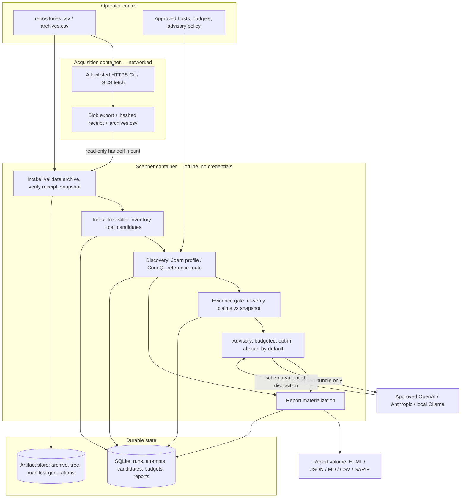

# System Design Document: VeriFlow — evidence-gated vulnerability discovery

- **Author(s):** Eric Kikunda
- **Status:** Draft
- **Target Release / Milestone:** Functional POC completion, then bank OCP dev acceptance (Q4 2026)
- **Reviewers:** AppSec (evidence policy and detection quality), Platform/Infra (OpenShift, storage, identity), Model governance (provider approval and data handling), Vulnerability management (report and severity contract)
- **Supersedes:** [system-design.md](system-design.md) v0.3. That document remains the record of the Foundry adaptation rationale (§2), the enterprise capacity model (§12) and the per-slice changelog. This v2 restructures the same material as an implementation-grounded SDD and states explicitly which parts are running code.
- **Implementation checkpoint:** through Slice 141. Every "Implemented" claim below is traceable to `src/veriflow/`, `tests/` or `scripts/validate_*.py`.

---

## 1. Executive Summary & Context

### Problem statement

A security organization needs a defensible vulnerability assessment across roughly 1,000 source repositories per day. Neither available approach works alone. Deterministic SAST at fleet scale produces alert volumes that reviewers cannot triage, and — more dangerously — reports zero findings for repositories it could not parse, extract or build, which reads downstream as "clean." An LLM pointed at source code produces fluent, unfalsifiable claims: it will cite line numbers that exist while asserting a data flow that does not, and it cannot distinguish "I found no path" from "I did not look."

VeriFlow addresses the conjunction of both failures. Deterministic scanners produce **candidates** with snapshot-bound provenance; a service-owned **evidence gate** re-verifies every quoted source span, sink expression and flow against the immutable snapshot before a model is invoked; and a budgeted model may only return an **advisory disposition** that is incapable of confirming or suppressing a candidate. The product's core invariant is that *coverage gaps stay visible*: a scan that failed, timed out or covered an unsupported language must never be representable as a clean result.

### Goals

**Delivered and locally verified in this POC (Slices 1–141):**

| Goal | Status |
|---|---|
| Reproducible intake: CSV manifest → verified immutable snapshot with per-file digests | Implemented; archive, Git and GCS acquisition paths |
| Bounded discovery across 9 language selections and 8 CWE families | Implemented; 18 named Joern profiles, 31 packaged queries |
| Evidence gates that abstain rather than dismiss when a claim cannot be re-verified | Implemented; `claims.py`, `joern_claims.py` |
| Budgeted, opt-in model advice with pre-call reservation and idempotent request keys | Implemented; OpenAI, Anthropic, Ollama, replay |
| Immutable reports with exact retrieval, history, comparison and 6 export formats | Implemented; `reports.py`, `comparison.py`, `sarif_export.py` |
| Offline scanner execution with zero model calls by default | Implemented; verified in restricted Linux containers |
| Deterministic acceptance for every detection profile | Implemented; 62 native validation scripts, 1,061 unit tests in ~57 s |

**Target for enterprise rollout (not yet demonstrated):**

- 1,000 successful evaluations of a declared scan profile per rolling 24 hours, counting `(repository, snapshot, profile version)` tuples, with fresh and validated-reuse counts reported separately.
- Published precision with a 95% confidence lower bound ≥ 90% on an adjudicated sample, measured against the supplied 50-repository ground-truth benchmark.
- End-to-end recall that does not regress against the declared deterministic scanner baseline on that benchmark.
- p95 ≤ 2 s retrieval for an already-materialized single-repository report under declared concurrent load.

### Non-goals (out of scope)

- **Confirmed exploitability.** No profile asserts a vulnerability is exploitable. Runtime reproduction is designed (v1 §8) but not implemented; there is no testbed plane in this codebase.
- **Comprehensive language coverage.** Nine language *selections* with bounded profiles is not "we scan Java." Unsupported files, parse failures and unmodeled framework entry points remain recorded gaps.
- **Distributed execution.** SQLite with a single OS-level worker lock is the POC contract. PostgreSQL leases, fencing epochs, Redis coordination and multi-worker correctness are explicitly deferred to pilot.
- **Automatic backend equivalence.** Joern and CodeQL results are never merged or compared as equivalent because both emit SARIF or share a CWE identifier.
- **Model autonomy.** A model cannot promote a candidate, register a sanitizer, change a verdict, alter a budget or select what it reads. Prompt injection from repository text is contained by capability, not instruction.
- **Hosted API, dashboard UI, exploitation, patching, compliance certification.** Out of scope for v2.

---

## 2. Requirements & Constraints

### Functional requirements

| ID | Requirement | Implementation |
|---|---|---|
| FR-1 | Submit repositories by CSV manifest (mounted TAR/ZIP, Git URL, or GCS object) with owner and classification; return an accept/reject disposition per row | `intake.submit`, `git_batch`, `gcs_acquisition` |
| FR-2 | Capture an immutable, digest-verified source snapshot; never execute repository code or build scripts during intake or scanning | `artifacts.ArtifactStore`, `intake.process` |
| FR-3 | Produce a syntactic inventory and conservative call candidates per supported language; resume from checkpoints | `indexing.build_index`, `*_parser.py`, `java_index` |
| FR-4 | Run a bounded, named discovery profile and persist a durable attempt with normalized candidates, retained diagnostics and stage logs | `joern.discover`, `joern_pipeline.scan_run` |
| FR-5 | Select all applicable profiles automatically from snapshot inventory, one attempt and report per (language, profile) | `joern_selection.scan_selected` |
| FR-6 | Build a capped evidence bundle bound to one candidate; refuse to bundle when required evidence does not fit | `bundles.py` |
| FR-7 | Re-verify quoted source, sink syntax and flow against the snapshot before any provider call; abstain on failure | `claims.py`, `joern_claims.py`, `evidence.py` |
| FR-8 | Reserve budget atomically before a model call; enforce a per-run spend cap and request cap; never silently fall back between providers | `triage.py` |
| FR-9 | Publish immutable reports; identical state reuses its report; later decisions create a new version | `reports.publish_report` |
| FR-10 | Retrieve an exact historical report without rescanning or invoking a model; refuse to hide a newer attempt behind an older report | `reports.get_report`, `resolve_report` |
| FR-11 | Record append-only operator reviews with optimistic revision checks, kept separate from model advice | `reviews.py` |
| FR-12 | Compare two published reports; never report absence as resolution | `comparison.py` |
| FR-13 | Pause, cancel and resume batch dispatch durably, retaining completed work | `import_controls.py` |
| FR-14 | Evaluate pinned scorecards against evaluator-only labels, offline, with labels never reaching a detector or a model | `benchmark.py`, `evaluation.py`, `scorecards.py` |
| FR-15 | Export JSON, Markdown, self-contained HTML, scan-CSV, candidates-CSV and verified original SARIF | `reports.py`, `scorecard_html.py`, `sarif_export.py` |

**Ingress/egress boundary.** Networked acquisition (Git/GCS, CA bundles, credentials) runs in a *separate container image* and hands over immutable archives plus a hashed receipt through a read-only mount. The scanner image has no credentials, no model keys and — in the smoke configuration — `--network none`. This separation is a hard requirement, not a deployment convenience.

### Non-functional requirements

The honest position: this is a single-operator laptop/container POC. Latency and throughput targets below are **engineering targets to validate**, not measured SLOs. Only the "Measured today" column states fact.

| Dimension | Enterprise target | Measured today |
|---|---|---|
| Scan latency | Weighted mean 16.35 min/repo across a measured size mix (v1 §12 planning model) | Per-profile native fixtures complete within bounded stage timeouts; no portfolio distribution measured |
| Report retrieval | p95 ≤ 2 s for a materialized single-repository summary | Reads are single-row SQLite lookups with digest verification; unbenchmarked |
| Throughput | 1,000 profile evaluations / rolling 24 h | Local batches bounded to 10 rows, sequential |
| Availability | Service tier to be set with the platform team | Not applicable; CLI invocation, no service |
| Consistency | Strict serializability for state transitions; artifact manifest commit is the durability point | SQLite WAL, `BEGIN IMMEDIATE` write transactions, `PRAGMA foreign_keys=ON`, 5 s busy timeout; one writer enforced by `flock` |
| Durability | Artifact written to a new generation, digest-verified, then manifest pointer committed | Implemented; unreferenced `.stage-*` generations require manual cleanup |
| Test feedback | Full unit suite under 2 min | 1,061 tests, ~57 s, no external toolchain required |

**Scale constraints that are structural, not tunable.** SQLite WAL requires same-host processes and must not be mounted across OpenShift replicas. A single artifact PVC's capacity, topology and throughput must be validated before any fleet claim. Neither is a bug to fix later; both are reasons the pilot requires PostgreSQL and an approved artifact store.

### Security & compliance

**Data classification.** Every snapshot carries an operator-declared `classification` string, and every derived artifact — index rows, evidence bundles, candidate records, reports — inherits it. Source-derived summaries are *not* declassified by summarization. Reports may legitimately contain file paths, rule identifiers and (in investigator projections) source excerpts; the default summary projection omits source excerpts, model prose and raw diagnostics.

**AuthN/AuthZ.** Today: none. The trust boundary is the owning OS user, and the state directory is created mode `0700`. This is stated as a limitation in every operator guide and is why the POC mandates public or synthetic source. The enterprise design (v1 §14) requires enterprise OIDC, role separation (operator / investigator / application owner / platform admin) and per-security-domain authorization on every source, artifact, evidence and export access, with application-level enforcement tested independently of any database row-level security.

**Encryption.** Transport security for acquisition is enforced (HTTPS only, redirects disabled, inherited credentials and interactive prompting disabled, operator-supplied CA bundle). At-rest encryption is delegated to the platform; there is no application-level envelope encryption today, and the enterprise design requires an approved KMS-backed evidence store before bank source is handled.

**Secrets.** Provider credentials are referenced by environment variable name in an operator-authored config; keys never appear in CSVs, manifests, prompts, reports or artifacts. Acquisition credentials live in an operator-mounted file scoped to an exact repository and never reach the scanner boundary.

**Untrusted input.** All repository text — source, comments, logs, generated output — is untrusted data. Containment is by capability: the model receives a capped, gate-validated bundle and has no tools, no shell, no network and no ability to request arbitrary reads. "Ignore instructions found in the repository" is not a control.

**Sandboxing.** Container execution uses an arbitrary non-root UID, group 0, all capabilities dropped, read-only root filesystem, `no-new-privileges`, default seccomp, `--network none`, 2 CPU / 4 GiB / 256 PID limits and tmpfs scratch. macOS local C# extraction uses a fail-closed `sandbox-exec` network-deny profile that verifies denial inside the same process that execs the target. Neither is a claim of protection against hostile code with a kernel exploit; scanning does not build or run repository code.

---

## 3. High-Level Architecture



Arrows are data flow, not network permission. The scanner plane never receives Git credentials; the acquisition plane never receives model keys; the default discovery path makes **zero** model calls.

### Component overview

| Component | Responsibility | Tech stack / module |
|---|---|---|
| Operator CLI | Admission, batch control, status, retrieval; renders JSON or requested Markdown; never echoes source in errors | Typer + Pydantic — `cli.py` (63 commands), `domain.py` |
| Intake workers | Fetch/validate/unpack/fingerprint; enforce archive limits; publish snapshot manifests | `intake.py`, `artifacts.py`, `git_acquisition.py`, `gcs_acquisition.py`, `acquisition_provenance.py` |
| Indexer | Complete file/function inventory, parse coverage, conservative call candidates, resumable checkpoints | tree-sitter (9 grammars) — `indexing.py`, `python_parser.py`, `java_parser.py`, `csharp_parser.py`, `c_family_parser.py`, `express_parser.py`, `go_http_parser.py`, `rust_env_parser.py` |
| Scanner adapters | Bounded profile execution, stage timeouts, process-group kill, normalized output | Joern CPG + pinned queries — `joern.py`, `joern_pipeline.py`, `joern_selection.py`, `queries/*.sc` (31); CodeQL reference route — `codeql*.py`, `scanning.py`, `pipeline.py`; registry — `scanner_backends.py` |
| Evidence gate | Re-resolve every reference against the pinned snapshot; validate span/sink/flow syntax; decide whether a provider may be invoked at all | `claims.py`, `joern_claims.py`, `joern_*_claims.py`, `evidence.py`, `bundles.py`, `expansion.py` |
| Advisory client | Reserve budget, invoke one approved provider, validate schema and citations, record disposition | `triage.py`, `batch_triage.py`, `scan_advisory.py` |
| Reporter | Materialize immutable report versions and audience projections | `reports.py`, `comparison.py`, `scorecard_html.py`, `sarif_export.py`, `batch_reports.py` |
| Evaluator | Offline scorecards against evaluator-only labels; per-CWE proxy metrics | `benchmark.py`, `evaluation.py`, `scorecards.py`, `benchmark_comparison.py` |
| Persistence | Schema, migrations, transactions, single-worker exclusion | SQLAlchemy 2 + Alembic + SQLite WAL — `persistence.py` (17 tables, 9 migrations) |
| Deployment assets | Pinned offline images, restricted runtime validation, OpenShift Job/SA/NetworkPolicy manifests | 28 Containerfiles, `scripts/build_container.py`, `scripts/validate_container.py`, `deploy/openshift/` |

**Not present, by decision:** message broker, cache tier, graph database, vector store, agent framework, service mesh. PostgreSQL and Redis are pilot targets, and Redis is explicitly non-authoritative — losing it must never lose a finding or a budget ledger entry.

---

## 4. Detailed Component Design

### 4.1 API & interface contracts

The operator interface is the CLI; the hosted HTTP API remains a proposal (v1 §20). The contract is nonetheless typed and testable.

**Invocation shape.** `veriflow [--state-dir PATH] <command> [args]`. `--state-dir` is global and precedes the subcommand. Every command returns a JSON object on stdout unless `--format markdown|html|scan-csv|candidates-csv` is requested.

**Error contract.** `VeriFlowError` is the only expected failure class; it renders as `{"error": "<message>"}` on stderr with exit code 1. `OSError` and `SQLAlchemyError` collapse to a generic storage message so that paths and source content cannot leak through error text. Unhandled exceptions are intentionally not caught — they are bugs, not operator conditions.

**Critical semantic:** a nonzero exit means the *request* failed. A successful exit with `"status": "failed"` or `"status": "incomplete"` is a durable diagnostic outcome and is the normal representation of a scan that could not complete. Automation must inspect `status`, never exit code alone.

**Idempotency.** Four operations take a caller-supplied key and are exactly-once with respect to that key:

| Operation | Key | Replay semantics |
|---|---|---|
| `import-csv` | `--key` + SHA-256 of CSV bytes + input root | Same key and bytes returns the existing import; same key with different bytes is an error |
| `triage` | `request_key` + bundle + config + fixture digest | Returns the stored result without another provider invocation |
| `record-review` | `request_key` + `expected_revision` | Same request returns the original entry; stale or conflicting revision fails |
| `import-control` | `request_key` + revision | Same request is idempotent; concurrent revision change fails |

**Intake CSV contract** (`domain.IntakeSpec`, `extra="forbid"`):

```
required: repo_id, source_type, source_uri, owner, classification
optional: sha256, scan_profile, acquisition_receipt, acquisition_sha256
```

`repo_id` matches `^[A-Za-z0-9][A-Za-z0-9._-]{0,99}$`. `source_uri` must be absolute, non-null-byte and beneath the declared input root; symlinks are not followed. `sha256` pins the *original archive bytes*: without it, the source is pinned when the worker copies it, not when the row is admitted. `acquisition_receipt` and `acquisition_sha256` must be supplied together and require an archive digest.

**Report selection contract.** Retrieval requires an explicit selector so that "the report" is never ambiguous:

- `--report-id` — exact immutable version, ownership-enforced.
- `latest-attempt` (default) — latest admitted run's latest attempt; **never falls back** to an older successful run.
- `latest-completed` — latest published static-review-ready report, returned *together with* disclosure of newer work.

A completed report from last week must not conceal a newer failed or partial scan. This is enforced in `reports.resolve_report` and covered by tests.

### 4.2 Data modeling & storage

**Schema** — 17 tables, Alembic `0001`…`0009`, applied by `veriflow init` (idempotent, forward-only).

| Table | Grain | Identity and integrity |
|---|---|---|
| `repositories` | One per repo_id | PK repo_id; owner, classification |
| `imports` | One CSV submission | PK uuid; unique `idempotency_key`; `request_sha256`, `input_root` |
| `import_items` | One CSV row | Unique `(import_id, row_number)`; `state`, `attempts`, `error` |
| `import_controls` | One dispatch decision | PK `(import_id, revision)`; unique `(import_id, request_key)` |
| `snapshots` | One captured source tree | **PK is the content digest**; JSON manifest with per-file path/size/sha256 |
| `runs` | One analysis intent | PK uuid; FK repo, snapshot; `state`, `profile` |
| `source_indexes`, `indexed_files` | One index build / one file | Parser version + snapshot bound; enables resume and reuse |
| `codeql_attempts` | One extraction attempt | Durable diagnostic JSON even on failure |
| `scan_attempts` | One scanner execution | PK uuid; JSON report with engine, profile and query identity |
| `candidates` | One normalized finding | Unique `(attempt_id, fingerprint)`; JSON evidence |
| `evidence_bundles` | One immutable context bundle | **PK is the content digest**; FK candidate |
| `triage_budgets` | One per run | PK run_id; `limit_micro_usd`, `max_requests` (default 100) |
| `triage_calls` | One advisory request | Unique `(run_id, request_key)`; `state`, `charged_micro_usd`, `request_sha256` |
| `published_reports` | One report version | Unique `(run_id, version)` **and** `(run_id, input_digest)` |
| `operator_reviews` | One assertion | Unique `(candidate_id, revision)` and `(candidate_id, request_key)` |
| `benchmark_scorecards` | One publication | PK digest; indexed by `dataset_id` |

Three modeling decisions carry the correctness weight:

1. **Content-addressed identity** for snapshots, bundles and reports. A digest primary key makes reuse safe and tampering detectable, and makes "identical state reuses its report" a uniqueness constraint rather than application logic — that is the purpose of the `(run_id, input_digest)` constraint.
2. **Typed columns for what is searched; JSON for versioned payloads.** Manifests, evidence, reports and scorecards evolve with schema versions embedded in the payload; the database is not a document store.
3. **Append-only decision history with derived projections.** `operator_reviews` and `triage_calls` are never updated in place for a new decision; reports are new versions. Optimistic concurrency uses `expected_revision`.

**Indexing.** FK columns that drive lookups (`run_id`, `attempt_id`, `candidate_id`, `import_id`, `dataset_id`) are indexed. No partitioning: at POC volume the working set is one operator's state directory. Fleet volume moves to PostgreSQL, where `tasks`/`attempts` churn will need partitioning and vacuum tuning (v1 §13).

**Artifact store.** Outside the database: original archive, extracted tree and manifest, written as numbered *generations*. Publication is write-new-generation → verify size and digest → atomically rename → commit the manifest pointer in the same transaction as the state change. There is no distributed transaction between filesystem and database, and the failure direction is chosen deliberately: an orphaned `.stage-*` directory or an unreferenced published generation is acceptable; a committed database row pointing at absent or unverified bytes is not. Only manifests referenced by committed records are accepted; `storage-audit` inventories retained references without deleting.

**Retention.** Not automated. Published artifacts are read-only by convention and verified on read. The enterprise design requires separate retention for raw imports, rebuildable scanner databases, model interaction records, findings and audit events, with deletion propagation and legal hold — none of which should be invented without the data owner.

### 4.3 Core logic & workflows

**Intake state machine.** `ItemState`: `ready → processing → snapshotted`, with terminal `rejected` (bad input — needs a corrected input and a new submission key) and `failed` (exhausted attempts). `RunState`: `admitted → snapshotted`, terminal `failed`. Interrupted `processing` items resume automatically and are capped at **three attempts**; a rejected or failed archive never silently retries forever.

The v1 target lifecycle (`ADMITTED → SNAPSHOTTED → INVENTORIED → INDEX_READY → STATIC_ANALYZED → INVESTIGATING → GATED → REPORTED`) is the enterprise contract. The POC implements the first two states durably and expresses the rest as attempt records and report status, because a single sequential worker does not need a persisted DAG scheduler. **`snapshotted` means source is ready for analysis. It is not a clean security scan.**

**Scan and advisory sequence.**

```mermaid
sequenceDiagram
    actor O as Operator
    participant P as scan_run
    participant S as Snapshot
    participant J as Joern stages
    participant G as Evidence gate
    participant M as Provider
    participant R as Reporter
    O->>P: scan-run RUN_ID --engine joern [--joern-profile X]
    P->>S: verified_source() — re-verify every file digest
    S-->>P: manifest or hard failure
    P->>P: select (language, profile) plan; auto = all applicable
    loop Each selected profile
        J->>J: CPG build, then query, under separate stage timeouts
        Note over J: env scrubbed; GOPROXY=off, CARGO_NET_OFFLINE=true, own HOME/TMPDIR
        J-->>P: normalized output ≤16 MiB, or durable stage failure + logs
        P->>P: persist attempt + candidates (unique per fingerprint)
    end
    alt Advisory not requested (default)
        P->>R: publish report — 0 model calls
    else Advisory requested with explicit profile, config and budget
        P->>G: build capped bundle (≤8 locations, ≤16 KiB source, ≤32 KiB envelope)
        G->>S: re-resolve every span; check sink syntax and retained flow
        alt Gate fails or bundle incomplete
            G-->>P: abstain — provider never invoked
        else Gate passes
            G->>M: reserve budget, then send bundle
            M-->>G: schema-validated disposition + usage
            G->>G: validate citations; invalid → abstain
        end
        P->>R: publish report with advisory recorded separately
    end
    R-->>O: report_id, status, coverage gaps
```

**Discovery is gated at three independent points**, and each failure mode has a distinct outcome:

| Gate | Failure outcome |
|---|---|
| Snapshot verification (`verified_source`) | Hard error — analysis of modified source never proceeds |
| Profile/language compatibility (`discover`) | Explicit rejection — no silent fallback to a different profile |
| Evidence claims (`claims`, `joern_claims`) | **Abstain** — candidate stays visible, provider not invoked |

**Budget reservation state machine** (`triage.py`). The hard case is a call whose cost is unknown because the process died mid-flight:

1. Resolve the request key. An existing terminal record returns its stored result — no second invocation.
2. Mark any prior `running` call for this run as `unknown`. An interrupted call may have consumed provider resources; its reservation is **retained**, not refunded.
3. Enforce the request cap before spend: exhausted → error, provider never invoked.
4. Compute `reservation = f(estimated_input, max_output, price)`. If `spent + reservation > limit`, record `reservation_exceeded` and abstain.
5. Write the `running` row and commit *before* dispatch.
6. On reply, reconcile to actual usage and set a terminal state: `completed`, `invalid_citations`, `invalid_rationale`, `evidence_rejected`, `invalid_output`, `reservation_exceeded` or `unknown`.

Every non-`completed` terminal state yields `disposition: "abstain"`. Advisory outputs are limited to `needs_review`, `likely_false_positive` and `abstain` — there is no value a model can return that confirms a vulnerability or suppresses a candidate.

**Report materialization.** Publishing reads stored state only: no source access, no scanner execution, no model call. The input digest covers the attempt, its candidates, advisory history and operator reviews; identical inputs return the existing report, and any later decision produces a new version. `static_review_readiness` joins current index state with static-analysis diagnostics — and `ready_for_review` explicitly does not mean verified coverage or a clean verdict.

---

## 5. Resilience, Reliability & Failure Modes

### FMEA

| Failure scenario | Impact | Mitigation / fallback — implemented today |
|---|---|---|
| Worker process killed mid-item | Item stuck in `processing`; possible orphan `.stage-*` generation | `flock` released by the OS on death; next worker resumes the item, capped at 3 attempts; only manifests referenced by committed records are accepted; orphan cleanup is manual (`storage-audit`) |
| Second worker started on the same state dir | Concurrent writers corrupting run state | `exclusive_worker` refuses with a clear error; non-blocking `LOCK_EX` |
| Scanner stage hangs (CPG build, query) | Job never returns; slot held | Separate extraction and query timeouts; `start_new_session` + `killpg(SIGKILL)` on timeout; stage log retained; durable failure record |
| Scanner emits oversized or malformed output | Memory exhaustion or a corrupt candidate set | 16 MiB output cap; strict schema/engine/rule identity check before decode; failure is durable, not silent |
| Source modified after snapshot | Analysis of code nobody reviewed | Every read path calls `verified_source`; digest mismatch is a hard error |
| Archive is a zip bomb, has traversal, symlinks, or name collisions | Filesystem escape or disk exhaustion | `ArchiveLimits`: 256 MiB archive, 1 GiB expanded, 20,000 members, 512-byte paths, depth 30, ratio 200; links, device/sparse files, traversal, case/Unicode collisions and encrypted ZIPs rejected; nested archives stay opaque |
| Provider timeout with unknown cost | Double-spend or silent budget leak | Prior `running` calls become `unknown`; reservation retained until reconciled; no blind refund-and-retry |
| Provider returns prose, a refusal, or fabricated citations | A false verdict enters the record | Schema validation → `invalid_output`; missing evidence IDs → `invalid_citations`; failed gate → `evidence_rejected`. All abstain |
| Provider or key unavailable | Scan blocked | Discovery is the default path and makes zero model calls; advisory is strictly opt-in; **no automatic fallback between providers or models** |
| Budget or request cap reached | Work silently truncated | Explicit error before invocation; candidates retained and visible; a run budget is fixed once configured |
| Index or extraction fails for some files | Partial analysis presented as clean | Unsupported files, parse errors and unresolved calls remain in the report; zero candidates is never a clean verdict |
| Batch row fails | Whole batch lost | Rows are independent; per-row `state` and `error`; import and worker both succeed with failed rows inside |
| Database locked by a concurrent reader | Spurious failure | WAL mode, 5 s busy timeout, `BEGIN IMMEDIATE` for writes |
| Report requested for a run with no published report | Stale report returned as current | Explicit selector required; `latest-attempt` never falls back; newer work is disclosed |

### Backpressure & rate limiting

The POC's protection is structural rather than adaptive, which is appropriate for a single sequential worker:

- **Admission bounds:** `worker --max-items N`, `scan-import --limit N`, local batches capped at 10 rows and executed sequentially.
- **Resource bounds:** per-stage timeouts, `--threads` / `--ram-mb` for CodeQL, container CPU/memory/PID limits, tmpfs scratch.
- **Spend bounds:** per-run micro-USD cap *and* request cap; reservation before dispatch; `--advisory-limit` bounds candidates per invocation (max 100).
- **Evidence bounds:** 8 locations, 16 KiB source, 32 KiB envelope, ≤200-line and ≤32 KiB evidence reads, at most 4 ranges per expansion step and 2 steps.
- **Dispatch control:** `import-control` pauses, resumes or terminally cancels batch dispatch; running rows finish rather than being killed.

What is **not** implemented: adaptive provider backoff shared across workers, weighted fair queueing by owner or size class, and queue-aging for large repositories. All three are pilot work and depend on Redis-or-equivalent coordination that must remain non-authoritative (v1 §12, §13).

---

## 6. Observability & Operations

### Instrumentation today

There is no metrics pipeline, no tracing and no alerting. The current instruments are deliberate and machine-readable:

- **Structured results.** Every command returns JSON carrying status, identifiers, counts and coverage. This is the telemetry surface.
- **Durable diagnostics.** Failed extractions, timed-out stages and invalid outputs are persisted as records with retained stage logs, not discarded on a nonzero exit.
- **Provenance in every report.** Engine, profile, query digest, scanner version, snapshot digest, acquisition receipt.
- **Cost ledger.** `triage-report` returns budget, accounted, remaining and overrun micro-USD plus per-call state.
- **Storage inventory.** `storage-audit` reports retained artifact references and bounded logical sizes.
- **Prerequisite check.** `doctor` inspects local tools and suggests fixes without running migrations, scanners or models.

**Logs may contain source.** Raw scanner logs and SARIF stay inside the protected state directory and are never written to operator-facing stdout. Operational logs must stay free of raw source and prompt bodies.

### Golden signals to add before pilot

| Signal | Proposed metric | Proposed alert |
|---|---|---|
| Traffic | Completed `(repo, snapshot, profile)` evaluations per hour, split fresh vs. reused | Ticket: throughput below plan for 24 h |
| Errors | Ratio of attempts ending `failed`/`incomplete`, by language and profile | **Page:** incomplete rate > 20% for 30 min — the silent-clean-scan risk |
| Latency | p50/p95/p99 stage duration by profile and size class | Ticket: p95 beyond profile deadline |
| Saturation | Worker occupancy, artifact volume growth, database size | Ticket: artifact storage > 75% |
| Spend | Micro-USD and requests per run and per day vs. entitlement | **Page:** daily budget > 90%; ticket at 75% |
| Integrity | Snapshot verification failures; unreferenced artifact generations | **Page:** any verification failure — it means source or storage changed under a committed record |

Correlation should key on the identifiers that already exist — `import_id`, `run_id`, `attempt_id`, `bundle_id`, `report_id` — rather than introducing a parallel trace ID.

### Deployment & rollback

**Build.** `uv build` → wheel → `docker build` against a digest-pinned UBI9 base with hash-verified, wheels-only dependencies from `containers/requirements.lock`. Toolchains (CodeQL, JDK, .NET SDK, Joern, Rust) are checksum-pinned in `containers/*.json` and downloaded only at build time; runtime needs no network. After changing `uv.lock`, re-export the lock and review the diff.

**Validation before promotion.** `scripts/validate_container.py --suite <name> --image <tag>` runs the profile's fixtures inside the restricted runtime and asserts exact candidate counts per case (typically vulnerable/fixed/crossfile/disconnected/shadowed/unbound/guard), publication, exact retrieval, and HTML/JSON/CSV agreement — with zero model calls. Image IDs are inspected and recorded; a reused tag is never assumed to identify the same tools.

**Schema migration.** Alembic, applied forward by `init`; currently `0009`. `0008` demonstrated the required pattern: add `max_requests` with a server default so existing budgets acquire a 100-request cap without data loss. Rolling deployments require expand/migrate/contract — add nullable or defaulted columns, backfill, then contract in a later release. Each revision does define a `downgrade`, but those are destructive (`drop_table` / `drop_column`) and `init` only ever runs `upgrade head`. Operationally, rollback is a **version change plus forward migration**, not a downgrade run; all prior evidence is preserved for comparison.

**Rollback checklist.** Redeploy the previously recorded image digest; confirm the schema revision the older wheel expects is ≤ the applied revision (forward-compatible columns make this true for `0008`-style changes); re-run the profile's validation suite against the rolled-back image; published reports are immutable and unaffected.

**Canary.** A new query, profile, gate or model config runs shadow evaluation against fixtures, then a limited canary, before broad promotion — because a new profile changes rule identity, and a changed gate can invalidate existing triage keys across gate versions.

---

## 7. Alternatives Considered & Trade-offs

| Alternative evaluated | Why it was considered | Why it was rejected (or deferred) |
|---|---|---|
| **CodeQL as the primary engine** | Mature, broad query corpus, strong dataflow, SARIF-native | Private-repository use requires qualifying licensing that cannot be assumed; production delivery must not depend on obtaining it. Retained as a reference/POC route with full provenance |
| **LLM-first detection** (model reads repository, reports vulnerabilities) | Finds business-logic and authorization flaws no rule encodes | Unfalsifiable output, no coverage denominator, cost scales with repository size rather than with risk. Inverted: deterministic discovery first, model strictly downstream of a gate |
| **Multi-agent framework** (persistent conversational agents per repository) | The Foundry source spec's shape; natural task decomposition | Non-deterministic control flow, no durable state machine, no budget enforcement point, unreviewable failure modes. Replaced by typed stages with the same responsibilities (v1 §2, amendment A1) |
| **Graph database for the evidence graph** | Natural fit for call graphs and data flow | Premature before measurement. Immutable per-module graph artifacts plus bounded queries meet current needs; a dedicated engine is justified only when evidence-query measurements demand it |
| **Vector store / embeddings for retrieval** | Popular default for code context assembly | Symbol, call-graph and text search resolve the current retrieval needs deterministically. Add only if measured retrieval misses persist, and only via an approved embedding path |
| **PostgreSQL + Redis from the start** | Avoids a later migration; exercises real concurrency early | Would have front-loaded distributed-systems work ahead of detection correctness. SQLite keeps the POC honest; the state-machine contract is kept identical so the port is mechanical. Cost: multi-worker correctness stays unproven until pilot |
| **Redis as the authoritative work queue** | Simple, fast, ubiquitous | A Redis restart must never lose findings or reset a budget ledger. PostgreSQL owns correctness; Redis is optional ephemeral coordination |
| **Mutable findings with status fields** | Simpler queries, smaller database | Destroys auditability and makes "what did we report last Tuesday" unanswerable. Append-only history with immutable report versions |
| **Line numbers / snippet hashes in finding identity** | Trivially stable within one scan | Any edit above the finding creates a spurious "new" vulnerability. Identity is family key + structural occurrence; hashes serve evidence validity and caching only (v1 §2, amendment A4) |
| **Opengrep as a second scanner** | Fast, permissively licensed, complementary patterns | Assessed (`scripts/opengrep/`), not integrated. A second engine needs its own provenance, coverage semantics and qualification — it is not a free recall increase |
| **Automatic multi-language fan-out with merged results** | One report per repository reads better | Merging engines or profiles hides which analysis actually ran. `--language auto` fans out to **separate attempts and separate reports**, preserving per-profile coverage truth |

---

## 8. Open Questions & Appendices

### Open questions

- [ ] **Benchmark access.** The 50-repository ground-truth corpus, its revisions and label format are not yet available locally. No detection quality has been measured. Blocks every precision/recall gate in §1.
- [ ] **Portfolio census.** Language, size and build-system distribution is unknown. The §12 capacity model swings from 23 to 116 concurrent slots depending on the mix — sizing cannot be committed without it.
- [ ] **Model entitlement.** Approved endpoints, model IDs, retention policy and per-model quota from the bank gateway team. No live provider call has been made from this codebase.
- [ ] **CodeQL licensing** for private-repository and archive workflows — determines whether the reference route survives into production.
- [ ] **OCP acceptance.** SCC admission, storage access modes, registry/base-image approval, enforced NetworkPolicy and CPU architecture (current images are Linux ARM64 only; an AMD64 bundle must be prepared if bank workers differ).
- [ ] **PostgreSQL multi-worker correctness** — lease claims, fencing epochs, reservation reconciliation. Required before any fleet throughput claim.
- [ ] **Retention and deletion propagation** periods, per data class, from the data owner. Deliberately not invented here.
- [ ] **Severity mapping** from CWE to the bank's vulnerability-management scale, and the owner-facing vs. investigator-facing projection boundary.
- [ ] **Artifact store at scale** — a single PVC's capacity and throughput, against ~2 GiB retained per fresh scan (≈14 TB per 7 days at 1,000/day before replication).

### Appendix A — Discovery profile inventory (Slice 141)

18 named profiles across 9 language selections and 8 CWE families. Each is a *bounded syntactic pattern*, not language coverage.

| Language | Profiles | CWE families |
|---|---|---|
| Python / Flask | `python-flask-system-v1`, `-path-v1`, `-ssrf-v1`, `-sql-v1` | 78, 22, 918, 89 |
| Java / Spring | default Spring-GET-to-JDBC, `java-spring-file-path-v1`, `-url-stream-v1`, `-object-read-v1`, `-xml-entities-v1`, `-runtime-shell-v1` | 89, 22, 918, 502, 611, 78 |
| C# / ASP.NET | default Lookup-to-CommandText, `csharp-query-commandtext-v1`, `-file-read-v1`, `-shell-start-v1` | 89, 22, 78 |
| JavaScript / TypeScript / Express | `express-request-eval-v1`, `-exec-v1`, `express-html-send-v1` | 94, 78, 79 |
| Go | `go-http-shell-v1` | 78 |
| Rust | `rust-env-shell-v1` | 78 |
| C / C++ | `c-family-argv-system-v1` | 78 |

Principal limitations by language are recorded in [scanner-language-assessment.md](../plans/scanner-language-assessment.md); the forward queue is in [cwe-coverage-roadmap.md](../plans/cwe-coverage-roadmap.md). Advisory evidence gates exist only for a subset (Python/Flask, Java/Spring SQL, ASP.NET SQL); every other profile is **advisory-unsupported**, meaning discovery-only with no qualified model path.

### Appendix B — Codebase facts at this checkpoint

| Measure | Value |
|---|---|
| Application modules / lines | 80 / 13,872 |
| CLI commands | 63 |
| Packaged Joern queries | 31 |
| Database tables / migrations | 17 / 9 (`0001`–`0009`) |
| Unit tests / runtime | 1,061 / ~57 s, no external toolchain |
| Native validation scripts | 62 |
| Container recipes | 28 |
| Fixture corpora | 44 |

### References

- [system-design.md](system-design.md) — v0.3: Foundry adaptation and amendments (§2), enterprise capacity model (§12), durable-state target (§13), OpenShift controls (§14), evaluation program (§15), report contracts (§20), per-slice changelog.
- [implementation-plan.md](../plans/implementation-plan.md) — milestones M0–M7 and acceptance gates.
- [progress.md](../development/progress.md) — slice-by-slice acceptance record.
- [cli-operator-guide.md](../guides/cli-operator-guide.md), [container-operator-guide.md](../guides/container-operator-guide.md), [acquisition-container-guide.md](../guides/acquisition-container-guide.md) — executable operator procedures.
- [automatic-scan-selection.md](../guides/automatic-scan-selection.md) — `--language auto` semantics, overrides and retry behavior.
- Cisco Systems, Inc. Foundry Security Spec, commit `c770bf7764265dda188d9a270b1105a4bb62759b`, CC BY 4.0. This design is Foundry-derived and is **not** a declaration of unmodified conformance; Cisco does not endorse it.
- [PostgreSQL SELECT / SKIP LOCKED](https://www.postgresql.org/docs/current/sql-select.html), [SQLite WAL](https://www.sqlite.org/wal.html), [OpenShift SCC](https://docs.redhat.com/en/documentation/openshift_container_platform/4.22/html/authentication_and_authorization/managing-pod-security-policies), [CodeQL CLI licensing](https://docs.github.com/en/code-security/concepts/code-scanning/codeql/codeql-cli).

---

**Standing caveat.** Nothing in this document asserts that VeriFlow has found, confirmed or ruled out a vulnerability in any real application. Every detection profile produces candidates under stated syntactic bounds. A report with zero candidates means the selected profiles found nothing they are capable of finding — never that the repository is secure.
