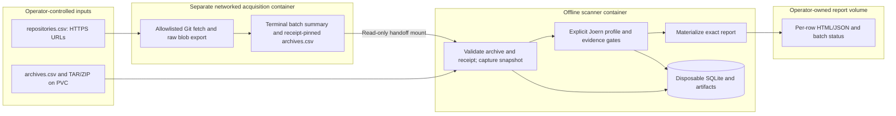
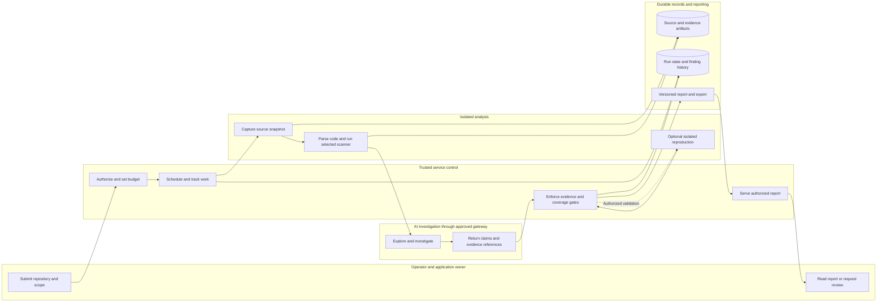
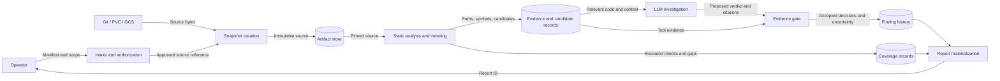
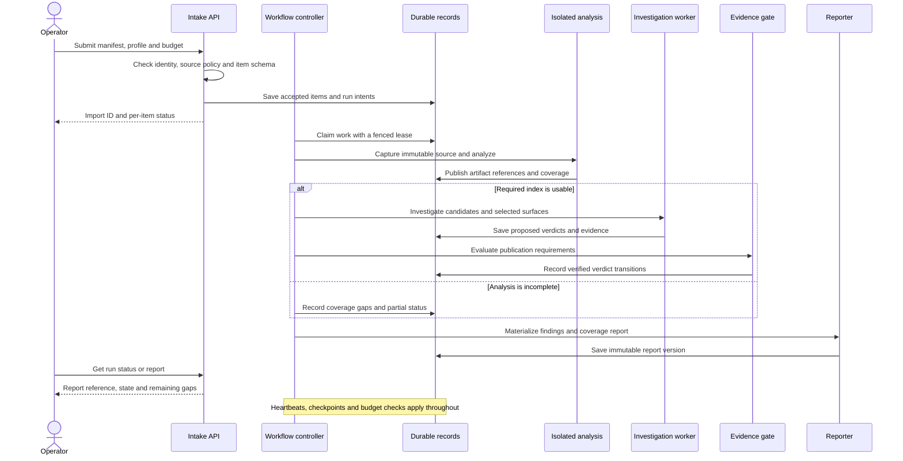
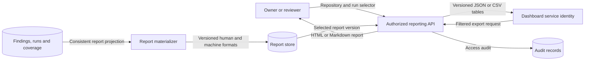
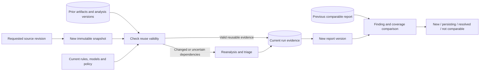
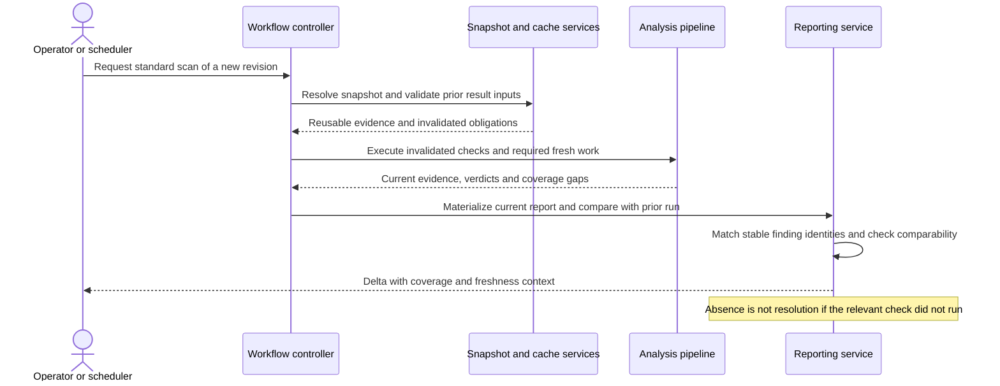
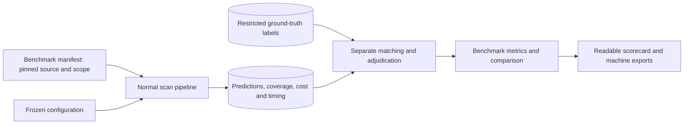
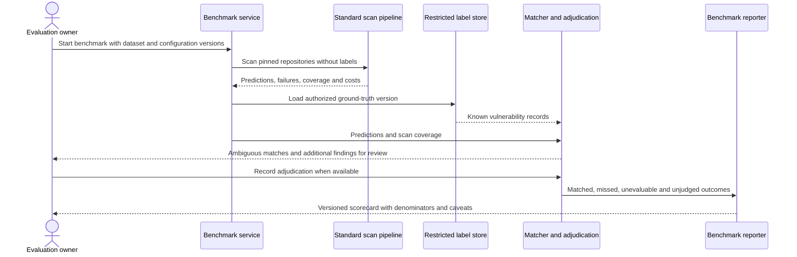
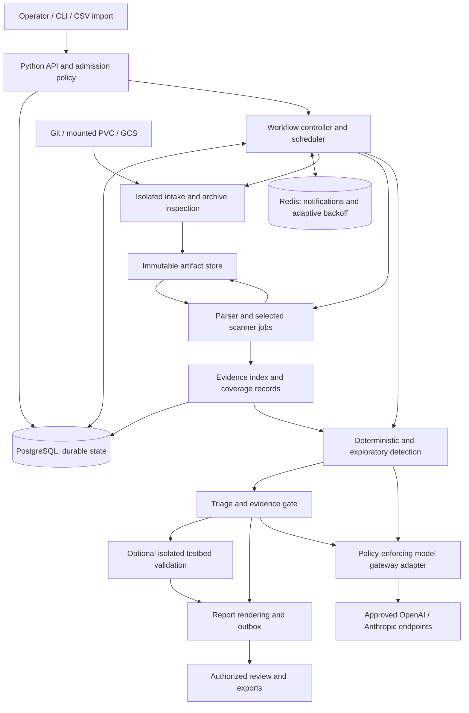

# LLM-assisted vulnerability discovery platform

**System design, version 0.3 — 11 September 2026**
**Implementation checkpoint:** through Slice 125. This document separates the implemented laptop POC from the proposed enterprise architecture. It is not an approved Wells Fargo architecture.

**Revision 0.3:** Records the Joern-first scanner strategy, bounded nine-language profiles, optional advisory policies, Ollama, separate Git acquisition and offline archive scanning, durable provenance, and local OpenShift preparation. PostgreSQL orchestration, Redis coordination, GCS, hosted API, bank OCP execution and fleet qualification remain future work. The [implementation plan](../plans/implementation-plan.md) governs delivery order; [progress](../development/progress.md) and slice records retain acceptance evidence. Section 0 is the current checkpoint; production mechanisms in later sections are design requirements unless explicitly marked implemented.

## 0. Leadership walkthrough

See the [intake operator guide](../guides/intake-operator-guide.md) and
[current readiness checkpoint](../development/slice-123.md) for current execution guidance.

### Current architecture and delivery status

TraceProof is a Python CLI application with SQLite and local artifacts, bounded scanner execution, evidence gates, budgeted optional model advice, and immutable reports. **Redis is not a POC dependency.** The enterprise target remains PostgreSQL with isolated OpenShift jobs; local database locking does not implement distributed leases or fleet scheduling.

| Area | Implemented and locally tested | Remaining acceptance |
|---|---|---|
| Scanner strategy | Explicit Joern route in scan-run/scan-import; CodeQL retained as POC/reference route | Broader rules, representative quality, tool approval; no automatic backend equivalence |
| Languages | Bounded profiles for Python, Java, JavaScript, TypeScript, C#, Go, Rust, C and C++ | Complete language/framework coverage is not claimed; mixed repositories need explicit supported selections |
| Intake | Local/PVC TAR/ZIP manifests; bounded public HTTPS Git acquisition; receipt-bound snapshots | Corporate transport qualification; GCS acquisition |
| Evidence and AI | Deterministic provenance/context gates; explicit budgeted advisory policies; OpenAI, Anthropic and local Ollama options | Live bank gateway/model qualification and measured precision/recall; independent exploration/reproduction at target scope |
| Reporting | Immutable exact report retrieval, history/comparison, HTML/Markdown/JSON/CSV and retained SARIF export | Hosted API, authenticated audience projections and enterprise dashboard integration |
| Evaluation | Offline benchmark/scorecard machinery tested on fixtures | Authorized execution and adjudication of the supplied 50 repositories |
| OpenShift preparation | Pinned Linux ARM64 images, restricted Docker tests, offline Job/ServiceAccount/NetworkPolicy manifests | Actual bank OCP dev execution, cluster architecture, SCC/storage/network/registry acceptance |
| Scale | Bounded sequential local batches and local controls | PostgreSQL multiworker correctness, fleet recovery and measured 1,000 repositories/day |

The existing CLI may retain CodeQL defaults for compatibility: select Joern explicitly. Scanner-neutral identity and result contracts are in place, but CodeQL prepared databases and Joern source/CPG execution still have distinct paths. Opengrep is an assessed potential supplement, not an integrated replacement or a required second scan. The bounded C# comparison missed cross-file positives; the accepted path uses the experimental repaired Joern frontend. This is a scope decision, not a general rating of either tool.

### Current language and evidence scope

Each row has bounded discovery and explicit advisory acceptance. “Accepted” means the tested profile works with retained evidence and conservative review outcomes; it does not mean a language is comprehensively scanned. See the [language assessment register](../plans/scanner-language-assessment.md) for fixtures and limitations.

| Language | Selected Joern profile / weakness example | Principal limitation |
|---|---|---|
| Java / Spring | Default bounded GET/String-to-JDBC, CWE-89 | Limited framework sources, dependency semantics and runtime reachability |
| Python / Flask | python-flask-system-v1, request args/form.get to system, CWE-78 | Limited aliases/API identity and guard semantics |
| JavaScript / TypeScript / Express | express-request-eval-v1, request to eval, CWE-94 | Limited imports, module variants and framework binding |
| C# / ASP.NET | Repaired default Lookup-to-CommandText, CWE-89 | Experimental frontend; bounded source mappings do not generalize to all HTTP inputs |
| Go | go-http-shell-v1, HTTP form to shell, CWE-78 | Constructing a command does not prove execution or exposed routing |
| Rust | rust-env-shell-v1, environment to shell, CWE-78 | Environment attacker control and broader Cargo/macros remain unproven |
| C / C++ | c-family-argv-system-v1, argv to system, CWE-78 | API identity and broader C++ semantics; no broad memory-safety coverage |

Language inventory can identify likely languages; it is not automatic comprehensive dispatch over every module. The mounted batch runner applies one explicit language/profile to its batch. Default Joern scanning is discovery-only with zero model calls. Explicit advisory policies validate native/query/SARIF/source provenance, source coordinates, endpoint syntax and retained context before budgeted advice. They support **needs_review** with unresolved claims, not automatic false-positive dismissal, confirmed exploitability or negative safety verdicts. Unsupported candidates remain visible. Supplying more CodeQL .ql/.qls queries expands candidate discovery, not the qualified evidence/triage scope; new policies require reviewed fixtures and gates.

### Implemented swimlane and handoff



The acquisition image has Git and CA certificates; the offline scanner images carry their pinned language toolchains. A real public Git acquisition-to-offline-C-scan handoff passed locally in Slice 115 with zero model calls. No-alert output still has incomplete coverage. The scanner smoke path has networking denied and receives no Git credentials or model keys. Model-enabled CLI workflows are separate from this offline smoke path; a production broker/gateway boundary remains to be implemented.

### Sequence: public Git batch to exact report

```mermaid
sequenceDiagram
    actor O as Operator
    participant A as Acquisition CLI/container
    participant G as Allowlisted Git server
    participant H as Handoff PVC
    participant S as Offline scanner
    participant R as Report PVC
    O->>A: repositories.csv, approved hosts, limits
    loop Each bounded row
        A->>G: HTTPS fetch requested ref/commit
        G-->>A: Git objects
        A->>A: Resolve commit; validate and export raw blobs
        A->>H: ZIP, file inventory and hashed receipt
    end
    A->>H: Terminal acquisition-batch.json and successful archives.csv
    A-->>O: Complete or incomplete acquisition status
    O->>S: Start only after terminal handoff; mount input read-only
    S->>H: Read CSV, archive and pinned receipt
    S->>S: Admit provenance and verify captured file hashes
    loop Each admitted row
        S->>S: Run selected profile; retain failures and coverage gaps
        S->>R: Exact report HTML/JSON and row status
    end
    S-->>O: Exported or incomplete batch result
    O->>R: Read/share retained reports without rescanning
```

Acquisition and scan completion are different outcomes. archives.csv contains successful acquisitions only; retain acquisition-batch.json so rejected or unstarted rows cannot disappear from portfolio accounting. Checkpoints use atomic file replacement, not a multi-file transaction or an automatic restart guarantee. A killed job can leave a running summary. Local batches are capped at ten rows and execute sequentially; this is not the production fleet scheduler.

### Business outcome and reading guide

The service turns a portfolio of source-code repositories into prioritized, evidence-backed vulnerability reports. It combines repeatable code analysis with focused AI investigation, measures quality against known vulnerabilities, and makes both findings and coverage gaps visible.

The main business decisions are how deeply to scan, how much to spend, and which findings need action. Security engineers own the evidence policy; application owners receive readable reports; platform teams operate a bounded, auditable service. An AI claim cannot publish itself as a confirmed vulnerability.

For a leadership review, read this walkthrough, the recommendation in §1, the capacity assumptions in §12, and the rollout decisions in §18. Engineering details follow those concepts. Report contracts are in §20; milestone sequencing is in the companion implementation plan. The diagrams following the use-case table describe the enterprise target; the current POC handoff is shown above. API authorization, controller services and reproduction lanes in those target diagrams are not deployed components.

### Main use cases

| ID | Use case and actor | What happens | Business outcome |
|---|---|---|---|
| UC-01 | **Submit repositories** — security operator | Submit CSV links, a mounted archive, or GCS archive references with ownership and scope | One consistent intake path, with an accepted/rejected result for each item |
| UC-02 | **Scan and investigate** — security operator | Analyze an immutable source revision; investigate candidates; enforce evidence and coverage gates | Prioritized findings with reasons, and explicit limits on what was checked |
| UC-03 | **Retrieve and share a repository report** — application owner or reviewer | Select a repository, scan, or revision; view/download an authorized report | A readable answer to “what was found, what should we fix, and what was not checked?” |
| UC-04 | **Refresh and compare** — operator or scheduler | Rescan changed code, validate reusable results, compare compatible reports | New, persisting and resolved findings without duplicate issues |
| UC-05 | **Review or validate a finding** — investigator | Review uncertainty, record a decision, optionally reproduce in an isolated testbed | Stronger evidence and accountable human decisions |
| UC-06 | **Monitor the portfolio** — leadership or dashboard service | Retrieve filtered summaries and governed exports with quality, coverage, cost and freshness | Portfolio visibility without reading individual technical reports |
| UC-07 | **Benchmark detection quality** — evaluation owner | Later, run frozen configurations against the provided 50-repository benchmark and compare to known vulnerabilities | Measured detection quality, regressions, misses and cost before wider rollout |
| UC-08 | **Control and recover scans** — operator or platform team | Pause, cancel, resume, adjust authorized budgets, inspect blockers and recover failed work | Predictable resource use and no silent loss of work |

UC-01 through UC-04 form the first usable product. UC-05 and UC-08 have minimal support from the start and deepen during implementation. UC-06 begins with exports rather than a custom dashboard. UC-07 has local evaluation/reporting machinery; execution against the actual 50-repository benchmark remains pending.

### Architecture swimlane: who does what

This lane-style diagram groups work by responsibility. It shows the standard scan-to-report path; runtime reproduction is an optional branch.



The control service owns access, budgets and publication. Analysis jobs handle source code in isolation. Models assist investigation but cannot change permissions or bypass evidence gates. PostgreSQL holds durable decisions; immutable artifacts hold source and evidence. Redis accelerates coordination and is omitted here because losing it must not lose findings.

### Data flow: submit, scan and investigate — UC-01 / UC-02

Data-flow diagrams below show information movement; arrows do not grant network access. Optional validation is expanded in its own sequence diagram.



### Sequence: a standard scan — UC-01 / UC-02 / UC-08



### Data flow: retrieve a report and feed dashboards — UC-03 / UC-06



### Sequence: retrieve and share a repository report — UC-03 / UC-06

```mermaid
sequenceDiagram
    actor U as Owner or dashboard client
    participant API as Reporting API
    participant AUTH as Access policy
    participant DB as Report catalog
    participant S as Report store
    U->>API: Get repository report with explicit selector
    API->>AUTH: Check repository and export permissions
    alt Access denied
        API-->>U: Deny without exposing repository details
    else Access allowed
        API->>DB: Resolve run, report version and latest-run metadata
        alt Report exists
            API->>S: Read requested immutable representation
            API->>DB: Record access event
            API-->>U: Report, revision, completion status and as-of time
        else No materialized report
            API-->>U: Report unavailable or pending; run-status reference
        end
    end
    Note over API,S: Retrieval does not rescan code or invoke a model
    Note over U,API: Shared links preserve identity checks; downloads inherit classification
```

### Data flow: refresh and compare — UC-04



### Sequence: rescan and compare — UC-04



### Sequence: review and optional reproduction — UC-05

```mermaid
sequenceDiagram
    actor I as Investigator
    participant API as Review API
    participant DB as Finding history
    participant W as Controller
    participant V as Independent verifier
    participant T as Disposable testbed
    participant R as Reporter
    I->>API: Record review or request authorized validation
    API->>DB: Append decision and actor identity
    opt Testbed and validation authorization available
        API->>W: Queue validation of a confirmed finding
        W->>V: Supply minimal claim and reproduction artifact
        V->>T: Reset and attempt permitted reproduction
        T-->>V: Observable result
        V->>DB: Save result and evidence; set reproduced only on success
    end
    API->>R: Request a new report version for changed decisions
    R-->>I: Updated report with review and validation status
    Note over DB,R: Later validation completion also triggers a new report version
```

### Data flow: evaluate the 50-repository benchmark — UC-07



Ground-truth labels go only to the evaluator, never into detector or triager prompts. A known-vulnerability list establishes labeled positive cases; it does not by itself establish that every other finding is false.

### Sequence: benchmark execution and scorecard — UC-07



### Leadership scorecard

Show portfolio scan freshness, supported coverage, confirmed findings by severity, unresolved high-impact uncertainty, known-vulnerability benchmark recall, adjudicated precision, daily completed scans, backlog age, and cost per completed scan. Every view includes an as-of timestamp and scope. A partially scanned repository must not appear as a clean repository; an incomplete benchmark must not appear as a passing benchmark.

## 1. Recommendation

Evolve the implemented **Python modular application toward a durable PostgreSQL workflow, isolated analysis jobs, interchangeable scanner contracts with Joern as the primary implementation direction, and narrowly scoped LLM investigations**. CodeQL remains a permitted POC/reference backend; production delivery must not depend on obtaining its license. Use Redis optionally for expendable coordination accelerators, not as the authoritative work queue. Store large immutable artifacts in an approved artifact store backed initially by a filesystem/PVC, with GCS as an optional adapter. Keep SQLite for single-machine development and exercise PostgreSQL concurrency early.

Preserve Foundry’s distinct detection, triage, validation, coverage, and reporting responsibilities. Implement those responsibilities as explicit stages and typed contracts; they do not require eight permanent conversational agents for every repository.

The key improvement is a reusable **evidence graph**: symbols, entry points, data flows, authorization checks, trust boundaries, and their provenance. Deterministic tools produce facts; models propose hypotheses, investigate gaps, and explain evidence. A service-owned gate decides whether a finding meets the publication policy.

The 1,000-repositories-per-day target should mean **1,000 successful evaluations of a declared scan profile per rolling day**, with distinct reporting for full scans, incremental scans, unchanged snapshots reused, partial scans, and deep investigations. It cannot credibly mean exhaustive vulnerability discovery or live reproduction for 1,000 arbitrarily large applications each day.

The target enterprise operating model is (not the current default discovery-only POC):

1. A daily standard profile with broad deterministic analysis, attack-surface inventory, targeted LLM triage, and bounded independent exploration.
2. Incremental analysis backed by conservative invalidation and scheduled full refreshes.
3. A separately provisioned deep profile for high-risk applications, difficult findings, and periodic coverage expansion.
4. An evaluation program that measures missed vulnerabilities as seriously as false alarms.

## 2. Foundation and adaptation policy

This design adapts Cisco Systems, Inc.’s **Foundry Security Spec**, retrieved at commit `c770bf7764265dda188d9a270b1105a4bb62759b`, with `spec.md` version 0.1.0 and constitution version 0.2.0. The source is licensed under [CC BY 4.0](https://creativecommons.org/licenses/by/4.0/). Changes below are proposed downstream adaptations; Cisco does not endorse this design. Sources: [pinned specification](https://github.com/CiscoDevNet/foundry-security-spec/blob/c770bf7764265dda188d9a270b1105a4bb62759b/spec.md), [pinned constitution](https://github.com/CiscoDevNet/foundry-security-spec/blob/c770bf7764265dda188d9a270b1105a4bb62759b/constitution.md), and [license](https://github.com/CiscoDevNet/foundry-security-spec/blob/c770bf7764265dda188d9a270b1105a4bb62759b/LICENSE).

This is a Foundry-derived architecture, **not a declaration of unmodified conformance**. Before implementation, maintain a downstream specification and a requirement-to-test matrix. Preserve upstream identifiers in the mapping even if local requirements receive new identifiers.

| Foundation | Decision in this design | Enforcement |
|---|---|---|
| Evidence before true-positive verdicts; FR-051–054, FR-087–088 | Retain and strengthen beyond checking whether cited lines exist | Typed evidence, semantic path checks, counterevidence review, gate-owned state transitions |
| Internal candidates; FR-044, FR-057 | Retain; operator-only review backlog, confirmed findings for developer publication | Separate access and export policies |
| Atomic claims and heartbeat liveness; FR-005, FR-095–101 | Retain | PostgreSQL leases with fencing epochs; independent heartbeat lane |
| Independent reproduction; FR-060–066 | Retain; runtime validation is optional by profile, never fabricated | Fresh testbed and verifier session; explicit validation status |
| Index gate and deterministic structure; FR-020–029 | Retain per supported module; unsupported modules remain visible gaps | Parser/extractor health and nonempty-inventory checks |
| Security map; FR-030–036a | Retain as small evidence-backed records plus rendered views | Deterministic fallback, explicit unknowns, section-level generation |
| Rule corpus and exploration; FR-037–042 | Adapt rule execution, preserve both modes | Compiled rules plus bounded LLM rules; independent exploration allocation |
| Coverage before low-yield stopping; FR-067–074, FR-116 | Retain for exploratory runs; add finite profile completion | Coverage obligations backed by completed artifacts |
| Stable identity; FR-090–091 | Preserve structural family identity; add distinct occurrences | Repository-scoped family plus sink/condition occurrence records |
| Runtime sandbox; FR-107–111 | Retain and separate source execution from trusted services | Deny-by-default network, least privilege, isolated jobs |
| Replayable audit; FR-122, NFR-007 | Retain observable messages, evidence, decisions and usage | Encrypted evidence archive; no dependence on hidden model reasoning |

### Explicit downstream amendments

**A1 — Systematic detection, FR-037 and assumption A-9.** Replace mandatory evaluation of every rule against every function by an LLM with an applicability matrix and interchangeable compiled or LLM evaluators. Every supported function receives an inventory record and applicability assessment. Applicable deterministic checks run broadly; applicable LLM-only checks run according to the declared profile. Unexecuted checks remain coverage debt. The daily profile does not claim exhaustive Foundry LLM rule coverage. A deep profile may perform an exhaustive applicable-rule sweep when funded.

**A2 — Rate governance, Constitution V and FR-105.** Treat the bank’s approved gateway allocation as the effective upstream entitlement. Enforce organizational spending, fairness, and contractual limits even where lower than provider capacity. Adapt within that entitlement using observed backpressure. This is an intentional constitutional amendment: consuming a shared gateway’s entire capacity could interrupt other bank services and violate its operating agreement. Record it in the downstream constitution with a version bump, date, rationale, and tests.

**A3 — Budgets and completion, FR-114/116.** Require production budget limits. Finite profiles may complete when their declared obligations and required triage are finished, without spending additional tokens merely to fill a trailing-yield window. Exploratory deep evaluations retain coverage-plus-yield stopping. Deadline or budget termination with unfinished obligations is partial, never complete. Record the departure from upstream defaults.

**A4 — Fingerprinting, FR-090.** A path/symbol/class fingerprint alone can merge two different defects inside the same function. Retain it as the family key and add occurrence identity based on structural sink identity and security condition. Avoid line numbers and snippet hashes in finding identity. Use hashes for evidence validity and caching separately.

**A5 — Operator override.** Operators can change workflow decisions and classifications with an audit event. Overrides do not overwrite machine evidence or turn an unobserved reproduction into a machine-verified fact. Store `operator_asserted_exploited` separately from `independently_reproduced`. This narrows upstream NFR-009 to preserve truthful reporting.

**A6 — Sensitive artifacts.** Interpret full investigation records as observable requests, responses, tool outputs, evidence and concise decision explanations. Hidden chain-of-thought is neither required nor available as a system contract. Store secrets only in the designated restricted evidence/secret store, not shared agent notes, despite the permissive example in FR-104.

**A7 — Scope-sensitive evidence.** Do not automatically exclude generated/test/example code: shipped generated code and copied examples may be relevant. For exposed secrets, repository presence can establish exposure even if the file is never built; actual security impact still needs evidence. For weak cryptography, distinguish security-sensitive use from benign checksums. These refine FR-055, FR-087a and the `not-applicable` definition.

## 3. Requirements, assumptions, and boundaries

### Confirmed from the request

| Item | Requirement |
|---|---|
| Language | Python preferred for orchestration and application logic |
| Production | OpenShift; PostgreSQL and Redis available |
| Development | SQLite; personal laptop first |
| Analysis | Joern-first implementation; CodeQL available for POC/research pending production entitlement; Opengrep optional supplement |
| Models | Bank-approved OpenAI and Anthropic cybersecurity-capable models |
| Intake | repositories.csv with Git URLs; archives.csv with mounted TAR/ZIP paths and metadata; GCS archives remain required future input |
| Goals | Improve recall, reachability analysis and true positives; reduce false positives, latency, tokens and cost |
| Scale | Approximately 1,000 repositories daily |
| Benchmark | A provided set of 50 repositories with known vulnerabilities; integrate benchmark reporting during implementation |
| Reporting | Retrieve a scan report for a given repository; make reports readable and usable by visualization/dashboard tools |

### Working assumptions

Source-only evaluation is the default. Testbeds exist only when explicitly provisioned. Required languages are **Python, Java/Spring, C#/ASP.NET, JavaScript, TypeScript, Go, Rust, C and C++**. Current accepted profiles and limits are listed in §0; language breadth took priority over additional CLI refinement.

Assume restricted outbound access, internal package mirrors, enterprise identity, audited service accounts, software approval, source-code classification, and change control. These are design accommodations, not assertions of specific Wells Fargo rules.

An approved artifact storage capability is necessary in addition to the named databases. A PVC can satisfy the initial contract, but a single shared volume’s capacity, topology and throughput must be validated before claiming fleet scale. GCS input access does not imply permission to store outputs there.

### Scope

The target scope includes source-level vulnerabilities, configuration weaknesses visible in supplied source, exposed secrets, and dependency risk. Current implemented detection is bounded by the selected scanner profiles; dependency and secret-scanning adapters are not implied by this target. Prioritize injection, authorization/tenant isolation, SSRF, path traversal, deserialization, sensitive-data exposure, and security-relevant cryptography. Add memory-safety analysis when supported languages and resources justify it.

Keep dependency presence, dependency vulnerability matching, and application exploitability distinct. CodeQL alone is not a complete software-composition or secret-scanning product. Add approved deterministic adapters and a mirrored advisory dataset. Unavailable feeds or scanners create explicit coverage gaps.

Exclude production exploitation, autonomous patch deployment, internet reconnaissance, and compliance certification. Source-based deployment reasoning uses supplied manifests and attested metadata; it is not a live infrastructure assessment.

## 4. Architecture

**Enterprise target.** This diagram includes services not implemented in the local POC; see §0 for the running architecture.



Arrows describe data flow, not unrestricted network access. Source-executing jobs exchange artifacts through a narrow broker; they do not receive control-plane database credentials or model-provider keys.

### Component boundaries

| Component | Responsibility | Implementation choice |
|---|---|---|
| API/CLI | Admission, imports, status, operator controls, access enforcement | Typer/Pydantic CLI implemented; FastAPI is a proposed hosted interface |
| Controller | Durable state machine, leases, scheduling, budgets, job reconciliation | Python service; lifecycle independent of model calls |
| Intake workers | Fetch, validate, unpack and fingerprint source | Isolated jobs, source-specific adapters |
| Static workers | Parse, extract, run approved queries, emit evidence | Python wrappers around Joern, CodeQL and language tooling |
| Investigation workers | Context assembly, bounded detection/triage sessions | Small explicit tool loop and schema validation |
| Evidence gate | Validate references and required claims; authorize verdict transition | Deterministic policy code plus recorded independent assessment |
| Validation plane | Execute authorized reproductions in disposable environments | Separate jobs/testbeds and network boundary |
| Reporter | Render evidence-backed reports and reconcile publication | Templates first; optional wording assistance |
| Persistence | Runs, tasks, findings, budgets, provenance, coverage | SQLAlchemy with repository migrations; SQLite local, PostgreSQL production target |

Keep a single repository and shared versioned package, with separate executable processes/images for trust boundaries and resource needs. Avoid adopting a distributed agent framework, graph database, vector database or extra message broker before measurements justify it. Redis is already enough for optional signals; PostgreSQL owns correctness.

A conversational operator interface can be added later as a read-oriented feature with explicit mutation tools. It must never share the controller’s execution lane.

## 5. Intake and immutable source snapshots

### Manifest contract

The implemented convention is **repositories.csv** for networked Git acquisition and **archives.csv** for archive intake. Names do not trigger work: explicit commands select the operation. Mounted smoke runners also accept legacy input.csv, but reject ambiguous names or a Git manifest in the offline input folder.

Git acquisition requires exactly these columns:

```csv
repo_id,url,revision,owner,classification
sample-api,https://git.example.invalid/team/sample-api.git,refs/heads/main,team-a,internal
```

Use `acquire-git` for one source or `acquire-git-csv` for a bounded batch. Hosts are allowlisted by the operator, never by repository metadata. The current path supports credential-free HTTPS, full branch/tag references or 40-character commit IDs, with redirects, inherited credentials/configuration and interactive prompting disabled. Slice 116 adds explicit operator --ca-bundle and credential-free --proxy options; Slice 117 adds exact-repository Basic/token credentials via an operator-mounted file; Slice 118 validates the packaged smart-HTTP and HTTP CONNECT paths locally. End-to-end corporate transport qualification remains pending.

Archive CSV uses the existing intake fields, including repo_id, source_type=pvc, source_uri, owner, classification and optional expected sha256. Operator-staged TAR/ZIP needs no Git access. See the [PVC intake guide](../guides/pvc-archive-intake.md), [Git batch guide](../guides/git-batch-intake.md) and [acquisition container guide](../guides/acquisition-container-guide.md) for executable commands and complete examples.

Generated Git handoffs add acquisition_receipt and acquisition_sha256 alongside the archive digest. Intake validates the pinned receipt, persists its content in existing import-item JSON, and compares its file inventory with the captured snapshot. Reports expose admitted versus snapshot_bound provenance, requested ref, resolved commit and archive identity. This establishes content consistency; an operator-supplied receipt is **not independent authentication of remote Git history**. Plain archives have no invented commit identity.

Git acquisition exports raw tree blobs without checkout/build/filter execution. Submodules, symlinks and LFS pointers cause rejection rather than silent omission. Per-repository limits include 2,000 files, 5 MiB per file and 100 MiB total source; temporary workspace monitoring is a soft limit and requires container/storage quotas for hard isolation. Inputs with unsupported content produce an explicit failure.

The later enterprise manifest may add application ownership, exposure, build profiles, GCS generation and approved credential references. These are schema evolution proposals, not accepted columns in repositories.csv today. Metadata must never grant permissions or choose executable commands. Slice 119 adds an internal generation/digest-checked GCS archive handoff contract tested with a local reader; Slice 120 adds an optional Google SDK reader and acquire-gcs CLI with explicit ADC opt-in and mocked boundary tests. Slice 121 binds GCS receipt metadata to captured archive hash/size and persists it in projection 14 reports. Slice 122 packages the SDK separately and verifies synthetic GCS-to-offline-C-scan handoff. Slices 124–125 complete vulnerable/fixed projection 14 handoff acceptance across all nine selections. Real cloud acceptance remains pending. Local intake has durable idempotency and row status; production asynchronous admission and authorization remain future work.

### Intake defenses and reproducibility

Allowlist Git hosts, protocols, GCS buckets and PVC roots. Prevent SSRF and redirects to unapproved destinations, including link-local metadata endpoints. Pin Git transport behavior; disable hooks, recursive submodule retrieval, LFS downloads and external filters unless separately configured. Any future opt-in submodule/LFS support must retain provenance and coverage gaps; the current Git adapter rejects these inputs.

Unpack archives in a fresh directory with limits on compressed bytes, expanded bytes, file count, nesting, path length and compression ratio. Reject traversal, absolute paths, device files, escaping symlinks/hardlinks, duplicate normalized paths, and ambiguous root layouts. Handle case and Unicode collisions explicitly. Fail encrypted or unsupported archives with an actionable reason. Prefer one source root per archive; bundles need an explicit root manifest.

Copy from the read-only intake PVC into an isolated snapshot; never scan a directory while another producer can mutate it. Publish only after digest and manifest completion. Store original bytes, normalized file inventory, omission reasons, and immutable source references under the applicable retention policy.

For archives without VCS, provide access-controlled source views addressed by snapshot digest, file path and line range. Links must preserve the analyzed revision and enforce the same repository access checks as findings.

### GCS Archive handling

If “Archive bucket” means the GCS **Archive storage class**, data is available with low-latency access; it does not require a Glacier-style restoration workflow. Retrieval/operation costs and a 365-day minimum storage duration still matter. Fetch once per object generation and digest, then reuse an approved warm copy. Do not modify source retention or lifecycle rules. [Google Cloud storage classes](https://docs.cloud.google.com/storage/docs/storage-classes).

## 6. Workflow and scan profiles

```text
ADMITTED -> SNAPSHOTTED -> INVENTORIED -> INDEX_READY
         -> STATIC_ANALYZED -> INVESTIGATING -> GATED -> REPORTED

Each stage can also be RETRY_WAIT, BLOCKED, FAILED, CANCELLED or PARTIAL.
COMPLETE is derived from profile obligations, not just process exit code.
```

Execution is a DAG: independent language modules, secret scanning and dependency parsing can proceed concurrently. Model-backed analysis starts only after the relevant module’s index gate passes. Triage gets the latest valid security-map slice; missing map sections receive mechanically derived facts and explicit unknowns.

| Profile | Contract | Intended use |
|---|---|---|
| Inventory | Snapshot, file/module inventory, basic metadata and declared tool coverage | Onboarding and size estimation; not a vulnerability scan |
| Standard | Supported-language static checks, dependencies/secrets where available, source security map, candidate triage, declared bounded LLM exploration | Daily fleet target |
| Deep | Broader rules, larger graph context, unresolved model/flow gaps, deeper design review, optional runtime validation | High-risk systems and scheduled rotation |

Full and incremental are execution modes of a profile, not different quality labels. Reuse must satisfy that profile’s validity rules. Inventory-only results never count toward the standard-scan SLO.

A completed standard scan means the requested checks were credibly executed and all required candidate dispositions are recorded. `needs-review` may remain as an explicit uncertain disposition; a triage backlog that was never examined is unfinished work. Reports expose uncertainty counts, coverage and outstanding deep tasks alongside completion.

When budget expires, persist deferred tasks and emit a partial result. Do not erase candidates or relabel unexamined code as low risk. Deep continuations have their own deadline and budget and do not conceal missed standard obligations.

## 7. Improving reachability and recall

### Build an evidence graph, not a universal proof engine

Create typed records for functions, calls, entry points, data-flow summaries, validators, security checks, dependencies and configuration facts. Each edge includes origin, source snapshot, producer version and evidence status:

- **Observed:** produced by a controlled execution trace.
- **Statically supported:** supported by a semantic extractor/query under recorded assumptions.
- **Inferred:** suggested by framework rules or a model and awaiting corroboration.
- **Unresolved:** a known missing edge or unavailable dependency/context.

Track four independent reachability questions: is a package present, is the affected function callable, can attacker-controlled data reach the vulnerable operation, and is the relevant entry point exposed in the supplied deployment context? An internal endpoint may still be attacker-reachable under a compromised-service or low-privilege-user threat model.

**Failure to find a path is not proof that no path exists.** Negative reachability is qualified by the supported language subset, extraction completeness, framework models, entry-point set and deployment assumptions. An empty graph, a truncated query, or a missing dependency produces `unknown`, not `unreachable`.

### Deterministic structure

Use parsers for complete file/function inventory and language-aware tools for binding resolution. Tree-sitter-style syntax alone cannot reliably resolve overloaded methods, virtual dispatch or imports. Use retained Joern CPG/query results or CodeQL database paths where the selected profile is supported. Import bounded paths and summaries rather than copying an entire scanner graph into PostgreSQL. A syntactically valid path alone does not prove runtime identity or attacker reachability.

Maintain direct-call adjacency and reverse adjacency in an indexed representation. For very large graphs, use immutable per-module graph artifacts loaded by graph-query workers; PostgreSQL stores manifests, joins, entry points and finding-relevant subgraphs. Do not require loading a million-node graph into an API process or recursively joining it without bounds.

Graph queries have explicit node, depth and wall-time budgets and return a `truncated` flag. Retained scanner paths can guide a narrow slice without imposing the same short depth on the underlying analysis. Truncation triggers a larger-budget task or an uncertainty marker.

### Enterprise framework models are a high-value investment

Model approved internal wrappers for request input, SQL/query execution, HTTP clients, serialization, authorization, tenant scoping and message handling. Capture sources, sinks, propagation and barriers. Include Java annotations/Spring dispatch, Python decorators, JS middleware, dependency injection, ORM methods, scheduled jobs, file parsers and queue consumers.

CodeQL supports extending Java/Kotlin library analysis with data extensions for sources, sinks and summaries; that interface is documented as beta, so pin and test its format. Language adapters must validate their own supported extension mechanisms. [CodeQL library modeling](https://codeql.github.com/docs/codeql-language-guides/customizing-library-models-for-java-and-kotlin/).

An LLM may propose a missing model. It cannot promote a sanitizer/barrier into the shared corpus: an incorrect barrier hides vulnerabilities fleet-wide. Require a reviewed change, positive and negative fixtures, and held-out regression evaluation. Version framework models independently and invalidate dependent analysis when they change.

### Detection lanes

| Lane | Finds | Recall protection |
|---|---|---|
| Selected scanner and structural rules | Modeled data-flow and API misuse classes | Broad default checks; targeted broader suites; diagnostics retained |
| Dependency and secret adapters | Known component risk and exposed material | Scan manifests/lockfiles and source; classify uncertainty |
| Targeted LLM rules | Cases difficult to express mechanically | Rule applicability and executed/omitted coverage recorded |
| Independent exploration | Authorization flaws, multi-step business logic, novel misuse | Receives goals and graph context even when the selected scanner reports nothing |
| Variant search | Repeated instances of confirmed patterns | Structural search first; evidence gate for every occurrence |

Start with a **15% reservation of the investigation token budget for exploration**, adjustable only through versioned profile policy. Sample lower-ranked surfaces as well as high-risk ones; record sampling probabilities so evaluation can estimate selection bias. This percentage is a proposed experiment, not an established optimum.

Do not use a cheap model’s dismissal as a permanent exclusion. It may rank candidates, identify required context or recommend escalation. Maintain random audits of dismissals and nonselected areas. Preserve deterministic candidates regardless of whether the LLM agrees.

Cross-repository flow is a later capability: join service/API/message contracts using versioned deployment manifests and identity assumptions. Mark speculative joins as inferred. Source from two unrelated commits does not establish a real deployed attack path.

## 8. True positives and false-positive reduction

### Evidence contract

Every investigation produces a schema-validated object, not just prose:

```text
finding_id, snapshot_id, family_key, occurrence_id, weakness_class
entry_point: source reference, attacker capability, exposure assumptions
path: ordered evidence references, edge origin, unresolved gaps
boundary: protected asset, principal/tenant transition, expected control
sink: operation reference, concrete impact, prerequisites
controls: sanitizers/authorization checks considered and their applicability
counterevidence: alternative explanations and observations
coverage_context: extraction/build limitations and missing dependencies
proposed_verdict, decision_explanation, evidence_gate_version
```

The service resolves every evidence reference against the pinned snapshot, validates symbol/location consistency, verifies producer provenance, and checks whether required claims have support. A real line of code is not automatically evidence that an attack path is feasible.

For injection, require source-to-sink data-flow evidence and account for the relevant sanitizer’s exact semantics. For authorization, require actor, protected operation/object, intended policy and the missing or bypassed enforcement; a taint path alone is insufficient. Where intended policy cannot be established, use `needs-review`. For SSRF, examine destination construction, protocol restrictions, redirects, resolution and the available network context. Do not equate an HTTP call with arbitrary internal access.

Presence-based rules use class-specific gates. A likely token pattern is a secret candidate; without evidence of actual sensitive material and impact, do not assert an active credential. Never test discovered credentials against external services as part of routine scanning. Redact secret values from model contexts and reports, with restricted evidence references where needed.

### Triage procedure

1. Deduplicate without discarding distinct occurrences and bind evidence to the source snapshot.
2. Assemble the relevant source, callers, callees, guards, policy facts and scanner trace in the first request.
3. Investigate the claim and explicitly search for a disqualifying control or alternative explanation.
4. Fetch missing context through bounded read tools; missing information remains unknown.
5. Run structural and class-specific gate checks.
6. Escalate ambiguous high-impact cases to a stronger model or independent session; optionally use the second provider if its data policy permits.
7. Record the verdict, explanation, failed gate fields and residual uncertainty.

Model agreement is corroboration, not proof or a voting rule. Disagreement is a reason to inspect evidence. A lower-cost model should not silently suppress a supported finding. If a raw deterministic alert does not pass the product’s stronger gate, retain it and its original severity in the operator view.

### Lifecycle and publication

Keep verdict, workflow, validation and remediation state separate. Verdicts follow Foundry: `true-positive`, `false-positive`, `needs-review`, `not-applicable`, `code-quality`. Candidates have no triage verdict yet.

Validation status is one of `not-requested`, `no-testbed`, `queued`, `blocked`, `inconclusive`, `failed-to-reproduce`, `independently-reproduced`. A failed reproduction does not automatically refute a code-supported finding. Synthetic unit-harness success is recorded as supporting evidence; it does not automatically establish the headline live-testbed impact.

In a deep profile with a configured testbed, every true positive receives a validation task, independent of the triager’s exploitability hint. Build the reproduction artifact in one session and verify it in a fresh session with a reset testbed, minimal claim/artifact inputs, and defined observable success conditions. Only the independent verifier may set the machine `exploited` flag.

Publish confirmed findings to developer-facing outputs. Keep a separate access-controlled operator backlog for `needs-review`; high-impact uncertainty should be visible without being mislabeled as a confirmed vulnerability. A production pilot may require human approval before external tracker publication, even though the internal evidence pipeline is automated.

Suppressions require owner, reason, scope, expiry, source/context validity and review history. A risk acceptance does not mean false positive. Reopen on material code, dependency, control or environment changes.

## 9. Scanner integration and build isolation

### Joern-first execution and qualification

The main pipeline explicitly routes Joern source snapshots through pinned frontend/query tooling into durable attempts, normalized candidates, evidence bundles and reports. Scanner identity, query/profile versions and source identity participate in provenance and reuse. Do not reuse or compare results as equivalent merely because two engines emit SARIF or share a CWE. The CodeQL prepared-input registry remains separate; its database preparation interface is not a universal Joern frontend.

Joern C# uses a bounded repaired frontend with source-location and binding acceptance fixtures. Rust uses a pinned Cargo-based toolchain and a separate Linux image. General, C# and Rust offline smoke images have distinct supported profile inventories. C/C++ profiles cover argv-to-system discovery, not broad memory-safety analysis. Changes to frontend, query, parser or evidence policy require scoped requalification and retained version identity. The [assessment register](../plans/scanner-language-assessment.md) is the current evidence record.

No backend is automatically promoted to replace another's reachability or triage evidence. Opengrep may later contribute complementary candidates with its own provenance and coverage; it is not wired into the production path. License and dependency approval for all shipped artifacts remains an enterprise gate; this architecture does not claim a license-risk-free toolchain.

### Retained CodeQL reference path

The CodeQL database is a separate analysis artifact; it is not the application PostgreSQL database. Pin CLI/extractor versions, query packs, model packs, build image, build profile, dependency resolution and query configuration. Record them in each result manifest.

Use approved default security queries broadly. Route more expensive extended/custom queries according to profile and measured cost. Import SARIF plus extraction diagnostics; save raw outputs for audit. Zero alerts with extraction errors is partial analysis.

Build-mode support varies by language and CLI version. Current GitHub documentation describes no-build options for several compiled languages but notes limitations involving generated code and dependencies; Java no-build does not analyze Kotlin. Prefer tested manual build profiles where materially better coverage is required. Do not promise universal build-free analysis. [CodeQL build modes](https://docs.github.com/en/code-security/how-tos/find-and-fix-code-vulnerabilities/manage-your-configuration/codeql-for-compiled-languages).

For each language/module, report files inventoried, parsed, extracted, omitted, generated, and eligible for selected queries. CodeQL coverage alone is not application coverage, and a successful build is not proof that all modules were extracted.

Repository builds, package installation hooks and generated PoCs execute untrusted code. Run them outside the controller and investigation workers. Use approved dependency mirrors, bounded scratch storage and CPU/memory, and no provider keys or general database access. Copy immutable source into a writable build workspace while retaining the original snapshot read-only. An unsupported build creates a structured blocker and parser-only partial result, not an automatic privileged retry.

Reuse CodeQL databases on exactly matching build inputs. Do not assume a small Git diff permits patching a CodeQL database or changing the analysis to diff-only. The application’s parser graph can be incremental while CodeQL extraction still rebuilds affected modules. Evaluate any CLI-specific incremental capability separately before relying on it.

Confirm the bank’s license permits its private-repository and archive workflows. GitHub documents that private CodeQL use requires qualifying licensing; possession of the executable is not evidence of entitlement. The laptop POC should use appropriately licensed public/synthetic fixtures. [CodeQL CLI licensing](https://docs.github.com/en/code-security/concepts/code-scanning/codeql/codeql-cli).

## 10. Incremental analysis and cache correctness

Cache at several layers: fetched source, parsed files, dependency graph, scanner-specific graph/database/results, context bundles, investigation results, and rendered reports. Keep shared-library caches inside the same approved security domain; no cross-domain source deduplication or model-answer reuse by default.

A result key includes all material inputs:

```text
security_domain + repository_identity + source_snapshot
+ module/build/dependency_inputs + deployment/threat_context
+ parser/extractor/query/model_pack_versions
+ rule/prompt/schema/gate_versions + provider_model_revision
+ policy/classification/redaction_version
```

Per-file parser caching may use file digests, but downstream invalidation must include imports, symbol binding, signatures and call edges. When a sanitizer or authorization helper changes, reanalyze its affected callers and relevant paths. When dependencies, routing, build flags, generated code, framework models or deployment context change, invalidate their dependent results. If the dependency closure cannot be bounded confidently, perform a full module/profile scan.

A structurally identical finding can retain identity while receiving fresh evidence. Line numbers and content hashes belong in evidence/cache validation, not deduplication identity. A previous false-positive verdict is reusable only when its disqualifying evidence and context remain valid.

Schedule full refreshes by risk and elapsed time, and re-evaluate unchanged code when new rules, models or dependency advisories arrive. Reserve capacity for these refreshes. Store why each result was reused and which dependencies were checked. Distinguish validated reuse from newly executed analysis in every throughput dashboard.

## 11. Model integration and token economics

### Model contract

Keep native OpenAI and Anthropic adapters behind a small internal contract: structured input/output, tool requests, model identity, usage, finish reason, refusal/truncation status, and provider request ID. Do not assume API compatibility or identical token accounting.

The model registry contains approved endpoint, immutable model revision where available, task eligibility, data classifications, region, retention/caching policy, context/output limits, price schedule, quota scope, and evaluation version. If only an alias is available, record its returned identity and treat detected changes as a requalification event.

Use configurable roles such as `investigation_primary`, `exploration_primary`, and `independent_reviewer`. Do not deploy with a moving `latest` alias. If the strongest permitted model is unaffordable for a task, defer the task or use an evaluated alternative with a visible quality profile.

Implemented provider options include OpenAI, Anthropic and **Ollama for local POC testing**, plus replay-based validation. Local-model support does not qualify model accuracy or authorize bank source on a personal laptop. Select approved explicit endpoint/model configurations; provisioned cybersecurity model IDs, access, retention and quotas must be established with the bank gateway team. No particular “latest” model is assumed available, and no live bank-provider qualification has been performed.

Do not silently fall back between providers or models. Validate usage accounting and structured responses per adapter. Keep secrets out of artifacts and command examples. Endpoint availability and contractual data handling are deployment decisions, not properties inferred from provider names. Offline container smoke runs intentionally make zero model calls.

### Request efficiency

Start with deterministic code retrieval: source location, symbol, call graph and trace before optional similarity search. Supply the expected first reads in the first request. Separate stable instructions/rules from changing code context. Generate compact evidence summaries, but retain original source references and expose truncation.

Use small, coherent context bundles rather than entire repositories or unrelated batches. Group related candidates around the same root cause only when evidence remains attributable to each. Skip LLM report formatting and routine status calls. Use templates for these.

Initial experimental limits: 12,000 input tokens and 2,000 output tokens for a first triage request; at most two targeted context expansions before escalation, with a separate larger allowance for deep investigation. Treat these as tunable limits, never reasons to silently cut off a security check. Record `context_incomplete` when limits prevent an answer.

Local result caching is the primary saving. Provider prompt caching is optional and its realized hit rate must be measured. Do not send keepalive calls merely to preserve a cache. Provider batch APIs are optional for nonurgent work only after retention and completion-window review; the daily SLA must work without them.

### Budget reservation

Before each call, atomically reserve the maximum planned input/output and billable reasoning allowance against run, portfolio and daily budgets. Reconcile with provider usage afterward. Track uncached input, cache reads/writes where billed, output, reasoning where applicable, and fees without double counting provider categories.

A request timeout may have consumed provider resources. Record an unknown-cost attempt and hold a conservative reservation until reconciled or resolved by accounting policy. Do not blindly refund it and retry indefinitely. Retries, validation, failed calls and exploration all count toward cost.

Use Redis for shared adaptive backoff by gateway/provider quota scope; preserve durable spending in PostgreSQL. If Redis is unavailable, pause new LLM dispatch or use a single coordinated conservative dispatcher. Static analysis continues. Never let a Redis restart reset the budget ledger.

## 12. Capacity model: 1,000 repositories per day

All numbers in this section are **planning assumptions, not benchmark results or vendor prices**. The first performance milestone replaces them with portfolio measurements.

### Define the denominator

Report unique `(repository, snapshot, profile version)` evaluations. Repeated status checks do not add throughput. Track separately: fresh full scans, fresh incremental scans, unchanged validated reuse, inventory-only, partial/failed and deep work. Publish both the rolling 24-hour total and freshness against the requested revision. Count completion only after required reports and coverage records are durable.

Run an onboarding census across representative languages, sizes, build systems and ownership groups. Measure cold-cache and warm-cache runtime, CPU-seconds, peak memory, scratch bytes, input bytes, candidate count and tokens. Calibrate size classes on measurements rather than lines of code alone.

### Illustrative static-analysis fleet

Assume 1,000 fresh standard scans, a 20-hour useful processing window per day, and 65% effective worker utilization. The remaining time and utilization allowance accommodate bursts, scheduling, retries and variation; they are separate conservative assumptions.

| Class | Repositories/day | Mean static time/repo | vCPU/job | GiB RAM/job | Concurrent slots required |
|---|---:|---:|---:|---:|---:|
| Small | 700 | 8 minutes | 2 | 8 | 8 |
| Medium | 250 | 25 minutes | 4 | 16 | 9 |
| Large | 50 | 90 minutes | 8 | 32 | 6 |
| Total | 1,000 | 16.35 minutes weighted | — | — | 23 |

For each class: `slots = ceil(repos × minutes / (20 × 60 × 0.65))`.

This illustrative static pool reserves **100 vCPU and 400 GiB RAM** at maximum class concurrency. It excludes ingestion, LLM workers, database, validation, cluster overhead and node-failure reserve. Mean service time gives a throughput estimate; p95/p99 completion latency requires a measured distribution and queue simulation/load test.

If all 1,000 repositories instead require 90 minutes, the same formula requires **116 large slots: 928 vCPU and 3,712 GiB RAM**. Therefore, the repository mix is a prerequisite to a credible sizing commitment.

Multi-language work contributes to the same repository’s total resource consumption. Splitting into jobs does not erase that cost. Very large monorepos receive a separate class and deadline, with approved module decomposition and cross-module checks.

### Illustrative LLM demand

Assume an average standard scan consumes 10 calls, each averaging 8,000 input tokens, 1,000 output tokens and 20 seconds of service time. These totals must include mapping, triage and exploration, not only the first detector call.

| Quantity | Daily amount | Mean over 20 hours |
|---|---:|---:|
| Requests | 10,000 | 8.33 requests/minute |
| Input tokens | 80 million | 66,667 tokens/minute |
| Output tokens | 10 million | 8,333 tokens/minute |
| In-flight calls | — | 2.78 at ideal steady state; about 4.3 at 65% utilization |

At 100 calls per repository these requirements multiply by ten. Provider/gateway limits may count tokens differently, and reasoning-heavy calls may be much slower. Negotiate entitlement from measured peak and sustained demand, not just average requests per minute. Per-model and provider allocations must be sized separately.

For an illustrative blended input price `Pi` and output price `Po` per million tokens, with no cache benefit assumed:

`daily model cost = 80 × Pi + 10 × Po`.

For arithmetic only, `Pi=$5`, `Po=$25` gives **$650/day or $0.65/repository**. At ten times the calls, it becomes $6,500/day. These are placeholder rates, not OpenAI or Anthropic quotes. Real cost uses each model’s contract, cache classes, reasoning accounting and retry usage.

Overall daily cost also includes scanner licensing where applicable, compute, storage, GCS retrieval/egress, observability and reviewer time. The product should report cost per scan **and per human-confirmed useful finding**.

### Storage, ingress and validation

At an assumed 500 MB compressed input per repository, fresh intake is 500 GB/day. Over 20 hours that is about 6.9 MB/s on average before bursts, protocol overhead and retries. Archive retrieval and network bandwidth require separate validation.

At an assumed 2 GB of retained analysis artifacts per fresh scan, seven days creates roughly 14 TB before replication. This is why artifact retention and reuse matter. Keep compact findings and provenance longer than rebuildable scanner graphs/databases, subject to approved retention; preserve source/evidence needed for active findings or legal holds.

If 100 findings/day require 10-minute validation attempts at 65% utilization over 20 hours, two testbed slots are needed for one attempt each; three attempts each need four slots. Add provisioning/reset time and target dependencies. Runtime testing must not block the standard scan pool.

### Scheduling and throughput controls

Use weighted fair queues by security domain, owner, priority and size class. Reserve large-job capacity so small jobs cannot starve monorepos; apply queue aging. Scale CPU workers against runnable work and measured service demand, not queue length alone. Scale LLM workers against approved token entitlement and latency, not CPU usage.

Backpressure should limit admission when artifact storage, database latency or downstream triage capacity is exhausted. Candidate explosions are retained and marked as backlog; they are not silently truncated to meet throughput. Display the resulting partial status and requested extra budget.

## 13. Durable state, scheduling and failure recovery

**Production target below.** The POC uses SQLite, local worker exclusion, bounded sequential execution and durable artifacts. PostgreSQL leases/fencing, distributed reservations, Redis coordination and outbox recovery at fleet scale are not qualified implementations.

### Data model

| Entity | Key content |
|---|---|
| `repositories` | Stable identity, security domain, owner, classification and source bindings |
| `snapshots` | Resolved revision/digest, acquisition provenance, immutable artifact manifest |
| `scan_runs` | Profile/goals/policy versions, requested scope, parent run, completion status |
| `tasks`, `attempts` | DAG stage, priority, dependencies, lease owner/epoch, heartbeat, checkpoint, retry reason |
| `artifacts` | Digest, generation, storage locator, classification, retention, completeness |
| `symbols`, `entrypoints`, `graph_manifests` | Structural keys and evidence graph access metadata |
| `finding_families`, `occurrences` | Repository-scoped structural identity and distinct defect occurrences |
| `observations`, `verdicts` | Snapshot-specific evidence, append-only decisions, current projection |
| `validations` | Attempt, environment, reset proof, artifact and observed impact |
| `coverage_obligations`, `coverage_attempts` | Required checks, scope, execution evidence, exclusions and unknowns |
| `llm_calls`, `budget_reservations` | Request identity, model/config, usage/cost and reservation reconciliation |
| `outbox`, `publications` | Durable pending exports, external identifiers and reconciliation status |
| `reports`, `report_versions`, `report_exports` | Immutable report snapshots, audience projections, artifact references and export filters/status |
| `benchmark_datasets`, `benchmark_runs`, `benchmark_matches` | Pinned corpus/configuration versions, per-repository outcomes, label matching and adjudication history; restricted evaluator access |
| `suppressions`, `operator_events` | Reason, scope, expiry, overrides and audit identity |

Keep important searchable fields typed; use JSON for versioned evidence payloads, not for the whole database. Maintain a current verdict projection with immutable history. Index runnable tasks, repository/snapshot lookups and finding identities. Partition large append-only tables only when volume warrants it; tune vacuum and retention for a churn-heavy task table.

### Claim protocol

PostgreSQL can use `SELECT ... FOR UPDATE SKIP LOCKED` in a **short transaction** to select eligible tasks, set owner and increment the lease epoch, then commit before work starts. PostgreSQL specifically identifies queue-like access as a use for skipping locked rows; it is not a general consistent-read strategy. [PostgreSQL SELECT](https://www.postgresql.org/docs/current/sql-select.html).

Use a starting heartbeat interval of 15 seconds and stale threshold of 90 seconds, tuned by failure tests. The heartbeat originates from a trusted worker supervisor independently of CPU analysis or an outstanding provider request. It checks the child’s existence and carries the current epoch. A heartbeat does not imply useful progress; progress health is a separate signal.

After heartbeat staleness, reclaim transactionally and increment the epoch. All checkpoint/final writes compare owner and epoch; stale workers cannot commit results or publish. Stop/fence stale execution before dispatching further side effects. Duplicate computation may occur during partitions, but accepted durable outcomes must remain idempotent.

Hard job deadlines are deliberate cancellation, not evidence of worker death. Request checkpoint/release first; terminate if needed, and use the lease protocol for any unreleased claim. Do not requeue a healthy long-running call solely because it is old.

The controller writes a job intent with a deterministic task/attempt identity, then reconciles the OpenShift Job. If it crashes after creating a Job, the next controller discovers that Job rather than creating another. Leadership and task epochs protect competing controllers. Keep Kubernetes retry behavior coordinated with application retries; avoid two independent retry loops spawning duplicate attempts.

### Atomic artifacts and publication

Write artifacts to a new generation, verify size/digest, then commit its manifest pointer. On a local filesystem, finalize by same-filesystem atomic rename; on object storage, use immutable objects and a conditional manifest update. There is no assumption of a distributed transaction between files and PostgreSQL. Garbage-collect unreferenced generations after a safety period.

Commit confirmed findings and an outbox record in one transaction. Publisher retries use a stable key and reconcile external IDs. If a tracker does not support idempotency and a create call times out ambiguously, search/reconcile or require operator resolution before another create. Do not promise exactly-once external side effects from an at-least-once queue.

### SQLite mode

Use a local SQLite file with foreign keys, busy timeout and WAL as supported. One scheduling writer claims with a transactional compare-and-update/`BEGIN IMMEDIATE` adapter; do not emulate PostgreSQL `SKIP LOCKED` with unsafe application checks. Keep the state-machine contract identical, while acknowledging different concurrency mechanics.

Do not mount a shared SQLite database across OpenShift replicas. SQLite WAL requires processes on the same host and does not support network-filesystem coordination. [SQLite WAL](https://www.sqlite.org/wal.html). PostgreSQL integration tests are required before the POC is considered ready for multiworker operation.

### Failure outcomes

| Failure | Required response |
|---|---|
| Worker dies | Reclaim after stale heartbeat; fence old epoch; resume checkpoint |
| Provider 429/outage | Shared backoff, durable retry time, unaffected static work continues |
| Provider refusal or malformed/truncated response | Record as inconclusive/error, bounded retry; no safety verdict inferred |
| PostgreSQL unavailable | No authoritative state transitions or new billable dispatch; retain staged outputs for reconciliation |
| Redis unavailable | Preserve all durable work; coordinate or pause LLM dispatch; rebuild ephemeral signals |
| Archive corrupt/unsafe | Reject item, preserve audit reason; other import items continue |
| Build/parser/query fails | Coverage gap and partial scan; no clean result |
| Repeated task failure | Block after three unsuccessful task attempts by default; operator-visible reason |
| Budget/deadline reached | Stop new work, checkpoint, emit partial result if obligations remain |
| Report/export failure | Finding remains durable; retry outbox, show publication lag |

Separate transient provider outages from failed investigation attempts so a long outage does not consume all semantic attempts. Retry schedules are persisted; no busy retry loops.

## 14. OpenShift and enterprise controls

### Deployment shape

**Current preparation:** Docker Desktop is sufficient for laptop validation; installing OpenShift locally is optional. OCP dev execution is a hard POC acceptance gate, deferred by user decision until functional POC completion. It has not occurred. RHCOS is the node OS; application images use pinned compatible Linux userland/toolchains, not a requirement to build an RHCOS application image.

The current offline bundle emits a Job, ServiceAccount and NetworkPolicy, with no service-account token automount, read-only root, dropped capabilities, no privilege escalation, seccomp RuntimeDefault, read-only input PVC, writable report PVC and bounded scratch/resource settings. UID/fsGroup are left to the cluster SCC. Restricted Docker validation uses an arbitrary non-root UID and denied networking. Manifest generation and Docker checks do not prove SCC admission or cluster NetworkPolicy enforcement; policies are additive.

Three pinned Linux ARM64 offline image variants cover general, C# and Rust profiles. A separate Git/CA acquisition image performs networked acquisition and hands immutable inputs to the scanner through a shared mount path. Operator-supplied archives can bypass acquisition. Image digests and inventories live in containers/ocp-smoke-images.json and containers/git-acquisition-image.json; do not assume every image includes the newest checkout. Build the application wheel before rebuilding images and requalify changed artifacts. Bank CPU architecture, approved registry/base images, SBOM, storage access modes, quotas and private network configuration remain acceptance work.

The smoke runner's SQLite/artifacts are disposable scratch; exported reports survive on the report PVC. This is not the production persistent report service or restartable distributed queue. Reports can be partial while successfully exported; operational success must not become a clean security verdict.

**Target service deployment:**

Use Deployments for the API, controller, investigation workers and publisher; Jobs for acquisition, scanner/build and validation isolation. A startup configuration selects local process/container runners for development and OpenShift runners for production. Use the same task and artifact contracts.

Use bank-approved base images, dependency lockfiles, signed immutable image digests and an internal registry. Prepackage toolchains and approved query/model packs. No runtime `pip install`, arbitrary query downloads or repository-selected container images in production.

Target the cluster’s approved restrictive SCC: arbitrary assigned UID compatibility, dropped capabilities, no privilege escalation, runtime-default seccomp, and read-only root filesystem with designated writable scratch mounts. Do not assume a fixed UID or permission to use `anyuid`. Exact SCC defaults vary by release; validate against the bank’s installed version. [OpenShift SCC documentation](https://docs.redhat.com/en/documentation/openshift_container_platform/4.22/html/authentication_and_authorization/managing-pod-security-policies).

Set CPU/memory and ephemeral-storage requests/limits, bounded Job duration, graceful termination, readiness/startup probes and disruption budgets where appropriate. Do not treat a slow query or provider outage as failed API liveness. Use persistent manifests so a pod can disappear without losing completed stages.

### Trust and network boundaries

| Plane | Allowed access | Must not have |
|---|---|---|
| Intake | Approved source endpoints and one scoped artifact upload path | Model keys, general findings DB access |
| Static/build | Own snapshot, scratch, approved package mirror if needed | Control-plane credentials, external internet, unrelated source |
| Investigation | Task-scoped evidence API and approved model gateway | Arbitrary shell/network or other domain’s evidence |
| Validation | Disposable target and test identities within defined boundary | Production endpoints, bank credentials, controller DB |
| Publisher | Approved report records and tracker endpoint | Raw arbitrary model instructions to execute |

Use deny-by-default ingress/egress policies with explicit permitted connections. Standard Kubernetes NetworkPolicy does not itself provide a portable hostname allowlist: use the bank’s approved egress proxy/firewall mechanism for domain controls, and test DNS, redirects and direct-IP escape paths. Block cloud metadata and unintended proxy routes.

Only the controller/job service has narrowly scoped permission to create Jobs from approved templates. Source-executing pods have no service-account token unless strictly necessary; use a bounded artifact-broker credential if required. A pod that can create arbitrary pods can otherwise turn job submission into privilege escalation.

Containers share a host kernel. For runtime exploit validation, obtain an approved stronger isolation option or dedicated validation environment appropriate to the threat model. Do not assume privileged Docker-in-Docker or nested containers are permitted. If adequate isolation is unavailable, ship source-only and record validation unavailable.

Treat all repository text, logs, comments and generated test outputs as untrusted data. Tool allowlists, scoped capabilities and data access controls enforce boundaries even after prompt injection. Redact output and constrain artifact access before providing it to a model; do not rely on “ignore instructions in the repository” as the only protection.

### Identity, data and audit

Integrate enterprise OIDC/SSO and role-based access: operator, investigator/reviewer, application owner, platform administrator. Add application/security-domain authorization on every source, artifact, evidence and export access. PostgreSQL row-level security can provide an additional barrier if available, but application enforcement and tests remain required.

Separate service identities for retrieval, job control, model calls and publication. Prefer short-lived workload identity through approved federation where available; otherwise use managed secret references with rotation. No credentials in CSV, prompts, query artifacts or shared notes.

Encrypt transport and storage using approved controls. Source-derived graph facts, embeddings and evidence summaries inherit source classification. A secret scanner/DLP pass reduces accidental disclosure but does not make source safe to export. The approved endpoint/classification policy decides whether any code may leave the enclave.

Keep operational logs free of raw source and prompt bodies. Store investigation payloads in a separate encrypted audit/evidence store with tighter access and retention. Reports omit provider/model internals, agent IDs and infrastructure hostnames; provenance remains available internally.

Set retention separately for raw imports, rebuildable databases, model interaction records, findings and audit events. Implement deletion propagation to warm caches, indexes, evidence and backup expiry, with legal-hold exceptions. Do not invent bank retention periods. Review artifact access and administrative overrides through the bank’s audit pipeline.

Plan backup and restore of PostgreSQL and artifact manifests together. Proposed initial operating targets are RPO ≤15 minutes and RTO ≤4 hours, subject to platform agreement. Verify recovery with a restore drill that detects missing blobs and safely resumes durable tasks. Redis is reconstructable.

## 15. Evaluation and measurable quality

The system’s most dangerous failure is a confident clean result caused by missing coverage. Precision alone can improve by publishing almost nothing. Evaluate precision, recall and coverage together.

| Metric | Definition |
|---|---|
| Published precision | Human-confirmed true vulnerabilities / adjudicated published findings |
| Detection recall | Ground-truth vulnerabilities that entered candidate store / all ground-truth vulnerabilities in scope |
| End-to-end recall | Ground-truth vulnerabilities published correctly / all ground-truth vulnerabilities in scope |
| False-discovery proportion | False published findings / adjudicated published findings; equals 1 − precision |
| Benchmark false-positive rate | False positives / known negative cases; do not invent a production true-negative denominator |
| Reachability accuracy | Correct supported paths and correct abstentions against labeled path cases |
| Coverage | Inventory/extraction/applicable checks completed, plus unresolved dispatch/model gaps |
| Reviewer burden | Median and p95 review minutes; overturned verdicts and duplicate tickets |
| Efficiency | Tokens, dollars, CPU time and wall time per completed profile and useful confirmed finding |

The user has confirmed an existing **50-repository ground-truth benchmark with known vulnerabilities**. Use this as the primary supplied benchmark once access, revisions and label format are available during implementation. It is not assumed to be available on the personal laptop, and no evaluation has been run for this design.

Register a versioned manifest containing repository identity, immutable revision/archive digest, scope, build prerequisites and label-set version. Each known vulnerability needs a stable label ID, affected revision, weakness class, structural location and enough evidence to distinguish it from other defects. Record label completeness and adjudication provenance. Ground-truth labels are accessible to the evaluation service only; scan workers and models receive source and evaluation scope without the answers.

Supplement the supplied benchmark where needed with vulnerable/fixed pairs, realistic benign lookalikes, internal-wrapper simulations, missing-auth and tenant-isolation cases, dynamic dispatch, unreachable branches and incomplete builds. Additional approved fixtures provide negative cases and failure scenarios that a known-positive list may not cover.

Match predictions using repository and pinned revision, compatible weakness classification, structural location and root cause. Require one-to-one assignment at the chosen vulnerability unit, with explicit occurrence grouping so duplicates cannot inflate recall. Ambiguous matches require adjudication. An unmatched prediction is **unjudged**, not automatically a false positive: it could be a previously unlisted real vulnerability. Published precision remains provisional until those predictions are reviewed.

Report corpus-level known-vulnerability recall with all in-scope known positives in the denominator, including misses caused by failed scans. Also report recall on the successfully evaluated subset, with its smaller denominator clearly labeled. List unsupported cases, failed repositories, absent source and label ambiguities separately; do not quietly remove them to improve the score. Report repository-weighted and vulnerability-weighted metrics, per-language/class results, cost, runtime and coverage. Compare configurations on the same pinned dataset and declared budget/profile.

Split by repository/family, not random snippets, to reduce leakage. Hold out projects from prompt/rule tuning. Adjudicate outputs blind to the producing configuration where practical; use two reviewers for disputed cases. Audit rejected candidates and sampled nonselected surfaces. A sample of published findings cannot estimate overall recall.

Choose the development/holdout split after inspecting the 50 repositories' family relationships and language distribution. Do not invent a fixed split that leaves key categories unrepresented. Track all tuning exposure. If the corpus is too small for a stable holdout, use grouped cross-validation for development and disclose the limitation; confidence intervals should account for correlation within repositories rather than treating every finding as independent.

Run ablations per supported engine/profile: Joern deterministic baseline; CodeQL reference where entitled; baseline plus enterprise models; plus LLM triage; plus exploration; plus independent review. Compare at both equal cost and equal coverage. Count a LLM-suppressed real scanner alert as a pipeline miss. Measure marginal true positives per additional token for each stage.

### Proposed acceptance gates

These are initial engineering targets to ratify after corpus construction:

- Every published finding has valid snapshot-bound evidence and a complete provenance chain; every reproduced flag has independent runtime evidence.
- Published precision has a 95% confidence lower bound of at least 90% on a representative adjudicated sample, with a 95% point-estimate aspiration. A tiny handpicked sample does not qualify.
- End-to-end recall does not materially regress against the declared deterministic scanner baseline, and improves on a declared business-logic/framework test subset. Set the numerical improvement after measuring the baseline; do not promise universal recall.
- Zero silent clean scans in fixtures with unsupported languages, parse errors, failed extraction or deliberately omitted modules.
- Repeated unchanged scans create zero duplicate findings/issues; a changed guard invalidates prior suppressions as expected.
- Kill, network-partition and provider-timeout tests demonstrate recovery, fencing and conservative spend accounting.
- A sustained seven-day representative load completes at least 1,000 standard evaluations/day within the agreed resource/cost envelope, with separate fresh/reused counts and no growing backlog. Run a cold-cache capacity scenario too.
- No cross-domain artifact access or unapproved egress in negative authorization and sandbox tests.

Keep a release scorecard per language, framework and weakness class. A new model/prompt/query pack runs shadow evaluation, then a limited canary, before broad promotion. Rollback is a version change; preserve all old evidence for comparison.

## 16. Maintainability and implementation structure

The implemented package is **src/traceproof/**, a modular application rather than separate microservices. Key boundaries include intake/git_acquisition/git_batch/acquisition_provenance; pipeline/joern_pipeline/scanning/scanner; language-specific parsers and claim gates; bundles/triage/scan_advisory; persistence/artifacts; reports/comparison/evaluation; and the Typer CLI. Query assets live with the application; fixture and native validation scripts record scoped acceptance. Container runners and OpenShift manifests are separate deployment assets.

Keep these boundaries explicit as the code grows. A generic backend contract must not hide scanner-specific preparation, limitations or evidence strength. Future hosted API and distributed controllers should call the same domain services rather than duplicate CLI logic. Do not present a proposed directory layout as implemented code.

Domain logic depends on protocols such as `SourceProvider`, `ArtifactStore`, `AnalysisRunner`, `EvidenceReader`, `ModelClient` and `FindingPublisher`. Version evidence schemas and reject incompatible results rather than silently discarding fields. Validate adapters with shared contract tests.

Use async I/O for network work and separate processes/jobs for CPU-heavy parsing and CodeQL. Keep migrations compatible with rolling deployments through expand/migrate/contract changes. Pin toolchain versions; upgrades require artifact compatibility and evaluation checks.

Avoid automatic self-modification. The feedback loop creates reviewed rule/model/prompt proposals with fixtures and impact estimates. A newly confirmed exploratory finding should produce a rule-gap record classified as missing rule, missing library model, missing entry point, inadequate retrieval or reasoning failure. These require different fixes.

Operational ownership should be explicit: AppSec owns evidence policy and detection quality; platform engineering owns runtime/storage/identity; application teams validate domain assumptions; the model governance function approves models/data handling; the product owner sets cost and service levels. Exact bank roles remain to be mapped.

## 17. Laptop POC and migration plan

The laptop phase uses public or synthetic source. This design does not assume permission to place bank code, metadata or credentials on a personal machine.

### Delivered foundation

The original Python/CodeQL vertical slice has evolved into scanner-neutral durable reporting plus explicit Joern discovery/advisory routes across nine language selections. Local archive batches, public Git acquisition, receipt-bound provenance, model adapters including Ollama, operator reporting and fixture-based evaluation are implemented at bounded scope. Restricted Linux images and offline OCP smoke manifests are available. The [implementation plan](../plans/implementation-plan.md) and [Slice 115](../development/slice-115.md) are the delivery references; slice counts are not percentage completion.

### Next functional work

Prioritize enterprise acquisition configuration: explicit trusted corporate CA/proxy and private repository credentials, tested locally with controlled fixtures before bank integration. Keep credentials in the acquisition boundary and preserve offline scanner operation. Then complete remaining functional POC obligations in the plan, including GCS and broader detection/evaluation where supported by available inputs. Avoid more language-local refinement without an observed gap that blocks useful coverage.

### Enterprise and capacity gates

At functional POC completion, execute the required bank OCP dev acceptance: image admission, SCC-assigned identity, storage, enforced network isolation and toolchain compatibility. Validate approved model gateway behavior and private acquisition using bank-provided configurations in an authorized environment. Implement and test PostgreSQL multiworker claims, fencing, reservations and reconciliation before fleet claims; Redis remains optional ephemeral coordination, not durable truth.

Run the supplied 50-repository ground truth when available, distinguish known-label recall from adjudicated precision, and measure cost/runtime by engine/profile. Qualify representative sustained throughput and recovery separately from correctness fixtures. No live bank benchmark, OCP acceptance or 1,000/day demonstration has been completed. No fixed completion date or percentage is inferred from the number of delivered slices.

## 18. Decision register before enterprise rollout

| Decision | Proposed default | Evidence/owner needed |
|---|---|---|
| What counts as 1,000/day? | Standard profile, separate execution/reuse counts | Product owner and AppSec acceptance |
| Portfolio language/build distribution | Nine required language selections; scoped profiles in §0 | Repository census and build owners |
| Models and data handling | Approved pinned model profiles; no automatic fallback | Gateway team, security/data governance, provider agreements |
| Scanner entitlement and supply chain | Joern primary direction; CodeQL reference only where entitled; review all bundled tools/dependencies | License/procurement and platform owners |
| Artifact persistence | PVC adapter initially; scalable approved store for production | Storage team, capacity and access-mode tests |
| GCS meaning/connectivity | Generation-pinned input, warm cache | Bucket owner, network team, retrieval-cost policy |
| External dependencies | Approved mirrors and advisory feed | Supply-chain tooling owner |
| Testbeds | Absent by default, isolated and disposable when enabled | App owners and platform security |
| Report destination/severity | Local outputs first; CWE plus configurable bank severity mapping | AppSec and vulnerability-management owner |
| Source classification/retention | Inherit source classification; no guessed periods | Data owner and retention policy |
| Security-domain isolation | Separate access boundaries and caches | Architecture/security review |
| Budget and SLO | Bounded per run/day; initial resource estimates in §12 | Service owner and gateway quota allocation |

These decisions do not prevent the synthetic laptop POC. They do prevent asserting production readiness, a fixed bill, or guaranteed throughput for an unknown portfolio.

## 19. Priorities after the POC

Invest first in internal framework models, reliable extraction, evidence quality, conservative reuse, and the evaluation corpus. Those improvements can compound across thousands of repositories.

Add structural variant hunting once confirmed findings exist. Add broader dynamic testing and cross-service attack-chain analysis only after the core quality and isolation gates hold. Add embeddings only if measured retrieval misses remain after symbol/graph/text search, and only with an approved local or remote embedding path. Add a dedicated graph engine only when evidence-query measurements demonstrate a need.

The production success criterion is an explainable, measurable security service: it finds additional real vulnerabilities, tells reviewers why they matter, tells operators where it could not look, and stays within an agreed daily resource envelope.

## 20. Repository reports, retrieval and visualization interfaces

### Report as a first-class product artifact

A report is an immutable, versioned view of one scan's findings, coverage, source identity and decision state. It is materialized from durable evidence; retrieving it requires no new scanner execution or LLM calls. Reviews or validation results arriving later create a new report version rather than rewriting a report someone already shared.

Each report has `report_id`, `report_version`, `schema_version`, `repo_id`, `run_id`, source revision/digest, profile/version, execution mode, creation time, data-as-of time, source classification and completion status. Retain separate selected-run and latest-requested-run metadata. A completed report from last week must not hide a newer failed or partial scan.

### Human report layout

1. **Summary:** repository, owner, source revision, scan time, profile and complete/partial status, followed by a plain-language assessment.
2. **Action priorities:** confirmed findings ranked by severity and business context, with owner and recommended next action.
3. **Evidence:** affected code, attacker prerequisites, impact, source links, controls considered and reproduction status. Keep detailed evidence expandable or linked.
4. **Coverage and limitations:** languages/modules/checks attempted, extraction gaps, unexamined areas, unresolved review items and source freshness.
5. **Changes since a comparable scan:** new, persisting, resolved, reopened and not-comparable findings, with the comparison basis.
6. **Appendix:** method/profile identifiers and authorized evidence references. Sensitive internal model/provider details remain in the restricted audit record.

Default to a self-contained **HTML report for reading and sharing**, with no third-party scripts/assets and proper escaping of source-derived content. Provide Markdown as a lightweight alternative and canonical JSON for machines. PDF can be a later rendering adapter if requested. HTML, Markdown, JSON and CSV projections are implemented; retained SARIF is available for exact attempts. Audience authorization and the HTTP interface below remain proposed.

An owner-facing report shows confirmed findings and aggregate uncertainty/coverage warnings. Detailed candidates, false-positive reasoning and `needs-review` records are available through an investigator-authorized view. These audience projections derive from the same report snapshot and have explicit visibility labels.

### Implemented retrieval and proposed API

Today operators use `report-history`, `get-report REPO_ID --report-id REPORT_ID --format html` (or json/markdown/scan-csv/candidates-csv), `resolve-report`, `import-reports` and `compare-reports`. Exact retrieval uses saved state with no scanner/model call. Report projection 14 includes Git/GCS acquisition provenance when available; earlier immutable reports retain their original contract. The current local report is an investigator/operator artifact and can include review candidates; authenticated owner-only projections are future work.

The table below is an **unimplemented HTTP API proposal**, not runnable endpoints. An API operator guide should accompany the first hosted API slice; the existing CLI and intake/container guides document current operation. Authentication, domain filtering, service-level latency and revocable share links are production requirements still to implement.

| Operation | Proposed interface | Semantics |
|---|---|---|
| List scan history | `GET /v1/repositories/{repo_id}/scans` | Paginated runs; filter by revision, profile, time and status |
| Get a specific report | `GET /v1/repositories/{repo_id}/scans/{run_id}/report?version={n}&format=json` | Exact immutable version; omit version for latest materialized version of that run |
| Get a repository's selected report | `GET /v1/repositories/{repo_id}/report?selector=latest_completed&profile=standard&format=html` | Explicit selector; response also identifies latest attempted run and freshness |
| Inspect the latest attempt | `GET /v1/repositories/{repo_id}/report?selector=latest_attempt&profile=standard` | Return a partial report if materialized, otherwise typed pending/unavailable status |
| Compare runs | `GET /v1/repositories/{repo_id}/report-comparison?base_run_id={a}&target_run_id={b}` | Includes compatibility checks; absence alone does not establish resolution |
| List findings | `GET /v1/repositories/{repo_id}/scans/{run_id}/findings` | Cursor pagination, severity/verdict/owner filters within access policy |
| Create a portfolio export | `POST /v1/report-exports` | Authorized filters, audience and format; asynchronous immutable export job |
| Retrieve export status/artifact | `GET /v1/report-exports/{export_id}` | Snapshot metadata, completion state and authorized download reference |
| Retrieve benchmark report | `GET /v1/benchmarks/{benchmark_run_id}/report` | Evaluator-authorized scorecard, denominators and adjudication completeness |

Require `selector` and `profile` for repository-level lookup to avoid silently mixing standard/deep or completed/attempted runs. Unknown authorized resources return not-found; a known run with no report returns a structured `report_pending` or `report_unavailable` response and status link. Unauthorized lookups follow the bank's non-disclosure convention. Exact status-code mapping is a contract decision for implementation; it must be consistent and tested.

Use ETags for immutable representations and conditional retrieval. Pin export reads to a consistent report snapshot, so pagination cannot mix revisions while scans finish. Rate-limit large export jobs separately from interactive report access; record exports in the audit log. A report lookup never starts a scan as a side effect.

### Dashboard data contract

Provide versioned JSON and UTF-8 CSV exports, with a manifest identifying schema, timestamp, filters, report versions, classification and row counts. JSON is canonical; CSV is a flat projection. SARIF remains a security-tool integration format and is not the main leadership dashboard format. No particular dashboard vendor is assumed.

| Dataset | Grain | Key measures and fields |
|---|---|---|
| `scan_summary` | One selected run/report per repository and profile, or explicitly requested run history | Completion, freshness, full/incremental/reuse mode, counts, costs and durations |
| `finding_summary` | One occurrence per run/report | Stable identity, weakness, severity, verdict, validation, owner and remediation state |
| `coverage_summary` | One coverage obligation per run | Required/attempted/completed, supported scope, gaps and exclusion reasons |
| `benchmark_summary` | One metric per benchmark/configuration and declared slice | Numerator, denominator, metric definition, label version and adjudication status |

Document joins by repository, run, report and finding IDs. Distinguish current-state from historical views so the same persisting finding is not counted as a new vulnerability every day. Standardize UTC timestamps, null semantics, severity ordering and currency units. Use explicit unknown values instead of zero for unavailable metrics. CSV renderers neutralize spreadsheet-formula injection in text fields.

Begin with API pull and downloadable exports. If an approved BI tool needs database access, expose a governed reporting schema/read-only account or replica with enforced domain filtering; do not hand out unrestricted operational tables. A read replica is an optional scaling measure, not an initial infrastructure requirement.

Exports contain no raw source, secrets, prompts or internal infrastructure names by default. Shared links remain authenticated and repository-scoped. Downloaded files inherit classification and cannot be revoked after copying; show handling metadata and follow the approved distribution policy. Do not interpret “shareable” as publicly accessible.

### Benchmark report contents

The planned benchmark artifact includes dataset/configuration versions, all 50 repository execution statuses, labeled vulnerabilities matched/missed, ambiguous and additional unjudged predictions, supported/unsupported scope, aggregate and per-repository metrics, comparison against declared scanner baselines (including CodeQL where entitled), and cost/runtime. The report explicitly states whether adjudication is complete and whether the data was used for tuning. Labels and sensitive evidence are excluded from general portfolio exports unless the requester has evaluator access.

### Proposed report acceptance criteria

- An authorized user can retrieve a specific repository's exact historical report without rerunning analysis or calling a model.
- Latest-completed lookup identifies any newer partial/failed/pending attempt; latest-attempt never silently substitutes an older clean report.
- HTML, Markdown, JSON and CSV projections agree on counts, source version and coverage for the same audience and report snapshot.
- Reports with failed or skipped required checks prominently show partial coverage; empty findings are not described as proof of safety.
- Portfolio tables import into an approved dashboard tool or a generic tabular consumer with documented keys and no manual text parsing.
- Cross-domain access, malformed filters, source-derived markup and formula injection are rejected or safely handled.
- A local target of p95 ≤2 seconds for an already-materialized single-repository summary is measured against a declared dataset and concurrent load; bulk exports run asynchronously. This is an engineering target to validate, not an achieved SLA.
