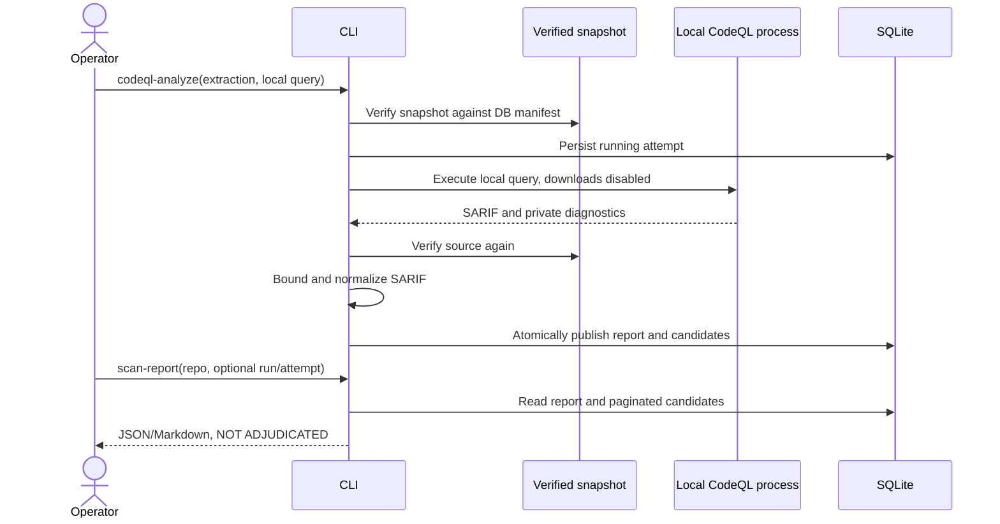

# Slice 03 — Static candidates and bounded evidence

Slice 02 is committed as `9ec6121`. This slice continues M2 with conservative call
resolution, bounded source reads, local CodeQL security queries and shareable candidate
reports. There are no LLM calls or claims of verified vulnerabilities.

## Main workflow

`source-evidence` verifies source and returns a requested line range separately. Neither
report retrieval nor call-context retrieval re-runs a parser, query or model.

## Implemented contracts

### Conservative call candidates

The v2 AST index records top-level exports, absolute imports and conservative binding
information. `call-context RUN_ID PATH --module-root ROOT` maps direct function names,
`from module import name as alias`, and `import module as alias` to a unique top-level,
undecorated function when the binding checks permit it. Both `module.py` and package
`module/__init__.py` are supported; a collision is unresolved.

Names bound more than once anywhere in a file are excluded, including arguments,
assignment/deletion, exception names and pattern captures. Star imports, explicit
global/nonlocal statements and recognized dynamic namespace operations disable candidates
for that file. This intentionally loses some recall while avoiding unsupported certainty.
Nested-function, relative-import, re-export, class dispatch and general alias resolution
remain unsupported. Comprehensions still use their enclosing inventory scope.

Each result is `static_candidate` or `unresolved`, with a digest-bound target reference
when available. The caller must supply the correct runtime module root. Import hooks,
monkey patching and external rebinding are excluded assumptions. This is a read-only
candidate overlay, not a persisted authoritative graph or a taint/reachability proof;
the base inventory and coverage counts continue to label calls unresolved.

Indexer version changes create a new generation. Historical coverage reports remain
available through `repo-report --run-id RUN_ID --index-id INDEX_ID`. No index is overwritten.

### Source evidence

`source-evidence RUN_ID PATH START END [--sha256 DIGEST]` returns an inclusive, one-based
line range, classification, snapshot/file digest and `trust=untrusted_source`. It validates
the full snapshot against its DB manifest before opening a manifest-listed file, verifies
the bytes read, respects Python encoding declarations, and rejects nonexistent ranges.
Limits are 1 MiB per input file, 200 lines and 32 KiB of UTF-8 output. There is no silent
truncation. This prepares a bounded context interface; future LLM prompts must still treat
all returned source and tool messages as untrusted data.

### CodeQL and SARIF

`codeql-analyze EXTRACTION_ID LOCAL_QUERY` requires a successful extraction and an
operator-controlled `.ql` or `.qls` entry outside snapshot storage. It runs with an explicit
SARIF 2.1.0 format, no automatic downloads, no source snippets/file contents, two threads,
a 2 GiB RAM hint, a restricted environment and a configurable process-group timeout.
The CLI version probe has a separate 10-second limit. Query stdout/stderr stays in private
logs. Dependencies must already exist locally; source never selects the queries.

Attempts record extraction/query identity, entry-file SHA-256, CLI versions, elapsed time,
exit code where available, log/SARIF paths and SARIF digest when normalized successfully.
Source and entry-file integrity are checked again before publication. The query hash does
not cover transitive libraries or compiled plans: production requires an immutable approved
pack bundle with a complete dependency digest and toolchain identity.

SARIF is limited to 16 MiB and 10,000 raw results. Structural failures reject publication
atomically. Exact duplicate results within the same snapshot/tool/rule are collapsed;
distinct flows/results are preserved. Suppressed candidates remain visible with a flag.
Normalized rows include rule, message, level, tool metadata, adjudication=`unreviewed`,
primary evidence reference, suppression flag and flow count. Full flows, secondary locations,
rule metadata and diagnostic messages remain in raw SARIF for subsequent triage work.

Only manifest-matching relative or in-root file URIs can bind evidence. Unsupported bases,
external paths and invalid primary regions remain unmapped and make a report partial;
they are never silently dropped. `snapshot_bound` means the file/digest is bound, not that
the SARIF line range has been verified; `source-evidence` performs that validation.

### Reports and persistence

Migration 0003 adds `scan_attempts` and `candidates`, including a unique fingerprint per
attempt. Reports and candidate rows commit together; a process death leaves a running
attempt with no published candidate rows. A subsequent attempt marks it interrupted.
`scan-report REPO_ID` selects the latest admitted run and latest attempt, including failures.
Use `--run-id` and `--attempt-id` for historical selection; selection enforces repository/run
ownership. There is no fallback to a previously successful report.

JSON supports dashboard ingestion; Markdown provides a shareable summary. Candidate
pagination uses database LIMIT/OFFSET with a maximum of 1,000 rows. All reports have
`security_verdict=not_adjudicated`, `verified_finding_count=null`, `coverage_verified=false`.
An empty successful result has `candidate_count=0`; failures have null, not zero.

Attempt states: `running`, `completed`, `partial`, `unavailable`, `launch_failed`,
`query_failed`, `timeout`, `invalid_output_or_integrity`, `interrupted`. Missing or failed
SARIF execution status, error notifications or unmapped locations prevent a completed
report. Warning counts remain explicit. Completion only describes query execution and
normalization, not vulnerability coverage. A valid empty report is never labeled clean.

`run-status` now adds `scan_status`; `analysis_performed` indicates a completed/partial
static query attempt, and `report_status=static_candidates_available` denotes its diagnostic
report. It makes no adjudication claim. Intake state remains separate.

## Local validation and blocker resolution

The installed CLI is now CodeQL **2.27.0**, with downloaded query pack
**codeql/python-queries@1.8.10** stored under ignored `work/codeql-packs`.
Its optional bundled `scc` baseline helper hung even on `--version`, causing the first
90-second extraction attempt to time out. No security controls were disabled. The explicit
`--skip-baseline` option selects CodeQL's supported `--no-calculate-baseline` flag and records
`baseline_requested=false`. With that option, extraction took about 3.6 seconds and the
CodeInjection query about 3.9 seconds on a tiny synthetic Flask/eval fixture, producing
one `py/code-injection` candidate. These times are smoke checks, not throughput estimates.

Resolved subsequently: the official GitHub 2.27.0 bundle was reinstalled with a verified
archive digest. Its `scc --version` succeeds, and VeriFlow extraction with baseline
counting enabled completed successfully in approximately 2.8 seconds. The launcher points
to `/opt/homebrew/opt/codeql-github/2.27.0/codeql/codeql`; bundled query packs are included.
`--skip-baseline` is no longer needed locally. Enterprise toolchain qualification should
validate bundled executables and pin the CLI and approved offline query packs.

Automated checks cover conservative bindings, aliases and module ambiguity; source bounds,
encoding, digest mismatch and tampering; old-index retrieval; URI mapping, malformed SARIF,
deduplication and diagnostics; query failure/timeout/partial/empty results; durable report
retrieval and no fallback to older successes; CLI output and schema migration regression.
Validation result: **102 tests passed**, Ruff lint/format checks passed, and wheel/source
distributions built successfully. The sole warning is the intentional duplicate-path ZIP
fixture inherited from Slice 01.

## Remaining boundaries and next slice

SQLite and local file locks remain the POC execution model. CodeQL processes are not a
hostile-code sandbox. Disk quotas, retention, orphan-process cleanup, PostgreSQL concurrency
tests and OpenShift Jobs remain future work. Per-file process launch and repeated full
snapshot verification favor integrity over throughput; no 1,000-repo/day claim is made.

Next: materialize bounded candidate evidence bundles including flow locations, then add
model adapters, budget accounting and adjudication with explicit abstention. The
50-repository benchmark labels remain outside scan inputs. Model integration will need
an approved endpoint/model identifier and a local secret configuration; none is needed for
the current deterministic slice.
