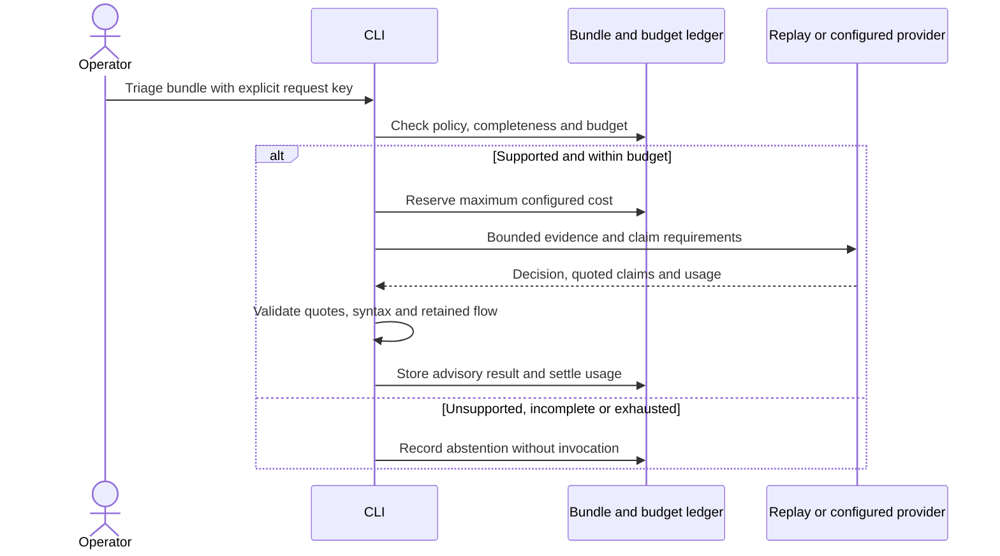

# Slice 05 — Source claim checks and explicit context expansion

Slice 04 is committed as `fd6bdb9`. This slice strengthens M2 evidence obligations and
adds operator-requested context expansion. It does not complete adjudication, establish
precision/recall, or demonstrate the production throughput target.

## Behavior

Non-abstaining decisions now include up to eight structured claims, each with obligation,
evidence ID, absolute start/end line, exact quote, assessment and explanation. Obligations
are source, sink, flow and guard. Unknown guard effectiveness is acceptable for review;
a likely-false-positive suggestion additionally needs a present guard and quoted
counterevidence. Neither disposition confirms or suppresses the original candidate.

The initial policies cover `py/code-injection` and `py/command-line-injection`. Source
syntax recognizes selected `request` attributes, `request.get_json` and `input`. Sinks
recognize `eval`/`exec`, `os.system`/`os.popen`, and selected subprocess calls with literal
`shell=True`. Aliases and other frameworks are outside this narrow vocabulary.

The gate checks quote membership in the cited line range, matching AST syntax outside
comments/string literals, and source/sink consistency with the first/last locations of
one retained SARIF thread. Guard/counterevidence syntax recognizes conditionals, asserts
and comparisons. These checks do not prove import bindings, attacker control, taint,
guard dominance/effectiveness, runtime reachability or semantic entailment. A passing
result is named `supported_for_review`; `reachability_proven` remains false.

Invalid claims produce `evidence_rejected` with an abstaining disposition, the proposed
decision and gate diagnostics retained. Usage is still accounted because invocation
occurred. Unsupported rules produce `unsupported_rule` without invocation or reservation.
Raw candidates remain available and unreviewed in all cases.



## Expansion and retrieval

`expand-bundle BUNDLE_ID REQUEST_JSON` accepts a JSON array of one to four objects:

```json
[
  {"path": "app.py", "line": 20, "end_line": 30, "reason": "Inspect surrounding validation"}
]
```

Paths must be snapshot-relative. Each range is 1–40 lines; the request is capped at
16 KiB. Snapshot/file digests are verified. New snippets receive stable evidence IDs,
and a content-addressed child records its parent, request and depth. Existing snippets
and original coverage gaps remain intact. Ranges already contained in an excerpt add
nothing. Repeating the same parent/request returns the same child.

Expansion permits at most two child generations and 16 total snippets, still capped at
16 KiB source and a 32 KiB bundle envelope. Exceeding a limit fails without publishing a
child. It cannot turn a partial bundle into a complete one. It has no model tools,
automatic retries or provider calls. Explicit child triage uses the original run budget.

`bundle-status` retrieves any parent or child. `check-evidence BUNDLE_ID DECISION_JSON`
checks a capped local decision without invoking a model or modifying the ledger.
`evidence-policy RULE_ID` describes the gate. `triage-report RUN_ID` includes each gate's
machine-readable checks, missing obligations and unknowns for downstream reporting.

## Compatibility and validation

No database migration is required; schema remains 0004. Builder version 2 retains flow
IDs, thread step positions and total step counts. Prompt version 2 requests claims;
gate version 1 participates in request identity. Historical bundles/reports remain
retrievable. Rebuild a version 1 bundle to obtain flow metadata and use a new request
key. Legacy replay decisions may omit claims, but non-abstentions then fail the gate.

The live response schema requires every root property, including claims, and forbids
additional properties, following the official
[Structured Outputs contract](https://developers.openai.com/api/docs/guides/structured-outputs).
Transport/schema tests are offline; no live provider call was made.

Validation: 149 tests passed, including forged quotes, comment/string matches, unrelated
or reversed flows, unsupported rules, immutable expansion, depth/source limits and
ledger accounting. The inherited duplicate ZIP fixture emits one expected warning.

Rebuilding the saved synthetic CodeQL 2.27.0 scan produced a ready version 2 bundle with
seven snippets and four flow steps. It also exposed a known conservative gap: CodeQL's
Flask trace starts at an import, while this gate requires recognized input syntax at
step zero. That trace cannot pass the current source obligation. Supporting modeled
sources requires an explicit mapping and regression fixtures; no relaxation is hidden
behind a passing status. This slice improves structural validation, not measured recall.

Next work includes modeled-source support, broader class policies, benchmark evaluation
with labels isolated from scanning, consolidated shareable reports, and gateway/Anthropic
integration. PostgreSQL concurrency, Redis scheduling, OpenShift isolation and throughput
measurements remain future work. No user action is currently needed for offline progress.
