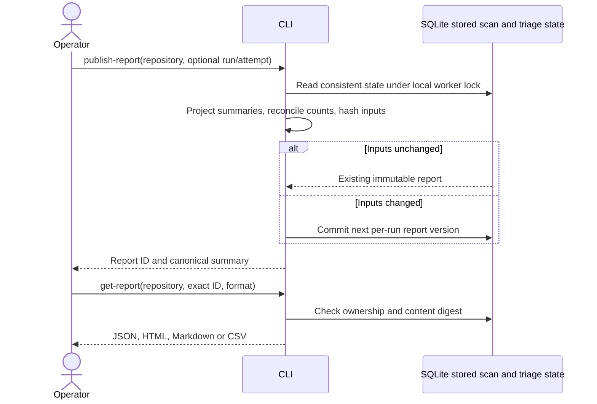

# Slice 07 — Immutable repository reports and exports

Slice 06 is committed as `4a6d363`. This slice implements the initial M2.8/M2.9 summary
publication and retrieval path. A report combines one stored analysis attempt with its
candidate-specific advisory history. It remains a candidate report, not an adjudicated
vulnerability report, and does not complete M2's finding-family or coverage obligations.

## Workflow and selection

`publish-report REPO_ID` selects the latest admitted run and latest analysis attempt.
`--run-id` and `--attempt-id` select historical state with ownership checks. No attempt
is represented as `not_started`, with unknown candidate count. Failed attempts do not
fall back to successful attempts. Report publication never runs analysis, reads source
files or invokes models, and cannot reconcile ambiguous provider charges.

`get-report REPO_ID --report-id ID` retrieves the exact immutable artifact. Without an
ID it selects the latest report version of the selected run (latest admitted run by
default). If a newer run has no report, or a newer attempt differs from the published
one, retrieval fails with instructions to publish or select an exact ID. There is no
`latest_completed` selector yet because the complete security gate is not implemented.
Later triage or status changes require explicit republication; polling never updates a
report. Freshness fields describe publication time, not current live state.

`report-history REPO_ID` lists IDs/versions with limit/offset pagination (maximum 1,000
entries per page). Exact IDs are suitable for sharing/retrieving a historical result.
An explicit historical publication can become the newest version for its run; default
retrieval still refuses it if it is not for that run's latest attempt.

## Contract and representation

Migration 0005 adds `published_reports`. Each row has a SHA-256 report ID over canonical
content, a per-run version, creation time, input digest and JSON content. Unique run/input
digests make identical publication idempotent. All reads for publication and its insert
share one database transaction under the existing local worker lock. A later report
never mutates an earlier one. This is local SQLite behavior, not distributed publication
certification; PostgreSQL concurrency remains future work.

The summary includes snapshot/profile, admitted owner, classification, selected and
latest-at-publication run/attempt IDs, execution status, candidate/diagnostic counts,
entry-query/SARIF digests, candidate evidence references, tool identity and advisory
history. Model/provider/config/request/gate identity and usage accompany triage entries.
The query digest still does not cover transitive pack dependencies.

Every candidate remains `unreviewed`, including tool-suppressed candidates and negative
advisories. The latest advisory is chronological (timestamp, then ID for ties), not a
consensus or resolution decision; prior entries remain in JSON and report details.
Replay status is explicit. Verified finding count is null and coverage verified is false.
Known zero candidates is distinct from an unknown count. Publication rejects count
disagreement, more than 10,000 candidate or call rows, or an output over 8 MiB rather
than silently truncating. Streaming large portfolio reports is deferred.

HTML is standalone, with a candidate table and expandable details, escaped text, no
scripts/assets and a restrictive content policy. Markdown has the same table and full
details with repository-controlled markup neutralized. JSON is canonical and contains
the complete summary projection. Default projections omit source excerpts, candidate
messages, model prose/quotes, endpoint configuration and local artifact paths. File
paths, rules, model IDs and repository metadata still require authorized sharing.

CSV exports are two separate tables:

| Format | Grain | Join and unknown semantics |
| --- | --- | --- |
| `scan-csv` | One row per report | `report_id`; candidate count null is an empty cell |
| `candidates-csv` | One row per candidate | `report_id` + fingerprint; no rows for zero/unknown candidates |

Always export the scan table so empty/failed scans remain visible. Both include schema,
report version, run, snapshot, analysis status, candidate count and coverage fields.
Candidate rows add rule/location, adjudication, latest advisory and replay indicator.
These are projections, not exports of all nested history. Spreadsheet-formula-like
cells receive an apostrophe prefix, including whitespace-prefixed formulas; JSON retains
exact values for consumers that need them. Accounted costs in JSON are scoped to the
selected attempt and split into simulated/live/unknown mode; they are not invoices or
the remaining per-run budget. Use `triage-report` for the full run ledger.

## Validation and remaining work

181 tests passed, covering immutable versions, idempotency, ownership, integrity, newer
failed attempts/runs, count mismatch, payload limits, empty scans, export escaping,
formula injection and CLI migration. The inherited duplicate ZIP fixture emits one
expected warning. The saved synthetic CodeQL scan published one candidate with two
replay decisions, 1,560 simulated micro-USD and zero live accounted cost. Exact retrieval
and repeated publication returned the same artifact. No paid provider call was made.

Remaining work includes reviewed finding identity/history across rescans, explicit
completion gates, richer investigator projections, benchmark scorecards, portfolio
exports, enterprise access control, PostgreSQL workers and OpenShift deployment. Local
repository ownership checks are not multi-user authorization. No throughput or quality
target has been measured by this slice.
