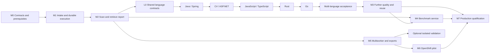

# Vulnerability discovery platform — implementation plan

**Version 0.2 — 10 September 2026**
**Basis:** [System design v0.2](../architecture/system-design.md).
**Status:** Proposed delivery plan. Implementation is underway; see the
[progress assessment](../development/progress.md) and slice documents for delivered scope.
No benchmark or production capacity qualification has been completed.

**Priority change:** Language and framework coverage is now the immediate delivery priority.
Java/Spring, C#/ASP.NET, JavaScript/TypeScript, Rust and Go take precedence over additional
CLI conveniences, presentation formats, history commands and storage tooling. Slice 37 adds an initial dependency-free Java static profile; the full requested
language/framework targets remain open.
The Python-only vertical slice is the foundation, not the revised POC completion target.

## 1. Delivery objective

Deliver a usable laptop POC first, then prove quality, reliability and OpenShift compatibility before committing to fleet throughput. The first product milestone ends with a readable report that can be retrieved for a specific repository. The later evaluation milestone generates a benchmark scorecard against the supplied 50 repositories and their known vulnerabilities.

The system design contains the leadership use cases and architectural diagrams because those explain the product regardless of implementation order. This plan translates them into work packages, dependencies, demonstrations and acceptance gates.

### Milestone overview

| Milestone | Demonstration | Exit decision |
|---|---|---|
| M0 — Contracts and prerequisites | A pinned local environment and agreed evidence/report schemas | Can the first supported language run safely on the laptop? |
| M1 — Intake and durable execution | Submit CSV/archive inputs, inspect accepted items, stop/resume a run | Is source identity and work state reliable? |
| M2 — Complete scan-to-report slice | Scan a fixture, retrieve a readable report, inspect evidence and gaps | Is the first POC useful end to end? |
| M3 — Quality and efficient reuse | Find harder cases, reject benign lookalikes, compare a rescan | Does AI add measured value over static analysis? |
| M4 — Benchmark reporting | Run a frozen configuration against supplied ground truth and export a scorecard | Can quality and regressions be measured honestly? |
| M5 — Multiworker operation and dashboard export | Recover from failures and export consistent portfolio data | Can work scale without duplication, leakage or uncontrolled spend? |
| M6 — OpenShift pilot | Run under approved identities, images, storage and network policies | Is the architecture feasible inside the enterprise? |
| M7 — Production qualification | Sustain representative daily throughput and pass quality/recovery gates | Is rollout justified by measured results? |

M0–M2 describe the original Python foundation. The revised POC also requires the language
coverage track below, including per-language extraction, reporting and evidence acceptance.
M4 integrates the existing benchmark; it does not require constructing a new corpus.
M5–M7 prove operational readiness. Isolated reproduction remains optional; approved
compiled-language extraction builds are separate from exploit reproduction.

## 2. Implementation order and dependencies

### Immediate priority: multi-language POC

Deliver the following sequence before discretionary CLI refinement. The order starts with
Java/Spring and C#/ASP.NET, then follows the requested JavaScript/TypeScript, Rust and Go
coverage. Qualify tool availability for all targets in L0 so an environment blocker can be
identified early. If one language is externally blocked, continue the next language while
recording the exact prerequisite; do not fill the gap with unrelated CLI polish.

| Priority / subpackage | Deliverable | Completion evidence |
|---|---|---|
| L0 / M3.1a — Shared language foundation | Language/module discovery, adapter contracts, explicit capability matrix and language-specific readiness; preserve Python adapter | Mixed-language fixture selects distinct adapters and cannot inherit a Python-only successful-completion gate |
| L1 / M3.1b — Java and Spring Framework | Java extraction/query/index adapter; Spring MVC/Boot request binding, service flow and representative guards; explicit WebFlux support/gaps | Real pinned Java and Spring vulnerable/fixed/incomplete fixtures; Maven and Gradle profiles qualified separately |
| L2 / M3.1c — C# and ASP.NET | C# adapter; ASP.NET Core MVC/minimal APIs and a distinct classic ASP.NET MVC/Web API qualification lane | Real .NET fixtures, framework-bound evidence, safe parameterization cases and explicit platform/build blockers |
| L3 / M3.1d — JavaScript and TypeScript | Shared CodeQL extraction with separate JS/TS coverage; Node/Express request handling and declared browser-source scope | JS and TS fixtures both pass; module resolution, asynchronous flow and source-map/generated-code gaps are reported |
| L4 / M3.1e — Rust | Rust adapter with pinned extractor/query packs; initial standard-library and explicitly selected web-framework model scope | Real Cargo fixture, vulnerable/benign flows, macro/build-script/dependency limitations and resource measurements |
| L5 / M3.1f — Go | Go adapter; modules, net/http request sources and explicitly selected router coverage | Real Go module fixture, handler-to-sink evidence, build-tag/generated-code/cgo gaps and resource measurements |
| L6 / M3.1g — Multi-language acceptance | Mixed repositories, language-aware reports/benchmark applicability and shared cost controls | No unsupported component disappears from coverage; exact retrieval and bounded triage work for every qualified target |

These subpackages replace the former single Java/Spring expansion item M3.1; they are real
additional scope, not seven equally sized tasks. They can span multiple implementation
slices. Do not schedule a new convenience command merely to produce another numbered slice.

**Delivered initial slice:** Slice 37 adds language selection/coverage contracts and a
real dependency-free Java extraction-to-candidate/report fixture. L0 and L1 remain partial.
Slices 38–39 add bounded Java syntax indexing and Spring annotation observations;
semantic resolution and runtime bindings remain unqualified.
Slice 40 adds a real source-only Spring-style SQL path fixture matrix.
Slice 41 enables a narrow Java SQL advisory policy; broader evidence remains open.
Slice 42 supports complete Java context assembled from bounded evidence expansions.
Slice 43 adds Java-only copied-source scanning for Maven/Gradle layouts; builds remain
unqualified. Next: establish isolated build execution and approved dependency access
for L1. If externally blocked, continue C#/ASP.NET L2 as specified above.
Slice 44 adds opt-in single-language auto selection. L6 still requires query routing,
per-language fan-out and consolidated repository reporting.
Keep existing operator entry points and add options only where language selection or
safe build-profile selection requires them.

**Deferred until coverage delivery:** new cosmetic HTML/CSV variants, additional history
views, CLI convenience wrappers and automated storage cleanup. Fix correctness, security,
data-loss and blocking usability issues immediately. Maintain the guide for changed
language workflows; the existing API-guide delivery requirement remains attached to the
first hosted API. Do not build an API solely to bypass this priority decision.

### What counts as language support

Track each language/framework/version at four distinct levels: detected, statically
analyzed, evidence/triage supported, and fixture-qualified. Installing an extractor or
producing a SARIF file alone is not complete support. For every target:

1. Pin the toolchain, query/model packs and approved build profile. Inventory modules,
   source roots, generated/vendor/test exclusions and unsupported components explicitly.
2. Produce a real CodeQL database and queries with diagnostics, then normalize candidates
   and retain exact source locations/flows. Qualify syntax indexing and retrieval for that
   language; do not parse it with Python AST or reuse Python-only evidence rules.
3. Implement a small published rule/CWE matrix with language/framework source, sink and
   counterevidence checks. Start with applicable injection, path traversal and SSRF cases;
   only claim classes backed by fixtures. Unsupported rule classes stay reportable static
   candidates with explicit unsupported triage, never silently discarded or confirmed.
4. For each claimed class, retain vulnerable, fixed/benign and ambiguous/incomplete cases.
   Exercise parameterization, validation/encoding where applicable, aliasing, wrappers and
   missing dependencies/models. Models remain advisory and must cite retained evidence.
5. Retrieve the resulting immutable report by repository/run, with per-language coverage,
   build mode, diagnostics, gate/rule versions and cost/time. Test at least one mixed-language
   repository with one blocked component; no aggregate clean/successful-security claim.

### Enterprise-compatible extraction and model use

Prefer a supported no-build extraction mode where it provides adequate declared coverage;
qualify each pinned language/tool combination rather than applying Python's `build-mode=none`
globally. Where a build is necessary, use fixed, operator-approved Maven/Gradle, .NET, Go or
Cargo profiles in isolated runners with bounded CPU/RAM/time/disk. Treat build plugins,
generators, macros and restore hooks as source execution. Never execute arbitrary build
commands from CSV metadata. Keep source mounts read-only, build output separate and LLM
credentials unavailable to extraction jobs. Use approved offline caches/internal mirrors;
dependency resolution failure produces an explicit blocked/partial result, not internet fallback.

Qualify classic ASP.NET separately from ASP.NET Core. A legacy project requiring Windows
or unavailable reference assemblies must receive a supported restricted extraction path
or an approved external build-runner path; Linux/OpenShift support must not be implied.
Record this prerequisite early, continue other targets if blocked, and keep classic ASP.NET
as an open acceptance obligation rather than silently treating Core coverage as equivalent.

Python remains the orchestration language. Reuse intake, immutable artifacts, budgets,
report retrieval, PostgreSQL-ready domain contracts and provider adapters. Each language
implements indexing/analysis/evidence contracts. Use one sub-analysis per selected language
and module scope; do not infer cross-language reachability across HTTP/RPC/FFI boundaries.
Record those boundaries as unknown unless independently modeled and tested.

Run deterministic extraction, queries and candidate deduplication before bounded LLM
triage. Reuse valid indexes/bundles with language, toolchain, pack and source dependencies
in their identities. Do not send entire repositories to models. Measure extraction/query
latency, peak resources, candidate counts, model tokens and configured cost by language;
keep recall-preserving ablations separate from cheaper-but-less-complete configurations.

### Tooling feasibility checkpoint (10 September 2026)

Local `codeql resolve languages --format=json` on CodeQL 2.27.0 lists `java`, `csharp`,
`javascript`, `rust` and `go`. This establishes extractor presence only, not installed query
packs, usable build dependencies or qualified TraceProof adapters. TypeScript uses CodeQL's
JavaScript extractor. Validate these details at L0 against the pinned local toolchain and
record supported framework/runtime versions in the capability matrix.

Primary references: [CodeQL supported languages/frameworks](https://codeql.github.com/docs/codeql-overview/supported-languages-and-frameworks/)
and [compiled-language build modes](https://docs.github.com/en/code-security/concepts/code-scanning/codeql/codeql-for-compiled-languages).
Vendor support is a starting point; TraceProof's fixture-qualified scope is the release claim.

Benchmark schema and synthetic matcher tests start before M4; the formal comparison waits for a stable M3 configuration and authorized dataset availability. PostgreSQL contract testing starts before M5, although fleet hardening is delivered there. OpenShift compatibility checks start in M0; full deployment is M6. These early checks prevent expensive late surprises without blocking the first vertical slice on enterprise integrations.

For one implementer, follow the immediate language sequence above using the delivered
Python foundation; do not wait for every historical M0–M2 gap to close. Baseline benchmark
contracts can evolve as necessary for language acceptance. Discretionary reporting and
runtime conveniences wait behind language coverage. Separate services are not required
merely because languages use separate adapters.

## 3. Cross-cutting implementation rules

1. **Keep state transitions deterministic.** A model proposes evidence and a verdict; application policy owns the accepted transition.
2. **Pin source and analysis inputs.** Every result names its source snapshot, profile, tools, rules, models and gate versions.
3. **Represent incomplete work explicitly.** Failed extraction, unsupported languages, expired budgets and unknown reachability cannot produce a clean result.
4. **Preserve observations.** Current finding state is a projection over immutable decisions and evidence; reviewed reports are versioned artifacts.
5. **Use a small set of contracts.** Local and OpenShift runners, SQLite and PostgreSQL stores, and different model providers implement common interfaces without pretending their operational behavior is identical.
6. **Separate source execution from authority.** Builds and PoCs do not run with provider credentials, general database access or job-creation rights.
7. **Measure savings and losses.** Any pruning, caching or model-tier change is tested for missed findings as well as token reductions.
8. **Keep benchmark answers out of scans.** Only the evaluator reads ground-truth labels.

Maintain a requirement-to-test register linking the design's Foundry adaptations and use cases to enforcing code and tests. A milestone is complete only when its acceptance evidence is saved, not simply when its tasks are checked off.

## 4. M0 — Contracts, fixtures and prerequisites

**Dependencies:** None.
**Use cases:** Foundation for all.
**Lead responsibility:** Implementer; later reviewed with AppSec/platform owners.

### Work packages

| ID | Work | Deliverable |
|---|---|---|
| M0.1 | Verify laptop architecture, disk/RAM, container runtime and CodeQL language support | Reproducible environment and compatibility notes |
| M0.2 | Scaffold Python package, dependency lock, lint/type checks and test entry points | Minimal application skeleton; no agent-framework dependency |
| M0.3 | Define run/task/verdict/validation states and completion rules | Typed domain schemas and transition tests |
| M0.4 | Define source snapshot, evidence reference, finding identity and report schemas | Versioned JSON contracts and representative fixtures |
| M0.5 | Define adapters for source, artifacts, runner, model and publisher | Protocols and adapter contract tests |
| M0.6 | Select small authorized vulnerable/fixed source fixtures | Pinned manifests and expected assertions |
| M0.7 | Define a benchmark manifest and label interface without loading bank data | Synthetic label examples, evaluator-access boundary |
| M0.8 | Record downstream Foundry amendments and initial support matrix | Architecture decision records with test obligations |

### Acceptance

The local runner analyzes a small supported fixture with the chosen CodeQL toolchain. Mock model responses can drive the domain state machine without a live provider. Evidence and report schemas reject missing revision IDs and malformed references. The initial profile declares supported languages and does not silently imply broader coverage.

Do not select exact enterprise model IDs, retention settings, issue trackers or storage classes by guess. Keep them as named configuration bindings. No bank source or labels are required at this milestone.

## 5. M1 — Intake and durable execution

**Dependencies:** M0.
**Use cases:** UC-01 and basic UC-08.

### Work packages

| ID | Work | Deliverable |
|---|---|---|
| M1.1 | Implement CSV validation and row-level import results | Import API/CLI with stable IDs and idempotency keys |
| M1.2 | Implement read-only local archive intake and safe unpacking | Digest-pinned snapshots and inventory manifests |
| M1.3 | Implement Git retrieval with explicit revision resolution | Commit-pinned source adapter and omitted-content records |
| M1.4 | Implement local immutable artifact store | Staging, integrity verification, atomic publication and orphan cleanup |
| M1.5 | Implement SQLite state persistence and single-writer scheduling | Tasks, attempts, checkpoints, retries and run status |
| M1.6 | Implement explicit pause/resume/cancel controls | Audited state transitions and resumable boundaries |
| M1.7 | Start PostgreSQL schema/migration contract checks | Early proof that portable domain data can persist in both databases |

### Acceptance

Submit a manifest with valid and invalid rows; valid items progress independently and each invalid item explains its rejection. Reimport with the same key does not create duplicate work. Archive traversal, escaping links, duplicate paths and expansion-limit violations are rejected. Mutating the intake directory after snapshot creation cannot change analyzed source.

Kill the local worker after a persisted checkpoint and resume it without losing completed work. API polling never executes analysis. No archive or Git metadata may inject a build command or select arbitrary credentials.

**Demonstration:** Import two fixtures through CSV, inspect accepted rows, stop a run, resume, and show the same immutable snapshot ID throughout.

## 6. M2 — Complete scan-to-report vertical slice

**Dependencies:** M1.
**Use cases:** UC-02, UC-03, minimal UC-05/UC-06.

### Work packages

| ID | Work | Deliverable |
|---|---|---|
| M2.1 | Implement deterministic Python function inventory and supported call resolution | Queryable symbols and explicit unresolved edges |
| M2.2 | Wrap CodeQL database creation, query execution and SARIF/diagnostic ingestion | Versioned raw analysis artifacts and normalized candidates |
| M2.3 | Implement index health gate and coverage obligations | Empty/failed extraction cannot release a successful-completion gate |
| M2.4 | Build compact context bundles and a minimal security map | Source-grounded entry points, calls, guards and unknowns |
| M2.5 | Implement mock and first live model adapter behind policy configuration | Structured output, usage capture and refusal/truncation handling |
| M2.6 | Implement bounded triage and class-specific evidence checks | Supported verdict transitions plus counterevidence |
| M2.7 | Implement finding family/occurrence identity and decision history | Idempotent records across repeated scans |
| M2.8 | Implement report materialization and retrieval | Self-contained HTML, Markdown and canonical JSON; raw SARIF available |
| M2.9 | Implement a small findings/scan CSV export | First machine-readable projection for generic dashboard consumption |
| M2.10 | Implement single-worker cost reservation and stop rules | Per-call accounting and honest budget-exhausted status |

### Initial API/CLI surface

**Operator documentation delivery:** Publish the first task-oriented CLI guide once the
local scan-to-report flow is stable (delivered in Slice 15; see
[CLI operator guide](../guides/cli-operator-guide.md)). Include a verified synthetic
walkthrough, ID handoffs, status interpretation, safe retries, budgets, evidence/reviews,
report selection/export and local recovery. Refresh it whenever a slice changes a user
workflow, command, schema or operational limit; CLI `--help` remains the argument reference.

Deliver `docs/guides/api-operator-guide.md` with the **first hosted API**, even if API
delivery occurs before M5. OpenAPI alone is insufficient for the workflow: the companion
guide must demonstrate authentication and repository scope, submission and idempotency,
asynchronous status polling, partial/failed outcomes, retry rules, exact report retrieval,
freshness disclosure, evidence access, pagination and dashboard exports. Use runnable
synthetic request/response examples verified against that implementation, with no invented
routes or credentials. Link to its generated OpenAPI reference and supported API version.
No HTTP API currently exists, so this API guide is a planned deliverable, not a usable
interface description. Expand both guides for multiworker recovery in M5 and approved
identity, egress, retention and deployment operations in M6 before pilot acceptance.

Use the report semantics in design §20. The first implementation needs import submission/status, scan status, a scan request, historical scan listing, exact report retrieval, and explicit latest-completed/latest-attempt selection. A CLI calls the same application operations; it should not implement a second workflow.

Reports start with source revision, owner, completion/coverage and action priorities. Detailed source evidence is linked or expandable. Escape repository content in HTML. Default exports exclude raw secrets, prompts and internal infrastructure identifiers.

### Acceptance

- A seeded vulnerability produces a confirmed report with valid evidence; its fixed counterpart is not published as the same vulnerability.
- Deliberate extraction failure produces a partial report, even with zero candidates.
- An authorized exact report lookup returns the same immutable report version with no model or CodeQL call.
- Latest-completed retrieval discloses a newer partial/failed attempt rather than presenting an outdated report as current.
- HTML/Markdown/JSON/CSV counts and coverage agree for the same report/audience.
- A refusal, invalid model JSON or missing citation produces an explicit error/uncertainty outcome, not an inferred safe verdict.
- A run that reaches its cost cap stops new calls and records remaining obligations.

**Demonstration:** Scan vulnerable and fixed fixtures, retrieve each by repository/run, inspect one evidence path and one coverage gap, and open the exported summary in a generic tabular consumer. This is the minimum useful laptop POC.

## 7. M3 — Discovery quality, framework support and efficient rescans

**Dependencies:** M2.
**Use cases:** UC-02, UC-04 and UC-05.

### Work packages

| ID | Work | Deliverable |
|---|---|---|
| M3.1a–g | Deliver the prioritized language track in §2: shared contracts, Java/Spring, C#/ASP.NET, JS/TS, Rust, Go and mixed-language qualification | Per-language extraction/index/evidence adapters, approved builds and fixture-qualified coverage matrix |
| M3.2 | Model representative custom sources, sinks, propagation and guards | Versioned framework models with vulnerable/benign tests |
| M3.3 | Add independent exploration and rule applicability accounting | Exploration that runs even when CodeQL finds nothing |
| M3.4 | Add selective independent review and second-provider adapter | Evidence-oriented escalation with approved fallback policy |
| M3.5 | Add deterministic dependency/secret adapters | Separate component-risk and secret-evidence contracts |
| M3.6 | Implement layered caches and conservative dependency invalidation | Reuse manifests with version/context dependencies |
| M3.7 | Implement run comparison and source freshness | New/persisting/resolved/reopened/not-comparable outcomes |
| M3.8 | Add human review, suppression expiry and rule-gap records | Audited decisions and proposed detection improvements |
| M3.9 | Add measured token/latency controls and context-expansion budgets | Cost/quality ablation results |

### Acceptance

Find a known fixture missed by the configured baseline through a framework model or independent exploration, with valid evidence. Test dynamic dispatch and an absent library model: both must preserve uncertainty rather than invent negative reachability. Test a second occurrence of the same weakness inside one function: it must not disappear through family deduplication.

Change a guard/helper and verify dependent findings are reconsidered. Change only line positions and verify stable finding identity. A report comparison must not mark a finding resolved if extraction or the relevant check failed. Repeated unchanged input creates no duplicate findings.

Compare baseline versus enhancements at equal profile/budget on development fixtures, recording detections, misses, adjudicated false positives and token consumption. Do not accept a token-saving feature solely because it is cheaper.

**Demonstration:** Show one useful additional discovery, one benign lookalike correctly rejected, one unresolved case honestly labeled, and a rescan delta with cache savings and validity evidence.

## 8. M4 — Supplied 50-repository benchmark and scorecard

**Dependencies:** M2 report contracts; M3 candidate configuration for the formal comparison.
**Use case:** UC-07.
**Execution prerequisite:** Authorized access to the supplied repositories, exact versions and known-vulnerability records. This can occur inside the bank rather than on the laptop.

### Work packages

| ID | Work | Deliverable |
|---|---|---|
| M4.1 | Import benchmark manifest and label records separately | Dataset/label versions, source pins and evaluator-only label access |
| M4.2 | Validate revision alignment, scope and label identity | Data-quality report covering all 50 repositories |
| M4.3 | Freeze baseline and candidate scan configurations | Reproducible run manifests and comparison budgets |
| M4.4 | Dispatch normal scans without labels | Predictions, candidate-stage results, coverage, errors, usage and timing |
| M4.5 | Implement deterministic matching and adjudication queue | One-to-one assignments, ambiguous matches and unjudged findings |
| M4.6 | Calculate aggregate/per-repository/per-class metrics | Explicit numerators, denominators and evaluation completeness |
| M4.7 | Materialize benchmark HTML/Markdown/JSON and CSV scorecards | Retrievable benchmark reports and dashboard tables |
| M4.8 | Add model/rule/configuration regression comparison | Version-to-version quality and cost changes |

### Ground-truth handling

Retain separate source manifests and labels so a scan task cannot accidentally load the answers. All 50 repositories appear in the execution-status table, even if some fail to build or are unsupported. Validate that known vulnerabilities apply to the pinned revisions; stale labels need correction or explicit qualification.

Match on repository, revision, structural location, compatible weakness and root cause, with a declared vulnerability unit. Multiple duplicate predictions cannot earn multiple true positives. Additional findings that are not listed in ground truth remain unjudged until reviewed. Do not present their count as false positives.

Report candidate recall and published recall separately so losses introduced by triage are visible. The main known-positive recall denominator includes all in-scope labeled vulnerabilities, including missed cases in failed scans. A secondary successfully-evaluated-subset metric must show its different denominator. Label ambiguity is disclosed rather than resolved by silent exclusion.

Define repository/family-aware development and holdout partitions after inspecting the dataset. Record any tuning exposure. Report uncertainty with the sample-size and within-repository correlation limitations; 50 repositories do not guarantee a precise estimate for every language or vulnerability class.

### Acceptance

Before real execution, synthetic evaluator tests include: an exact match, duplicate predictions, two flaws in one function, an ambiguous match, a novel unlisted finding, a missing/failed repository and mismatched source revision. Verify expected numerators/denominators and no label access from scan workers.

The real benchmark report must reconcile every supplied repository and every in-scope ground-truth record, clearly identify unjudged predictions, and state whether precision adjudication is complete. A configuration comparison must use the same dataset and disclose scope/budget differences.

**Demonstration:** Retrieve a scorecard showing baseline versus enhanced detection, drill into matched and missed known vulnerabilities, inspect unsupported/failed cases, and export a machine-readable comparison. Performance results are produced here, not assumed in this plan.

## 9. M5 — Multiworker reliability, GCS and portfolio exports

**Dependencies:** M2 stable contracts; M3 cache/identity rules as those features are enabled.
**Use cases:** UC-01, UC-03, UC-06 and UC-08.

### Work packages

| ID | Work | Deliverable |
|---|---|---|
| M5.1 | Implement PostgreSQL atomic claims and lease epochs | Multiworker scheduling and stale-writer fencing |
| M5.2 | Add independent heartbeat supervision and persistent retry schedules | Recovery without runtime-based false death detection |
| M5.3 | Implement shared budget reservations and Redis backoff | Fleet-wide cost safety and provider coordination |
| M5.4 | Implement controller/job intent reconciliation and outbox | Idempotent job dispatch and report publication |
| M5.5 | Implement GCS acquisition and warm-cache reuse | Generation-pinned downloads, integrity checks and retrieval accounting |
| M5.6 | Add asynchronous portfolio exports with snapshot consistency | Scan/finding/coverage/benchmark datasets and export manifest |
| M5.7 | Add repository/domain authorization and export audit | Authenticated retrieval and no cross-domain cache/data leakage |
| M5.8 | Add operational metrics, backlog views and recovery commands | Stage timing, resource/cost metrics and actionable blockers |

### Acceptance

Kill workers while claiming, analyzing, writing artifacts and finalizing reports. Partition a worker from PostgreSQL and ensure its old epoch cannot overwrite a new attempt. Lose Redis and verify budgets/work survive. Simulate a provider timeout that may have incurred charges; reservations remain conservative. Simulate a timed-out external report creation and ensure reconciliation precedes another create.

Run concurrent report pagination/export while scans complete; one export must contain one consistent data snapshot. Verify standard/deep, historical/current and new/persisting finding counts cannot be accidentally mixed. Enforce HTML escaping, CSV formula defenses and repository access on all representations, download paths and artifacts.

GCS tests first use a fake adapter and then a configured authorized test bucket. A changed object generation invalidates reuse. No source-bucket lifecycle changes are part of this feature.

**Demonstration:** Process several repositories concurrently, terminate a worker, observe recovery, retrieve reports during processing, and load a governed portfolio export into an approved dashboard tool or a generic contract-test consumer.

## 10. M6 — OpenShift feasibility and enterprise pilot

**Dependencies:** M5.
**Use cases:** All core use cases in the target environment.
**External dependencies:** Approved cluster, image registry, storage, identities, gateway and network paths.

### Work packages

| ID | Work | Deliverable |
|---|---|---|
| M6.1 | Build approved images with pinned CodeQL/query/toolchain dependencies | Signed image references and dependency inventory |
| M6.2 | Implement OpenShift runner using approved job templates | Durable task-to-job reconciliation |
| M6.3 | Validate restrictive UID/security context, scratch and PVC topology | Working source-only scan without privileged fallback |
| M6.4 | Integrate SSO, service identities, managed secrets, proxies and CAs | Environment-specific bindings and negative access tests |
| M6.5 | Enforce egress boundaries across intake, analysis and models | Tested allowlists, denied destinations and no metadata access |
| M6.6 | Configure retention, audit export, backups and restore procedure | Approved policy bindings and restoration evidence |
| M6.7 | Run a limited portfolio pilot | Real build/runtime/latency/storage measurements |

### Acceptance

The API remains responsive while analysis jobs run. Source-executing pods cannot access model keys, the control database, arbitrary job creation or unrelated sources. Approved storage supports concurrent jobs and persistent report retrieval. Job eviction/restart does not lose completed artifacts or create duplicate accepted results.

Test model endpoint/classification policy with denied combinations as well as allowed ones. Validate that the actual cluster security settings and connectivity enforce the design; a manifest that merely declares those settings is insufficient evidence.

**Demonstration:** Run an authorized small portfolio end to end on OpenShift, retrieve reports through enterprise identity, view export data, and show one controlled failure/recovery scenario.

## 11. M7 — Quality, capacity and operational qualification

**Dependencies:** M3, M4 and M6.
**Use cases:** Fleet operation across UC-01–UC-08, excluding optional runtime features not enabled.

### Work packages

| ID | Work | Deliverable |
|---|---|---|
| M7.1 | Census representative portfolio sizes, languages and build systems | Measured workload classes and source freshness requirements |
| M7.2 | Replace design sizing assumptions with measured distributions | CPU/RAM/I/O, token entitlement and cost forecast |
| M7.3 | Tune fair queues and resource classes | No starvation of large jobs; bounded downstream backlogs |
| M7.4 | Run representative sustained and cold-cache load scenarios | Seven-day service report with fresh/incremental/reused counts |
| M7.5 | Ratify benchmark quality thresholds and rollback gates | Release scorecard and approved configuration |
| M7.6 | Exercise backup restoration and infrastructure/provider failures | RPO/RTO evidence and operational runbook |
| M7.7 | Finalize support ownership and staged rollout | On-call responsibilities, incident response and canary/rollback plan |

### Acceptance

Meet the design's proposed 1,000-standard-evaluations/day target over a representative seven-day test without an expanding backlog, inside the agreed resource envelope. Report fresh full, incremental and unchanged reuse counts independently. Include a cold-cache scenario and measure p95/p99 latency rather than extrapolating from mean job times.

The 50-repository benchmark measures discovery quality, not by itself fleet capacity. Fifty representative scans repeatedly replayed can help stress the scheduler, but cache-hit replay alone cannot prove capacity for 1,000 distinct fresh repositories.

Ratify the published-precision gate and per-class recall requirements using adjudicated benchmark evidence. Disclose novel/unjudged findings and unresolved label issues. Demonstrate that report and coverage counts reconcile, existing reports remain retrievable during degraded analysis, and recovery does not duplicate publications.

**Demonstration:** Present a leadership scorecard with quality, freshness, coverage, cost, sustained throughput, operational incidents and remaining limits. Approve rollout by measured scope rather than asserting all languages or repository sizes are supported.

## 12. Optional extension — independent runtime validation

**Dependency:** Stable evidence pipeline and an approved isolation/testbed capability. This is not on the source-only POC critical path.

Implement a testbed manifest with snapshot/build identity, synthetic test credentials, permitted actions, reset procedure and observable success criteria. Separate reproduction-artifact authoring from a fresh verifier. The controller schedules validation; the verifier cannot grant itself scope or modify production targets.

Tests distinguish payload acceptance, mechanism reproduction and actual headline impact. Only the last, observed independently in the configured testbed, sets the machine reproduction flag. Failed or blocked validation leaves the code-based verdict intact and creates a new report version with the observed result.

If the enterprise cannot provide sufficient isolation, retain source-only findings and the explicit `no-testbed`/`blocked` status. Do not request privileged container exceptions automatically as an implementation shortcut.

## 13. Report and benchmark contract checklist

These contracts are established early and extended additively through milestones:

| Contract | Required fields/behavior | First delivery |
|---|---|---|
| Source snapshot | Repository, commit/digest, provenance, classification and manifest | M1 |
| Finding evidence | Snapshot-bound references, entry/boundary/impact, controls and uncertainty | M2 |
| Repository report | Immutable ID/version, run/profile, source, as-of time, findings and coverage | M2 |
| Report selection | Exact historical version or explicit latest-completed/latest-attempt | M2 |
| Run comparison | Stable identity, compatible scope and conservative resolution logic | M3 |
| Benchmark label | Label ID, repository/revision, root cause/location and applicability | Schema M0; operational M4 |
| Benchmark result | Dataset/configuration version, per-case status, numerators/denominators and adjudication state | M4 |
| Portfolio export | Schema version, snapshot IDs, audience/filters, data grain and row counts | Basic M2; fleet M5 |
| Authorization | Repository/domain checks on API, artifacts, evidence and downloads | Local boundary M2; enterprise M5–M6 |

Unknowns must be represented as unknowns, not zeros. Formats agree within the same authorized audience. Internal investigator evidence and owner-facing summaries are different projections, with explicit visibility rules.

## 14. Validation strategy

### Test layers

| Layer | Purpose | Runs when |
|---|---|---|
| Domain tests | State transitions, gates, identity and budget arithmetic | Each relevant code change |
| Adapter contracts | Equivalent artifact/report/model/store behavior | Adapter changes; both DBs where applicable |
| Security boundary tests | Archive handling, authorization, rendering and egress denial | Boundary changes and release checks |
| Integration tests | Real CodeQL, databases, jobs and report retrieval | Milestone/release verification and relevant changes |
| Evaluator tests | Correct matching, denominators and label isolation | Benchmark implementation changes |
| Quality evaluations | Actual detection and publication performance | Model/prompt/rule/gate changes |
| Failure/load tests | Recovery, fencing, throughput and resource behavior | M5 onward, then material operational changes |

Use deterministic model fixtures for workflow tests so routine engineering tests do not require live tokens. Live model evaluations are a separate, budgeted suite. Log model/configuration identity and retain evidence for comparisons; stochastic results should not be disguised as perfectly reproducible outputs.

Do not rerun the full 50-repository suite for a cosmetic report change. Do rerun relevant held-out quality checks for changes to retrieval, truncation, filters, rules, model routing, evidence gates or reuse validity. Formal release comparisons use the frozen benchmark configuration and declared budget.

### Definition of done for a work package

The code and schemas are committed; meaningful tests pass; the associated use case is demonstrated; failure and incomplete-state behavior is documented; migrations/version compatibility are addressed; resource and token effects are recorded when material. Any unmet acceptance criterion remains an explicit open item rather than a hidden assumption.

For user-visible changes, update the applicable CLI/API guide and verify affected
walkthrough examples. OpenAPI schema generation does not replace operator documentation.

## 15. Historical foundation backlog and revised next work

The following was the original foundation sequence; much is now delivered. It is retained
for traceability, not as the current queue:

1. Create the Python project and lock dependencies; verify the local CodeQL/runtime combination.
2. Implement the domain models for repository, snapshot, run, task, evidence, finding and report.
3. Implement SQLite persistence and local immutable artifact publication.
4. Add CSV/local-archive intake and safe snapshot validation.
5. Implement one supported-language static-analysis adapter with extraction diagnostics.
6. Implement the mocked triage contract, evidence gate and coverage accounting.
7. Materialize and retrieve HTML/Markdown/JSON reports by repository and run.
8. Prove the vulnerable/fixed/partial fixtures, then add the first configured live model adapter and usage accounting.

The current queue is L0 → Java/Spring → C#/ASP.NET → JavaScript/TypeScript → Rust → Go →
mixed-language acceptance, as defined in §2. Retain CSV/archive intake for the language
work; Git/GCS acquisition is not a prerequisite. Integrate the supplied corpus when
authorized and available, reporting per-language/per-framework and per-CWE applicability
with denominators that retain blocked/missing cases. Do not use labels to route scan discovery.

## 16. Decisions and risks to track during implementation

| Risk or open decision | Implementation response | When it must be settled |
|---|---|---|
| Exact benchmark source revisions/label completeness unknown | Validate manifest and label applicability; preserve unjudged findings | Before real M4 execution |
| Bank data not authorized on personal laptop | Synthetic/public fixtures locally; benchmark in authorized environment | Before transferring any benchmark data |
| Toolchain incompatibility on laptop | Verify in M0; document emulation effects or use an authorized compatible runner | Before claiming local CodeQL functionality |
| Private CodeQL licensing scope | Confirm intended enterprise/archive use | Before enterprise source scanning |
| Model approval, quota or retention restrictions | Keep configured approved adapters and mocks; prohibit silent fallback | Before live bank model calls |
| Arbitrary proprietary builds | Restrict to approved build profiles; report unsupported builds | Before expanding supported portfolio |
| Unknown dashboard product | Publish vendor-neutral JSON/CSV schemas first | Specific connector only after a consumer is selected |
| Artifact store/PVC bottleneck | Measure staging, concurrent I/O and retention in pilot | Before M7 sizing commitment |
| Benchmark overfitting | Grouped holdout, tuning-exposure register and frozen comparisons | Before tuning on the supplied corpus |
| False savings through missed coverage | Require cost/quality ablations and explicit skipped work | Every optimization milestone |

## 17. Planning and ownership

This plan uses dependency-based milestones rather than invented calendar dates. After M2, actual effort for the vertical slice, the first enterprise language and report contracts can inform an estimate for M3–M7. Infrastructure approvals and proprietary builds should be estimated separately from application development.

The implementer owns the POC and engineering contracts. AppSec validates evidence, ground truth and release quality. Platform engineering validates runtime and reliability. Application owners resolve business-policy ambiguity. Data/model governance approves source handling and model bindings. Leadership agrees the supported profile, cost envelope and rollout gate.

The immediate next deliverable is **the shared language adapter foundation plus a real Java
scan-to-report fixture**, followed by Spring and the remaining requested targets. The
expanded multi-language POC takes priority over CLI refinement. Earlier percentage estimates
describe the smaller scope and must not be presented as current completion percentages
until the expanded work packages are re-estimated.
