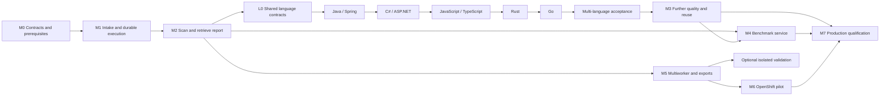

# Vulnerability discovery platform — implementation plan

**Version 0.2 — 10 September 2026**
**Basis:** [System design v0.3](../architecture/system-design.md).
**Status:** Proposed delivery plan. Implementation is underway; see the
[progress assessment](../development/progress.md) and slice documents for delivered scope.
No benchmark or production capacity qualification has been completed.

**Priority change (approved 10 September 2026):** Remove scanner lock-in before further
language expansion or configurable-triage work. Qualify Joern first as the primary
candidate; CodeQL remains the permitted POC/reference backend. Opengrep is a comparison
and optional complementary backend, not a mandatory second scan of every repository.
C and C++ are required follow-on languages after the current language work plan.
See §18 for the superseding delivery sequence and acceptance gates.

## Current checkpoint after Slice 120

Slice 120 adds the live GCS adapter/CLI with mocked SDK acceptance and optional dependencies.
Next durable GCS provenance and acquisition packaging; real cloud validation remains pending.

Slice 119 implements the internal generation-pinned GCS archive reader/handoff contract.
Next add the live GCS adapter and CLI; no real bucket access or cloud qualification yet.

Slice 118 supersedes the transport next-step notes below: the rebuilt acquisition image
passes local private smart-HTTP, CA and HTTP CONNECT proxy acceptance plus offline handoff.
Next implement GCS archive intake with local contract tests. Bank/OCP validation remains
pending; no private infrastructure configuration is needed from the user yet.

Slice 117 adds exact-repository private Basic/token credentials with local HTTPS transport tests. Next refresh the acquisition image and validate packaged behavior; bank authentication/proxy acceptance remains pending.

Slice 116 adds explicit operator CA/proxy options for Git acquisition; private authentication and end-to-end transport qualification remain next. Existing acquisition images require rebuilding for these options.

The bounded language integration/advisory pass is complete for its tested scope. The next
implementation priority is enterprise acquisition configuration (corporate CA/proxy
and private authentication), validated locally without assuming bank gateway access. Bounded repositories.csv acquisition is implemented in Slice 114. Slice 113
refreshes the three container variants for the receipt-enabled intake/report contract. The
requested bounded mounted multi-row archive handoff is implemented in Slice 111.
Bounded public HTTPS repository acquisition is implemented in Slice 109, separate from
offline scanning. Specialized C#/Rust smoke handoff is delivered in Slice 108; seven other
language selections have the shared smoke entrypoint from Slice 107.
The first OCP-2 offline smoke bundle and restricted Docker rehearsal passed in Slice 106. See
[the readiness checkpoint](../development/slice-105.md) for scope and acceptance.
This supersedes older immediate-next-step notes, while retaining their historical evidence.
No bank deployment, hosted API, Redis service or production throughput is claimed.

## Current execution priority — breadth before further local refinement

Approved after Slice 83: accept the repaired C# profile for its documented experimental
scope and defer broader ASP.NET source selection. This supersedes the earlier immediate
next-step notes in Slices 82–83. Prioritize durable Joern integration and restricted Linux
acceptance for Python, JavaScript/TypeScript, Go and Rust, then the planned C/C++ work.

Use a consistent minimum: vulnerable/fixed fixtures, cross-file propagation, a disconnected
negative, source-coordinate checks, persisted report retrieval, explicit incomplete
coverage, and a restricted Linux run. Reuse existing feasibility fixtures. Add deeper
checks when an observed failure warrants them, rather than exhaustively testing each
language feature. Passing this gate qualifies only the tested discovery profile.

Framework/query breadth, production triage qualification and measured recall remain
separate deliverables; do not equate integration completion with useful coverage of all
CWEs or framework APIs. After integration, prioritize wider detection using the available
50-repository ground-truth benchmark. No complete-coverage target blocks POC completion.

## 1. Delivery objective

Deliver a usable laptop POC first, then prove quality, reliability and OpenShift compatibility before committing to fleet throughput. The first product milestone ends with a readable report that can be retrieved for a specific repository. The later evaluation milestone generates a benchmark scorecard against the supplied 50 repositories and their known vulnerabilities.

The system design contains the leadership use cases and architectural diagrams because those explain the product regardless of implementation order. This plan translates them into work packages, dependencies, demonstrations and acceptance gates.

### Milestone overview

| Milestone | Demonstration | Exit decision |
|---|---|---|
| M0 — Contracts and prerequisites | A pinned local environment and agreed evidence/report schemas | Can the first supported language run safely on the laptop? |
| M1 — Intake and durable execution | Submit CSV/archive inputs, inspect accepted items, stop/resume a run | Is source identity and work state reliable? |
| M2 — Complete scan-to-report slice | Scan a fixture, retrieve a readable report, inspect evidence and gaps | Is the first POC useful end to end? |
| M3 — Quality and efficient reuse | Find harder cases, reject benign lookalikes, compare a rescan | Does AI add measured value over static analysis? |
| M4 — Benchmark reporting | Run a frozen configuration against supplied ground truth and export a scorecard | Can quality and regressions be measured honestly? |
| M5 — Multiworker operation and dashboard export | Recover from failures and export consistent portfolio data | Can work scale without duplication, leakage or uncontrolled spend? |
| M6 — OpenShift pilot | Run under approved identities, images, storage and network policies | Is the architecture feasible inside the enterprise? |
| M7 — Production qualification | Sustain representative daily throughput and pass quality/recovery gates | Is rollout justified by measured results? |

M0–M2 describe the original Python foundation. The revised POC also requires the language
coverage track below, including per-language extraction, reporting and evidence acceptance.
M4 integrates the existing benchmark; it does not require constructing a new corpus.
M5–M7 prove operational readiness. Isolated reproduction remains optional; approved
compiled-language extraction builds are separate from exploit reproduction.

## 2. Implementation order and dependencies

### Hard POC acceptance requirement: OCP dev execution

Added 10 September 2026: the POC must be runnable and testable in the bank's
OpenShift Container Platform development environment. Local Linux/OCP preparation is an immediate POC track. Per user direction, actual
bank OCP dev execution is deferred until functional POC completion; it remains a
required acceptance gate. M6/M7 retain enterprise pilot and fleet qualification.
Docker-based local checks are preparation; only execution in the target OCP dev
cluster satisfies this requirement. OpenShift Local is optional, not a prerequisite.

Prioritize the following bounded delivery steps alongside language qualification,
before more macOS-specific runtime work. Execute OCP-4 at functional POC completion:

Slice 48 delivers the first OCP-1 subset: digest-pinned UBI/Linux ARM64 packaging,
checksum-pinned CodeQL 2.27.0, hashed Python dependencies and a real restricted Docker
Python fixture suite. Slice 49 adds a pinned full Java 21 JDK and basic source-only Java Linux fixture
validation. Offline Spring fails (missing inferred dependencies); Slice 50 adds hash-pinned
Java artifact profiles and restores the Spring fixture under denied networking in
flat, Maven and Gradle source-only layouts; broader dependency closures remain open. Linux C# toolchains, full Java
builds, AMD64 qualification, formal SBOM
and bank policy validation remain open. No OCP execution is claimed.

1. **OCP-1 — Linux image and local restricted-runtime smoke test.** Package the CLI
   in an approved glibc-based Linux image (UBI candidate), pin Python dependencies,
   Linux CodeQL/query packs and platform-specific toolchains. Establish cluster CPU
   architecture before finalizing image architecture. Test arbitrary non-root UID,
   dropped capabilities, no privilege escalation, read-only root filesystem and
   explicit writable scratch/state. No Docker socket or privileged nested containers.
   Run real Python/Java/C# fixtures with networking disabled where dependencies are
   pre-provisioned. Publish image digests, SBOM and reproducible build instructions.
2. **OCP-2 — Namespace-scoped deployment bundle.** Provide Job manifests/Kustomize
   overlays, ServiceAccount with token automount disabled unless required, minimum
   RBAC, requests/limits, deadlines, bounded retries, ConfigMaps/Secrets, PVC mounts,
   and default-deny NetworkPolicies. Let SCC assign namespace-valid identities;
   do not request anyuid or privileged SCC. Configure corporate CAs and approved
   registry/dependency preparation separately from extraction. Extraction pods must
   not carry LLM credentials. The macOS offline flag is not the OCP isolation mechanism.
3. **OCP-3 — Durable state and staged execution.** Qualify PostgreSQL persistence
   and migration execution for shared OCP use; current SQLite/local locking must not
   be scaled across workers or assumed safe on arbitrary PVC filesystems. A first
   single-Job smoke test may use local ephemeral SQLite and export reports to PVC,
   explicitly without restart/durability claims. Separate intake, offline extraction
   and allowed-egress triage into stage-specific Jobs/artifacts before live model
   testing. Redis/distributed leases are required only when introducing concurrent
   orchestration, not for the first CLI Job. No hosted API is required for this gate.
4. **OCP-4 — Real cluster acceptance.** Deploy pinned images in the bank dev namespace;
   demonstrate archive/CSV from PVC through supported-language scan and retrieved
   JSON/HTML report, correct SCC admission/SELinux volume access, enforced extraction
   egress denial, successful allowed gateway traffic in the triage stage, restart/
   retry handling and bounded resource behavior. Record exact OCP version, image
   architecture, storage class, policies, fixture outcomes and limitations. Local
   Docker success must never be reported as OCP qualification.

Inputs needed from the platform team: OCP version and worker architecture, namespace
and allowed SCC, approved base images/registry, storage classes/access modes and quota,
PostgreSQL/Redis endpoints when applicable, corporate CA/proxy requirements, permitted
LLM/GCS/internal dependency endpoints and namespace RBAC/NetworkPolicy permissions.
Proceed with configurable manifests and local synthetic fixtures while these are pending.

RHCOS is the node OS; application dependencies belong in the OCI image/PVC rather than
being installed onto cluster nodes. OCP uses CRI-O. Docker builds/runs are suitable for
local image preparation but do not reproduce OCP SCC, SELinux, admission or cluster CNI.

References:
- [Red Hat RHCOS architecture](https://docs.redhat.com/en/documentation/openshift_container_platform/4.19/html-multi/architecture/architecture-rhcos)
- [OpenShift image guidelines](https://docs.redhat.com/en/documentation/openshift_container_platform/4.19/html-multi/images/creating-images)
- [CodeQL setup](https://docs.github.com/en/code-security/how-tos/find-and-fix-code-vulnerabilities/scan-from-the-command-line/set-up-codeql-cli)

### Immediate priority: multi-language POC

Deliver the following sequence before discretionary CLI refinement. The order starts with
Java/Spring and C#/ASP.NET, then follows the requested JavaScript/TypeScript, Rust and Go
coverage. Qualify tool availability for all targets in L0 so an environment blocker can be
identified early. If one language is externally blocked, continue the next language while
recording the exact prerequisite; do not fill the gap with unrelated CLI polish.

| Priority / subpackage | Deliverable | Completion evidence |
|---|---|---|
| L0 / M3.1a — Shared language foundation | Language/module discovery, adapter contracts, explicit capability matrix and language-specific readiness; preserve Python adapter | Mixed-language fixture selects distinct adapters and cannot inherit a Python-only successful-completion gate |
| L1 / M3.1b — Java and Spring Framework | Java extraction/query/index adapter; Spring MVC/Boot request binding, service flow and representative guards; explicit WebFlux support/gaps | Real pinned Java and Spring vulnerable/fixed/incomplete fixtures; Maven and Gradle profiles qualified separately |
| L2 / M3.1c — C# and ASP.NET | C# adapter; ASP.NET Core MVC/minimal APIs and a distinct classic ASP.NET MVC/Web API qualification lane | Real .NET fixtures, framework-bound evidence, safe parameterization cases and explicit platform/build blockers |
| L3 / M3.1d — JavaScript and TypeScript | Shared CodeQL extraction with separate JS/TS coverage; Node/Express request handling and declared browser-source scope | JS and TS fixtures both pass; module resolution, asynchronous flow and source-map/generated-code gaps are reported |
| L4 / M3.1e — Rust | Rust adapter with pinned extractor/query packs; initial standard-library and explicitly selected web-framework model scope | Real Cargo fixture, vulnerable/benign flows, macro/build-script/dependency limitations and resource measurements |
| L5 / M3.1f — Go | Go adapter; modules, net/http request sources and explicitly selected router coverage | Real Go module fixture, handler-to-sink evidence, build-tag/generated-code/cgo gaps and resource measurements |
| L6 / M3.1g — Multi-language acceptance | Mixed repositories, language-aware reports/benchmark applicability and shared cost controls | No unsupported component disappears from coverage; exact retrieval and bounded triage work for every qualified target |

These subpackages replace the former single Java/Spring expansion item M3.1; they are real
additional scope, not seven equally sized tasks. They can span multiple implementation
slices. Do not schedule a new convenience command merely to produce another numbered slice.

**Delivered initial slice:** Slice 37 adds language selection/coverage contracts and a
real dependency-free Java extraction-to-candidate/report fixture. L0 and L1 remain partial.
Slices 38–39 add bounded Java syntax indexing and Spring annotation observations;
semantic resolution and runtime bindings remain unqualified.
Slice 40 adds a real source-only Spring-style SQL path fixture matrix.
Slice 41 enables a narrow Java SQL advisory policy; broader evidence remains open.
Slice 42 supports complete Java context assembled from bounded evidence expansions.
Slice 43 adds Java-only copied-source scanning for Maven/Gradle layouts; builds remain
unqualified. Next: establish isolated build execution and approved dependency access
for L1. If externally blocked, continue C#/ASP.NET L2 as specified above.
Slices 45–46 add C# extraction/reporting and pinned SDK/reference profiles. The classic
fixture miss is resolved with matching references; the pair passes under macOS network
denial. Slice 47 adds application-managed macOS offline C# extraction with a pinned
profile, fail-closed enforcement and isolation-aware reuse. Next: enforced offline
Linux container validation, private-feed/Windows-worker integration and broader C# evidence.
Slice 44 adds opt-in single-language auto selection. L6 still requires query routing,
per-language fan-out and consolidated repository reporting.
Slice 51 adds the pinned Linux ARM64 .NET SDK/net48 image profile and C#/classic
ASP.NET offline fixture validation. Slice 52 adds a separate ASP.NET Core MVC
FromQuery/SQL fixture pair using matching .NET 10 reference packs under network denial.
Slice 53 adds a separate Core minimal API MapGet/SQL fixture pair using the same
pinned Core profile. Slice 54 adds classic Web API ApiController/FromUri SQL fixtures
with a separately pinned assembly profile. Slice 55 adds classic MVC Controller/SQL
fixtures using pinned MVC/Web Pages/Razor metadata references. Slice 56 enables a narrow
Core FromQuery/CommandText SQL advisory gate with complete syntax context and retained
CodeQL paths. Slice 57 adds narrow classic MVC/Web API HttpGet action source evidence.
Slice 58 starts L3 with separate JavaScript/TypeScript source-copy adapters and
Express code-injection fixture pairs using the shared CodeQL extractor. Module/dependency
resolution, asynchronous flows and JS/TS evidence qualification remain L3 follow-ups.
Revisit the bounded T1 registry slice after this initial L3 qualification as planned.
Broader C# bindings, guards, semantic resolution and
Windows/full-build qualification remain explicit L2 follow-up obligations.
Keep existing operator entry points and add options only where language selection or
safe build-profile selection requires them.

**Deferred until coverage delivery:** new cosmetic HTML/CSV variants, additional history
views, CLI convenience wrappers and automated storage cleanup. Fix correctness, security,
data-loss and blocking usability issues immediately. Maintain the guide for changed
language workflows; the existing API-guide delivery requirement remains attached to the
first hosted API. Do not build an API solely to bypass this priority decision.

### Approved shared capability: configurable triage policy packs

User-approved direction: broaden discovery through trusted `.qls` suites, and make
triage extensible through a separate policy registry. Supplying a suite must never
implicitly enable model calls or qualify new evidence semantics. JavaScript/TypeScript
remains the next implementation priority. Revisit the bounded registry slice after
initial L3 qualification; this shared capability must not become an open-ended blocker
for Rust, Go or mixed-language delivery.

| Mode | Behavior | Qualification boundary |
|---|---|---|
| Discovery only (default for unsupported rules) | Retain static candidates, source evidence and reports; no model call | No triage conclusion |
| Exploratory triage (explicit opt-in) | Explain the finding, identify missing evidence and suggest investigation steps | Unqualified model analysis; cannot confirm, suppress or establish remediation |
| Qualified advisory triage | Apply an approved, versioned policy pack and deterministic validators | Only the declared, fixture-tested evidence scope; still no automatic adjudication |

Implement the capability in bounded stages:

| Work package | Deliverable | Acceptance evidence |
|---|---|---|
| T1 — Policy registry | Extract current Python/Java/C# rule policies into a typed registry; preserve existing validator implementations and behavior | Existing fixtures and rejection tests produce equivalent outcomes; unsupported rules remain no-call by default |
| T2 — Exploratory mode | Add explicit run/operator selection for unsupported rules with a separate structured response schema | Mock-provider tests prove source/classification policy and budgets still apply; exploratory outputs cannot enter qualified verdict transitions or suppress findings |
| T3 — Trusted policy packs | Load declarative packs from administrator-controlled configuration/image/PVC; compose allowlisted built-in validators | Invalid/unknown validator references, conflicting rule selection, incompatible query versions and unapproved packs fail closed; no arbitrary plugin-code execution |
| T4 — Qualification and reporting | Evaluate policy fixtures, record approval/provenance and expose mode/coverage in CLI and machine-readable reports | Vulnerable/fixed/misleading fixtures pass the declared criteria; changing a policy invalidates inappropriate cache reuse; dashboards distinguish exploratory, qualified and untriaged results |

A pack declares its stable ID, version and content digest; rule IDs and CWE/language/
framework scope; supported CodeQL/query-pack identities; evidence obligations; validator
IDs and permitted parameters; approved prompt/schema versions; allowed advisory outcomes;
context/token/output limits; qualification fixture references and approval status.
CWE mapping alone is insufficient to select a policy: different queries for the same
CWE can require different source, sink and flow interpretation.

Configuration can compose existing validators. New language/framework semantics may
require reviewed Python implementation and new fixtures. Prompts or regex configuration
alone cannot confer qualified status. Model-generated pack suggestions are drafts only;
they cannot approve or activate themselves. Scanned source, archives and repository
metadata cannot install or override policy packs.

Record the exact effective policy digest, validator/prompt versions, query provenance,
triage mode and qualification status on each result and in request/cache identity.
Keep historical results immutable. Missing compatibility information produces an explicit
gap; never silently upgrade exploratory output to qualified evidence. A changed query
suite requires evaluation against the pack's applicability contract, not an assumption
that the same CWE implies compatibility.

All modes retain existing provider approval, source-classification/consent, redaction,
timeout, rate, context and monetary/token controls. Reserve cost before invocation;
exploratory calls count toward the same run budget and usage ledger. Pack limits may
narrow but cannot override administrator limits. No fallback to exploratory mode without
explicit opt-in, and no live model calls merely because a new `.qls` file was supplied.

Use replay/mock fixtures on the laptop first. When the authorized 50-repository corpus
is available, measure incremental detections, review burden, evidence acceptance and
cost by mode on a held-out partition. Do not count exploratory explanations as confirmed
true positives or evidence of improved precision. Document new operator options when
implemented; include the same distinctions in the future API guide.

This is planned work, not functionality currently shipped by the POC.

### What counts as language support

Track each language/framework/version at four distinct levels: detected, statically
analyzed, evidence/triage supported, and fixture-qualified. Installing an extractor or
producing a SARIF file alone is not complete support. For every target:

1. Pin the toolchain, query/model packs and approved build profile. Inventory modules,
   source roots, generated/vendor/test exclusions and unsupported components explicitly.
2. Produce a real CodeQL database and queries with diagnostics, then normalize candidates
   and retain exact source locations/flows. Qualify syntax indexing and retrieval for that
   language; do not parse it with Python AST or reuse Python-only evidence rules.
3. Implement a small published rule/CWE matrix with language/framework source, sink and
   counterevidence checks. Start with applicable injection, path traversal and SSRF cases;
   only claim classes backed by fixtures. Unsupported rule classes stay reportable static
   candidates with explicit unsupported triage, never silently discarded or confirmed.
4. For each claimed class, retain vulnerable, fixed/benign and ambiguous/incomplete cases.
   Exercise parameterization, validation/encoding where applicable, aliasing, wrappers and
   missing dependencies/models. Models remain advisory and must cite retained evidence.
5. Retrieve the resulting immutable report by repository/run, with per-language coverage,
   build mode, diagnostics, gate/rule versions and cost/time. Test at least one mixed-language
   repository with one blocked component; no aggregate clean/successful-security claim.

### Enterprise-compatible extraction and model use

Prefer a supported no-build extraction mode where it provides adequate declared coverage;
qualify each pinned language/tool combination rather than applying Python's `build-mode=none`
globally. Where a build is necessary, use fixed, operator-approved Maven/Gradle, .NET, Go or
Cargo profiles in isolated runners with bounded CPU/RAM/time/disk. Treat build plugins,
generators, macros and restore hooks as source execution. Never execute arbitrary build
commands from CSV metadata. Keep source mounts read-only, build output separate and LLM
credentials unavailable to extraction jobs. Use approved offline caches/internal mirrors;
dependency resolution failure produces an explicit blocked/partial result, not internet fallback.

Qualify classic ASP.NET separately from ASP.NET Core. A legacy project requiring Windows
or unavailable reference assemblies must receive a supported restricted extraction path
or an approved external build-runner path; Linux/OpenShift support must not be implied.
Record this prerequisite early, continue other targets if blocked, and keep classic ASP.NET
as an open acceptance obligation rather than silently treating Core coverage as equivalent.

Python remains the orchestration language. Reuse intake, immutable artifacts, budgets,
report retrieval, PostgreSQL-ready domain contracts and provider adapters. Each language
implements indexing/analysis/evidence contracts. Use one sub-analysis per selected language
and module scope; do not infer cross-language reachability across HTTP/RPC/FFI boundaries.
Record those boundaries as unknown unless independently modeled and tested.

Run deterministic extraction, queries and candidate deduplication before bounded LLM
triage. Reuse valid indexes/bundles with language, toolchain, pack and source dependencies
in their identities. Do not send entire repositories to models. Measure extraction/query
latency, peak resources, candidate counts, model tokens and configured cost by language;
keep recall-preserving ablations separate from cheaper-but-less-complete configurations.

### Tooling feasibility checkpoint (10 September 2026)

Local `codeql resolve languages --format=json` on CodeQL 2.27.0 lists `java`, `csharp`,
`javascript`, `rust` and `go`. This establishes extractor presence only, not installed query
packs, usable build dependencies or qualified TraceProof adapters. TypeScript uses CodeQL's
JavaScript extractor. Validate these details at L0 against the pinned local toolchain and
record supported framework/runtime versions in the capability matrix.

Primary references: [CodeQL supported languages/frameworks](https://codeql.github.com/docs/codeql-overview/supported-languages-and-frameworks/)
and [compiled-language build modes](https://docs.github.com/en/code-security/concepts/code-scanning/codeql/codeql-for-compiled-languages).
Vendor support is a starting point; TraceProof's fixture-qualified scope is the release claim.

Benchmark schema and synthetic matcher tests start before M4; the formal comparison waits for a stable M3 configuration and authorized dataset availability. PostgreSQL contract testing starts before M5, although fleet hardening is delivered there. OpenShift compatibility checks start in M0; full deployment is M6. These early checks prevent expensive late surprises without blocking the first vertical slice on enterprise integrations.

For one implementer, follow the immediate language sequence above using the delivered
Python foundation; do not wait for every historical M0–M2 gap to close. Baseline benchmark
contracts can evolve as necessary for language acceptance. Discretionary reporting and
runtime conveniences wait behind language coverage. Separate services are not required
merely because languages use separate adapters.

## 3. Cross-cutting implementation rules

1. **Keep state transitions deterministic.** A model proposes evidence and a verdict; application policy owns the accepted transition.
2. **Pin source and analysis inputs.** Every result names its source snapshot, profile, tools, rules, models and gate versions.
3. **Represent incomplete work explicitly.** Failed extraction, unsupported languages, expired budgets and unknown reachability cannot produce a clean result.
4. **Preserve observations.** Current finding state is a projection over immutable decisions and evidence; reviewed reports are versioned artifacts.
5. **Use a small set of contracts.** Local and OpenShift runners, SQLite and PostgreSQL stores, and different model providers implement common interfaces without pretending their operational behavior is identical.
6. **Separate source execution from authority.** Builds and PoCs do not run with provider credentials, general database access or job-creation rights.
7. **Measure savings and losses.** Any pruning, caching or model-tier change is tested for missed findings as well as token reductions.
8. **Keep benchmark answers out of scans.** Only the evaluator reads ground-truth labels.

Maintain a requirement-to-test register linking the design's Foundry adaptations and use cases to enforcing code and tests. A milestone is complete only when its acceptance evidence is saved, not simply when its tasks are checked off.

## 4. M0 — Contracts, fixtures and prerequisites

**Dependencies:** None.
**Use cases:** Foundation for all.
**Lead responsibility:** Implementer; later reviewed with AppSec/platform owners.

### Work packages

| ID | Work | Deliverable |
|---|---|---|
| M0.1 | Verify laptop architecture, disk/RAM, container runtime and CodeQL language support | Reproducible environment and compatibility notes |
| M0.2 | Scaffold Python package, dependency lock, lint/type checks and test entry points | Minimal application skeleton; no agent-framework dependency |
| M0.3 | Define run/task/verdict/validation states and completion rules | Typed domain schemas and transition tests |
| M0.4 | Define source snapshot, evidence reference, finding identity and report schemas | Versioned JSON contracts and representative fixtures |
| M0.5 | Define adapters for source, artifacts, runner, model and publisher | Protocols and adapter contract tests |
| M0.6 | Select small authorized vulnerable/fixed source fixtures | Pinned manifests and expected assertions |
| M0.7 | Define a benchmark manifest and label interface without loading bank data | Synthetic label examples, evaluator-access boundary |
| M0.8 | Record downstream Foundry amendments and initial support matrix | Architecture decision records with test obligations |

### Acceptance

The local runner analyzes a small supported fixture with the chosen CodeQL toolchain. Mock model responses can drive the domain state machine without a live provider. Evidence and report schemas reject missing revision IDs and malformed references. The initial profile declares supported languages and does not silently imply broader coverage.

Do not select exact enterprise model IDs, retention settings, issue trackers or storage classes by guess. Keep them as named configuration bindings. No bank source or labels are required at this milestone.

## 5. M1 — Intake and durable execution

**Dependencies:** M0.
**Use cases:** UC-01 and basic UC-08.

### Work packages

| ID | Work | Deliverable |
|---|---|---|
| M1.1 | Implement CSV validation and row-level import results | Import API/CLI with stable IDs and idempotency keys |
| M1.2 | Implement read-only local archive intake and safe unpacking | Digest-pinned snapshots and inventory manifests |
| M1.3 | Implement Git retrieval with explicit revision resolution | Commit-pinned source adapter and omitted-content records |
| M1.4 | Implement local immutable artifact store | Staging, integrity verification, atomic publication and orphan cleanup |
| M1.5 | Implement SQLite state persistence and single-writer scheduling | Tasks, attempts, checkpoints, retries and run status |
| M1.6 | Implement explicit pause/resume/cancel controls | Audited state transitions and resumable boundaries |
| M1.7 | Start PostgreSQL schema/migration contract checks | Early proof that portable domain data can persist in both databases |

### Acceptance

Submit a manifest with valid and invalid rows; valid items progress independently and each invalid item explains its rejection. Reimport with the same key does not create duplicate work. Archive traversal, escaping links, duplicate paths and expansion-limit violations are rejected. Mutating the intake directory after snapshot creation cannot change analyzed source.

Kill the local worker after a persisted checkpoint and resume it without losing completed work. API polling never executes analysis. No archive or Git metadata may inject a build command or select arbitrary credentials.

**Demonstration:** Import two fixtures through CSV, inspect accepted rows, stop a run, resume, and show the same immutable snapshot ID throughout.

## 6. M2 — Complete scan-to-report vertical slice

**Dependencies:** M1.
**Use cases:** UC-02, UC-03, minimal UC-05/UC-06.

### Work packages

| ID | Work | Deliverable |
|---|---|---|
| M2.1 | Implement deterministic Python function inventory and supported call resolution | Queryable symbols and explicit unresolved edges |
| M2.2 | Wrap CodeQL database creation, query execution and SARIF/diagnostic ingestion | Versioned raw analysis artifacts and normalized candidates |
| M2.3 | Implement index health gate and coverage obligations | Empty/failed extraction cannot release a successful-completion gate |
| M2.4 | Build compact context bundles and a minimal security map | Source-grounded entry points, calls, guards and unknowns |
| M2.5 | Implement mock and first live model adapter behind policy configuration | Structured output, usage capture and refusal/truncation handling |
| M2.6 | Implement bounded triage and class-specific evidence checks | Supported verdict transitions plus counterevidence |
| M2.7 | Implement finding family/occurrence identity and decision history | Idempotent records across repeated scans |
| M2.8 | Implement report materialization and retrieval | Self-contained HTML, Markdown and canonical JSON; raw SARIF available |
| M2.9 | Implement a small findings/scan CSV export | First machine-readable projection for generic dashboard consumption |
| M2.10 | Implement single-worker cost reservation and stop rules | Per-call accounting and honest budget-exhausted status |

### Initial API/CLI surface

**Operator documentation delivery:** Publish the first task-oriented CLI guide once the
local scan-to-report flow is stable (delivered in Slice 15; see
[CLI operator guide](../guides/cli-operator-guide.md)). Include a verified synthetic
walkthrough, ID handoffs, status interpretation, safe retries, budgets, evidence/reviews,
report selection/export and local recovery. Refresh it whenever a slice changes a user
workflow, command, schema or operational limit; CLI `--help` remains the argument reference.

Deliver `docs/guides/api-operator-guide.md` with the **first hosted API**, even if API
delivery occurs before M5. OpenAPI alone is insufficient for the workflow: the companion
guide must demonstrate authentication and repository scope, submission and idempotency,
asynchronous status polling, partial/failed outcomes, retry rules, exact report retrieval,
freshness disclosure, evidence access, pagination and dashboard exports. Use runnable
synthetic request/response examples verified against that implementation, with no invented
routes or credentials. Link to its generated OpenAPI reference and supported API version.
No HTTP API currently exists, so this API guide is a planned deliverable, not a usable
interface description. Expand both guides for multiworker recovery in M5 and approved
identity, egress, retention and deployment operations in M6 before pilot acceptance.

Use the report semantics in design §20. The first implementation needs import submission/status, scan status, a scan request, historical scan listing, exact report retrieval, and explicit latest-completed/latest-attempt selection. A CLI calls the same application operations; it should not implement a second workflow.

Reports start with source revision, owner, completion/coverage and action priorities. Detailed source evidence is linked or expandable. Escape repository content in HTML. Default exports exclude raw secrets, prompts and internal infrastructure identifiers.

### Acceptance

- A seeded vulnerability produces a confirmed report with valid evidence; its fixed counterpart is not published as the same vulnerability.
- Deliberate extraction failure produces a partial report, even with zero candidates.
- An authorized exact report lookup returns the same immutable report version with no model or CodeQL call.
- Latest-completed retrieval discloses a newer partial/failed attempt rather than presenting an outdated report as current.
- HTML/Markdown/JSON/CSV counts and coverage agree for the same report/audience.
- A refusal, invalid model JSON or missing citation produces an explicit error/uncertainty outcome, not an inferred safe verdict.
- A run that reaches its cost cap stops new calls and records remaining obligations.

**Demonstration:** Scan vulnerable and fixed fixtures, retrieve each by repository/run, inspect one evidence path and one coverage gap, and open the exported summary in a generic tabular consumer. This is the minimum useful laptop POC.

## 7. M3 — Discovery quality, framework support and efficient rescans

**Dependencies:** M2.
**Use cases:** UC-02, UC-04 and UC-05.

### Work packages

| ID | Work | Deliverable |
|---|---|---|
| M3.1a–g | Deliver the prioritized language track in §2: shared contracts, Java/Spring, C#/ASP.NET, JS/TS, Rust, Go and mixed-language qualification | Per-language extraction/index/evidence adapters, approved builds and fixture-qualified coverage matrix |
| M3.2 | Model representative custom sources, sinks, propagation and guards | Versioned framework models with vulnerable/benign tests |
| M3.3 | Add independent exploration and rule applicability accounting | Exploration that runs even when CodeQL finds nothing |
| M3.4 | Add selective independent review and second-provider adapter | Evidence-oriented escalation with approved fallback policy |
| M3.5 | Add deterministic dependency/secret adapters | Separate component-risk and secret-evidence contracts |
| M3.6 | Implement layered caches and conservative dependency invalidation | Reuse manifests with version/context dependencies |
| M3.7 | Implement run comparison and source freshness | New/persisting/resolved/reopened/not-comparable outcomes |
| M3.8 | Add human review, suppression expiry and rule-gap records | Audited decisions and proposed detection improvements |
| M3.9 | Add measured token/latency controls and context-expansion budgets | Cost/quality ablation results |

### Acceptance

Find a known fixture missed by the configured baseline through a framework model or independent exploration, with valid evidence. Test dynamic dispatch and an absent library model: both must preserve uncertainty rather than invent negative reachability. Test a second occurrence of the same weakness inside one function: it must not disappear through family deduplication.

Change a guard/helper and verify dependent findings are reconsidered. Change only line positions and verify stable finding identity. A report comparison must not mark a finding resolved if extraction or the relevant check failed. Repeated unchanged input creates no duplicate findings.

Compare baseline versus enhancements at equal profile/budget on development fixtures, recording detections, misses, adjudicated false positives and token consumption. Do not accept a token-saving feature solely because it is cheaper.

**Demonstration:** Show one useful additional discovery, one benign lookalike correctly rejected, one unresolved case honestly labeled, and a rescan delta with cache savings and validity evidence.

## 8. M4 — Supplied 50-repository benchmark and scorecard

**Dependencies:** M2 report contracts; M3 candidate configuration for the formal comparison.
**Use case:** UC-07.
**Execution prerequisite:** Authorized access to the supplied repositories, exact versions and known-vulnerability records. This can occur inside the bank rather than on the laptop.

### Work packages

| ID | Work | Deliverable |
|---|---|---|
| M4.1 | Import benchmark manifest and label records separately | Dataset/label versions, source pins and evaluator-only label access |
| M4.2 | Validate revision alignment, scope and label identity | Data-quality report covering all 50 repositories |
| M4.3 | Freeze baseline and candidate scan configurations | Reproducible run manifests and comparison budgets |
| M4.4 | Dispatch normal scans without labels | Predictions, candidate-stage results, coverage, errors, usage and timing |
| M4.5 | Implement deterministic matching and adjudication queue | One-to-one assignments, ambiguous matches and unjudged findings |
| M4.6 | Calculate aggregate/per-repository/per-class metrics | Explicit numerators, denominators and evaluation completeness |
| M4.7 | Materialize benchmark HTML/Markdown/JSON and CSV scorecards | Retrievable benchmark reports and dashboard tables |
| M4.8 | Add model/rule/configuration regression comparison | Version-to-version quality and cost changes |

### Ground-truth handling

Retain separate source manifests and labels so a scan task cannot accidentally load the answers. All 50 repositories appear in the execution-status table, even if some fail to build or are unsupported. Validate that known vulnerabilities apply to the pinned revisions; stale labels need correction or explicit qualification.

Match on repository, revision, structural location, compatible weakness and root cause, with a declared vulnerability unit. Multiple duplicate predictions cannot earn multiple true positives. Additional findings that are not listed in ground truth remain unjudged until reviewed. Do not present their count as false positives.

Report candidate recall and published recall separately so losses introduced by triage are visible. The main known-positive recall denominator includes all in-scope labeled vulnerabilities, including missed cases in failed scans. A secondary successfully-evaluated-subset metric must show its different denominator. Label ambiguity is disclosed rather than resolved by silent exclusion.

Define repository/family-aware development and holdout partitions after inspecting the dataset. Record any tuning exposure. Report uncertainty with the sample-size and within-repository correlation limitations; 50 repositories do not guarantee a precise estimate for every language or vulnerability class.

### Acceptance

Before real execution, synthetic evaluator tests include: an exact match, duplicate predictions, two flaws in one function, an ambiguous match, a novel unlisted finding, a missing/failed repository and mismatched source revision. Verify expected numerators/denominators and no label access from scan workers.

The real benchmark report must reconcile every supplied repository and every in-scope ground-truth record, clearly identify unjudged predictions, and state whether precision adjudication is complete. A configuration comparison must use the same dataset and disclose scope/budget differences.

**Demonstration:** Retrieve a scorecard showing baseline versus enhanced detection, drill into matched and missed known vulnerabilities, inspect unsupported/failed cases, and export a machine-readable comparison. Performance results are produced here, not assumed in this plan.

## 9. M5 — Multiworker reliability, GCS and portfolio exports

**Dependencies:** M2 stable contracts; M3 cache/identity rules as those features are enabled.
**Use cases:** UC-01, UC-03, UC-06 and UC-08.

### Work packages

| ID | Work | Deliverable |
|---|---|---|
| M5.1 | Implement PostgreSQL atomic claims and lease epochs | Multiworker scheduling and stale-writer fencing |
| M5.2 | Add independent heartbeat supervision and persistent retry schedules | Recovery without runtime-based false death detection |
| M5.3 | Implement shared budget reservations and Redis backoff | Fleet-wide cost safety and provider coordination |
| M5.4 | Implement controller/job intent reconciliation and outbox | Idempotent job dispatch and report publication |
| M5.5 | Implement GCS acquisition and warm-cache reuse | Generation-pinned downloads, integrity checks and retrieval accounting |
| M5.6 | Add asynchronous portfolio exports with snapshot consistency | Scan/finding/coverage/benchmark datasets and export manifest |
| M5.7 | Add repository/domain authorization and export audit | Authenticated retrieval and no cross-domain cache/data leakage |
| M5.8 | Add operational metrics, backlog views and recovery commands | Stage timing, resource/cost metrics and actionable blockers |

### Acceptance

Kill workers while claiming, analyzing, writing artifacts and finalizing reports. Partition a worker from PostgreSQL and ensure its old epoch cannot overwrite a new attempt. Lose Redis and verify budgets/work survive. Simulate a provider timeout that may have incurred charges; reservations remain conservative. Simulate a timed-out external report creation and ensure reconciliation precedes another create.

Run concurrent report pagination/export while scans complete; one export must contain one consistent data snapshot. Verify standard/deep, historical/current and new/persisting finding counts cannot be accidentally mixed. Enforce HTML escaping, CSV formula defenses and repository access on all representations, download paths and artifacts.

GCS tests first use a fake adapter and then a configured authorized test bucket. A changed object generation invalidates reuse. No source-bucket lifecycle changes are part of this feature.

**Demonstration:** Process several repositories concurrently, terminate a worker, observe recovery, retrieve reports during processing, and load a governed portfolio export into an approved dashboard tool or a generic contract-test consumer.

## 10. M6 — OpenShift feasibility and enterprise pilot

**Dependencies:** M5.
**Use cases:** All core use cases in the target environment.
**External dependencies:** Approved cluster, image registry, storage, identities, gateway and network paths.

### Work packages

| ID | Work | Deliverable |
|---|---|---|
| M6.1 | Build approved images with pinned CodeQL/query/toolchain dependencies | Signed image references and dependency inventory |
| M6.2 | Implement OpenShift runner using approved job templates | Durable task-to-job reconciliation |
| M6.3 | Validate restrictive UID/security context, scratch and PVC topology | Working source-only scan without privileged fallback |
| M6.4 | Integrate SSO, service identities, managed secrets, proxies and CAs | Environment-specific bindings and negative access tests |
| M6.5 | Enforce egress boundaries across intake, analysis and models | Tested allowlists, denied destinations and no metadata access |
| M6.6 | Configure retention, audit export, backups and restore procedure | Approved policy bindings and restoration evidence |
| M6.7 | Run a limited portfolio pilot | Real build/runtime/latency/storage measurements |

### Acceptance

The API remains responsive while analysis jobs run. Source-executing pods cannot access model keys, the control database, arbitrary job creation or unrelated sources. Approved storage supports concurrent jobs and persistent report retrieval. Job eviction/restart does not lose completed artifacts or create duplicate accepted results.

Test model endpoint/classification policy with denied combinations as well as allowed ones. Validate that the actual cluster security settings and connectivity enforce the design; a manifest that merely declares those settings is insufficient evidence.

**Demonstration:** Run an authorized small portfolio end to end on OpenShift, retrieve reports through enterprise identity, view export data, and show one controlled failure/recovery scenario.

## 11. M7 — Quality, capacity and operational qualification

**Dependencies:** M3, M4 and M6.
**Use cases:** Fleet operation across UC-01–UC-08, excluding optional runtime features not enabled.

### Work packages

| ID | Work | Deliverable |
|---|---|---|
| M7.1 | Census representative portfolio sizes, languages and build systems | Measured workload classes and source freshness requirements |
| M7.2 | Replace design sizing assumptions with measured distributions | CPU/RAM/I/O, token entitlement and cost forecast |
| M7.3 | Tune fair queues and resource classes | No starvation of large jobs; bounded downstream backlogs |
| M7.4 | Run representative sustained and cold-cache load scenarios | Seven-day service report with fresh/incremental/reused counts |
| M7.5 | Ratify benchmark quality thresholds and rollback gates | Release scorecard and approved configuration |
| M7.6 | Exercise backup restoration and infrastructure/provider failures | RPO/RTO evidence and operational runbook |
| M7.7 | Finalize support ownership and staged rollout | On-call responsibilities, incident response and canary/rollback plan |

### Acceptance

Meet the design's proposed 1,000-standard-evaluations/day target over a representative seven-day test without an expanding backlog, inside the agreed resource envelope. Report fresh full, incremental and unchanged reuse counts independently. Include a cold-cache scenario and measure p95/p99 latency rather than extrapolating from mean job times.

The 50-repository benchmark measures discovery quality, not by itself fleet capacity. Fifty representative scans repeatedly replayed can help stress the scheduler, but cache-hit replay alone cannot prove capacity for 1,000 distinct fresh repositories.

Ratify the published-precision gate and per-class recall requirements using adjudicated benchmark evidence. Disclose novel/unjudged findings and unresolved label issues. Demonstrate that report and coverage counts reconcile, existing reports remain retrievable during degraded analysis, and recovery does not duplicate publications.

**Demonstration:** Present a leadership scorecard with quality, freshness, coverage, cost, sustained throughput, operational incidents and remaining limits. Approve rollout by measured scope rather than asserting all languages or repository sizes are supported.

## 12. Optional extension — independent runtime validation

**Dependency:** Stable evidence pipeline and an approved isolation/testbed capability. This is not on the source-only POC critical path.

Implement a testbed manifest with snapshot/build identity, synthetic test credentials, permitted actions, reset procedure and observable success criteria. Separate reproduction-artifact authoring from a fresh verifier. The controller schedules validation; the verifier cannot grant itself scope or modify production targets.

Tests distinguish payload acceptance, mechanism reproduction and actual headline impact. Only the last, observed independently in the configured testbed, sets the machine reproduction flag. Failed or blocked validation leaves the code-based verdict intact and creates a new report version with the observed result.

If the enterprise cannot provide sufficient isolation, retain source-only findings and the explicit `no-testbed`/`blocked` status. Do not request privileged container exceptions automatically as an implementation shortcut.

## 13. Report and benchmark contract checklist

These contracts are established early and extended additively through milestones:

| Contract | Required fields/behavior | First delivery |
|---|---|---|
| Source snapshot | Repository, commit/digest, provenance, classification and manifest | M1 |
| Finding evidence | Snapshot-bound references, entry/boundary/impact, controls and uncertainty | M2 |
| Repository report | Immutable ID/version, run/profile, source, as-of time, findings and coverage | M2 |
| Report selection | Exact historical version or explicit latest-completed/latest-attempt | M2 |
| Run comparison | Stable identity, compatible scope and conservative resolution logic | M3 |
| Benchmark label | Label ID, repository/revision, root cause/location and applicability | Schema M0; operational M4 |
| Benchmark result | Dataset/configuration version, per-case status, numerators/denominators and adjudication state | M4 |
| Portfolio export | Schema version, snapshot IDs, audience/filters, data grain and row counts | Basic M2; fleet M5 |
| Authorization | Repository/domain checks on API, artifacts, evidence and downloads | Local boundary M2; enterprise M5–M6 |

Unknowns must be represented as unknowns, not zeros. Formats agree within the same authorized audience. Internal investigator evidence and owner-facing summaries are different projections, with explicit visibility rules.

## 14. Validation strategy

### Test layers

| Layer | Purpose | Runs when |
|---|---|---|
| Domain tests | State transitions, gates, identity and budget arithmetic | Each relevant code change |
| Adapter contracts | Equivalent artifact/report/model/store behavior | Adapter changes; both DBs where applicable |
| Security boundary tests | Archive handling, authorization, rendering and egress denial | Boundary changes and release checks |
| Integration tests | Real CodeQL, databases, jobs and report retrieval | Milestone/release verification and relevant changes |
| Evaluator tests | Correct matching, denominators and label isolation | Benchmark implementation changes |
| Quality evaluations | Actual detection and publication performance | Model/prompt/rule/gate changes |
| Failure/load tests | Recovery, fencing, throughput and resource behavior | M5 onward, then material operational changes |

Use deterministic model fixtures for workflow tests so routine engineering tests do not require live tokens. Live model evaluations are a separate, budgeted suite. Log model/configuration identity and retain evidence for comparisons; stochastic results should not be disguised as perfectly reproducible outputs.

Do not rerun the full 50-repository suite for a cosmetic report change. Do rerun relevant held-out quality checks for changes to retrieval, truncation, filters, rules, model routing, evidence gates or reuse validity. Formal release comparisons use the frozen benchmark configuration and declared budget.

### Definition of done for a work package

The code and schemas are committed; meaningful tests pass; the associated use case is demonstrated; failure and incomplete-state behavior is documented; migrations/version compatibility are addressed; resource and token effects are recorded when material. Any unmet acceptance criterion remains an explicit open item rather than a hidden assumption.

For user-visible changes, update the applicable CLI/API guide and verify affected
walkthrough examples. OpenAPI schema generation does not replace operator documentation.

## 15. Historical foundation backlog and revised next work

The following was the original foundation sequence; much is now delivered. It is retained
for traceability, not as the current queue:

1. Create the Python project and lock dependencies; verify the local CodeQL/runtime combination.
2. Implement the domain models for repository, snapshot, run, task, evidence, finding and report.
3. Implement SQLite persistence and local immutable artifact publication.
4. Add CSV/local-archive intake and safe snapshot validation.
5. Implement one supported-language static-analysis adapter with extraction diagnostics.
6. Implement the mocked triage contract, evidence gate and coverage accounting.
7. Materialize and retrieve HTML/Markdown/JSON reports by repository and run.
8. Prove the vulnerable/fixed/partial fixtures, then add the first configured live model adapter and usage accounting.

The language queue, resumed after the scanner qualification work in §18, is L0 → Java/Spring → C#/ASP.NET → JavaScript/TypeScript → Rust → Go →
mixed-language acceptance, as defined in §2. Retain CSV/archive intake for the language
work; Git/GCS acquisition is not a prerequisite. Integrate the supplied corpus when
authorized and available, reporting per-language/per-framework and per-CWE applicability
with denominators that retain blocked/missing cases. Do not use labels to route scan discovery.

## 16. Decisions and risks to track during implementation

| Risk or open decision | Implementation response | When it must be settled |
|---|---|---|
| Exact benchmark source revisions/label completeness unknown | Validate manifest and label applicability; preserve unjudged findings | Before real M4 execution |
| Bank data not authorized on personal laptop | Synthetic/public fixtures locally; benchmark in authorized environment | Before transferring any benchmark data |
| Toolchain incompatibility on laptop | Verify in M0; document emulation effects or use an authorized compatible runner | Before claiming local CodeQL functionality |
| Private CodeQL licensing scope | Confirm intended enterprise/archive use | Before enterprise source scanning |
| Model approval, quota or retention restrictions | Keep configured approved adapters and mocks; prohibit silent fallback | Before live bank model calls |
| Arbitrary proprietary builds | Restrict to approved build profiles; report unsupported builds | Before expanding supported portfolio |
| Unknown dashboard product | Publish vendor-neutral JSON/CSV schemas first | Specific connector only after a consumer is selected |
| Artifact store/PVC bottleneck | Measure staging, concurrent I/O and retention in pilot | Before M7 sizing commitment |
| Benchmark overfitting | Grouped holdout, tuning-exposure register and frozen comparisons | Before tuning on the supplied corpus |
| False savings through missed coverage | Require cost/quality ablations and explicit skipped work | Every optimization milestone |

## 17. Planning and ownership

This plan uses dependency-based milestones rather than invented calendar dates. After M2, actual effort for the vertical slice, the first enterprise language and report contracts can inform an estimate for M3–M7. Infrastructure approvals and proprietary builds should be estimated separately from application development.

The implementer owns the POC and engineering contracts. AppSec validates evidence, ground truth and release quality. Platform engineering validates runtime and reliability. Application owners resolve business-policy ambiguity. Data/model governance approves source handling and model bindings. Leadership agrees the supported profile, cost envelope and rollout gate.

The current deliverable is **the remaining S2 portability contracts** after Slices 59–60,
followed by Joern qualification in §18. The
expanded multi-language POC takes priority over CLI refinement. Earlier percentage estimates
describe the smaller scope and must not be presented as current completion percentages
until the expanded work packages are re-estimated.

## 18. Approved scanner portability and C/C++ extension

CodeQL licensing is uncertain beyond approved POC/research use. Preserve the existing
backend and reusable intake, persistence, reporting, budget and LLM controls. No backend
is assumed to match CodeQL simply because it parses the same language or emits SARIF.

| Order | Work package | Exit evidence |
|---|---|---|
| S1 — Slice 59 | Separate CodeQL process execution behind a typed execution contract | Existing success, empty, partial, invalid, failed and timeout publication behavior retained; unavailable/launch failures explicit |
| S2 | Add engine identity, prepared-input and capability contracts; explicit backend routing | Native engine/rule/version provenance, output format, diagnostics, scope and missing-flow state retained; historical CodeQL reports readable; cache/reuse decisions distinguish engines and rule packs |
| S3 | Implement a pinned Joern adapter and Java/Spring vertical slice | Controller → service → repository flow across files, vulnerable/safe/misleading cases, source-bound evidence, honest incomplete coverage |
| S4 | Qualify highest-risk frontends early: C#/ASP.NET Core and classic, Rust; add small C/C++ feasibility cases | Per-profile parse and analysis results, framework/library gaps and unsupported constructs documented |
| S5 | Compare equivalent Joern/Opengrep cases across Python, Java, C#, JS/TS, Rust and Go | Recall and false-positive results with applicability denominators; runtime, peak RAM, output size, evidence/token cost and maintenance effort measured |
| S6 | Decide primary and any optional per-language backend, resume language expansion and T1–T4 triage packs | Explicit supported profiles, no fabricated flows, no automatic promotion from discovery to qualified advisory |
| S7 | Complete C and C++ support after the existing language work plan | Separate language acceptance, source/build-context handling, tested CWE scenarios and readable reports |

S1 is only an execution boundary. Extraction still uses CodeQL databases; normalization,
policy identifiers and candidate evidence are not yet portable. Do not advertise Joern
or Opengrep as runnable until their adapter and qualification steps pass.

For C/C++, cover preprocessing/includes and compile context, cross-file calls, pointer
aliases, buffer lengths and allocation sizes; add C++ templates and lifetime/ownership
cases. Declare specific supported vulnerability scenarios rather than universal memory
safety coverage. Early feasibility fixtures inform engine selection without moving full
C/C++ implementation ahead of the existing requested languages.

Joern is preferred for deeper graph-based analysis, especially Java and C/C++; C# and
Rust remain hard qualification gates. Opengrep supports all target languages but its
documented intrafile cross-function taint is not evidence of cross-file parity. Language
frontend availability is separate from framework modeling and vulnerability detection.

Run synthetic/public fixtures on the laptop. Use the supplied 50-repository corpus only
in an authorized environment, retain holdout discipline, and keep labels out of discovery.
Measure safe counterparts as well as known vulnerabilities. Unknown library semantics,
partial parsing, timeouts and omitted languages must remain visible in reports.

Keep Python orchestration; isolate Joern Scala queries in versioned, tested rule packs.
Inventory engine, rules and dependency licenses separately (Joern Apache 2.0; Opengrep
LGPL 2.1). Pin binaries and local packs; prohibit scan-time downloads. Repeat arbitrary-UID,
read-only-root, network-disabled Linux validation for each backend. Bank OCP qualification
remains deferred until functional POC completion, as agreed.

Capacity acceptance still requires representative workloads: 1,000 repositories/day is
a target, not demonstrated throughput. Measure graph generation, scratch storage, peak
memory and tail latency alongside LLM cost. If using optional complementary scanning,
route by language/risk/coverage policy; do not run deeper analysis only after Opengrep
finds something, which would preserve its missed findings.

Decision sources (reviewed 10 September 2026): [Joern frontends](https://docs.joern.io/),
[Rust frontend](https://github.com/joernio/joern/tree/v4.0.625/joern-cli/frontends/rust2cpg),
[Opengrep](https://github.com/opengrep/opengrep), and
[intrafile scope](https://github.com/opengrep/opengrep/wiki/Intrafile-tainting-tutorial).

S2 progress (Slice 60): new attempts carry engine/runtime/adapter identity, bounded
capabilities, preparation references and entry-only rule provenance. Query execution
uses a trusted registry; other backends are rejected before side effects. Existing-attempt
skipping excludes explicitly different engines and preserves legacy CodeQL behavior.
Prepared-input routing, engine-aware evidence-policy qualification and full versioned
rule-pack reuse are still open; this is not yet a portable end-to-end pipeline.

S2 progress (Slice 61): prepared-input lookup is backend-owned. Bundles record engine
identity; gate 8, prompt 3 and builder 6 isolate CodeQL policy eligibility from other
engines while preserving legacy bundles. Preparation creation and complete engine/rule-
pack reuse remain open before non-CodeQL execution is enabled.

S2 progress (Slice 62): existing preparation creation and lookup now route through the
backend. New completed attempts record a version-aware configuration fingerprint and
explicitly disable automatic reuse because transitive packs/artifacts are not pinned.
The existing-attempt guard remains a retry policy, not cache reuse. Proceed to the Joern
Java feasibility/adapter slice with reuse disabled; define Joern preparation results and
normalization there. Full transitive rule-pack pinning remains a prerequisite for future
automatic result reuse, not for a no-cache Joern POC.

S3 progress (Slice 63): pinned Joern 4.0.625 macOS ARM64 passed a real Java cross-file
feasibility probe: vulnerable/fixed/disconnected flows 1/0/0. Source-file/line references
are retained and fixture hashes checked. The source/sink selectors are fixture-specific;
Spring/JDBC semantics remain unqualified. Next implement durable discovery-only adapter
results and normalization, then framework models and restricted Linux tests. Joern is
not yet selectable via TraceProof scan commands. See Slice 63 for exact limits/timings.

S3 progress (Slice 64): explicit experimental Joern command now persists scan attempts,
graphs/logs, source-bound SARIF candidates and normal published reports. Real durable
vulnerable/fixed/disconnected results are 1/0/0 and incomplete. Standard scan-run remains
CodeQL-only; the Joern query is fixture-scoped and not framework-qualified. Next replace
fixture source/sink selectors with bounded Spring/JDBC models and qualification fixtures,
then restricted Linux execution and C#/Rust gates. No automatic reuse is enabled.

S3 progress (Slice 65): Joern's query now models public Spring GetMapping String
RequestParam sources and the exact JDBC Statement.executeQuery(String) graph signature.
Seven real positive/safe/lookalike/renamed/missing-route fixtures pass; durable renamed
and annotation-lookalike scans retain 1/0 candidates. This is bounded discovery, not
qualified triage or runtime reachability. Next: explicit coverage/diagnostic accounting,
restricted Linux validation, then C#/Rust acceptance gates.

S3 progress (Slice 66): Joern reports graph file representation and modeled endpoint/flow
counts, with explicit no-source/no-sink/no-flow observations and missing graph files.
Parser diagnostic counts remain unknown, and successful process exits no longer imply
complete analysis in normalized output. Projection 8 retains coverage in shared reports.
Next: restricted Linux runtime validation and parser-diagnostic qualification, followed
by C#/Rust gates. Graph representation is never counted as full parsing or CWE coverage.

S3 progress (Slice 67): a separate digest/archive-pinned UBI/JDK21/Joern Linux ARM64 image
and seven-case durable acceptance harness are implemented. The harness runs with arbitrary
UID, read-only root, network none, dropped capabilities and resource limits; it exports
runtime/configuration evidence and reports. Bank OCP admission/SELinux/PVC checks remain
deferred and mandatory. See Slice 67 for real local results. Next: parser diagnostics and
early C#/Rust qualification; local ARM64 is not evidence of x86_64 acceptance.

S3 progress (Slice 68): bounded Joern log observations now report recognized parser-problem
files, warning/error events and missing/truncated logs without claiming authoritative
parser counts. Malformed-only and mixed valid/malformed fixtures extend restricted Linux
acceptance to nine cases. Next priority is the early Joern C#/ASP.NET gate, then Rust,
rather than further Spring refinements. Complete parser coverage remains unqualified.

S4 C# gate (Slice 69): **not passed**. Core/MVC/Web API single-file flow pairs yield 1/0,
but the vulnerable three-file chain yields 0 because calls remain unresolved. Parameter
framework attributes and source coordinates also require explicit bridging/qualification;
observed lines are one line earlier than their matching source position. Preserve regressions and
investigate frontend resolution and coordinate conventions before C# registration. The
existing syntax parser can supply bounded framework facts, but cannot manufacture missing
flow evidence. Rust remains the next independent early gate. No global Joern migration
commitment is justified by the Java success alone.

S4 Rust gate (Slice 70): initial Cargo-based single-file and three-file flow pairs passed
1/0 with matching sample source coordinates. Rust 1.98.1/rust-src were pinned locally;
loose .rs input failed project discovery. Cargo/build-script/macro policy and Linux remain
unqualified. Next assess Python, JS/TS, Go and early C/C++; defer C# remediation until the
portfolio assessment is complete, per user instruction. Track results in
[the assessment register](scanner-language-assessment.md).

S4 Python gate (Slice 71): initial source-only single-file/cross-file pairs passed 1/0;
disconnected negative yielded 0. Sample source coordinates matched. Framework and sink
identity, parser coverage and restricted Linux qualification remain open. Next assess
JavaScript/TypeScript, then Go and early C/C++, before revisiting C#. No production
Python backend or triage policy changed.

S4 JavaScript/TypeScript gate (Slice 72): both languages passed single-file and ES-module
three-file flow pairs 1/0 and disconnected negatives 0. Sample source lines matched.
Frameworks, CommonJS, project configuration and restricted Linux remain unqualified.
Next Go, then early C/C++, then deferred C# remediation and portfolio recommendation.

S4 Go gate (Slice 73): single-file and three-package flow pairs passed 1/0; disconnected
negative yielded 0. Sample source lines matched. Interfaces, concurrency, build tags,
cgo, framework coverage and restricted Linux remain open. Next early C/C++ feasibility,
then deferred C# investigation and portfolio-level recommendation.

S4 early C/C++ gate (Slice 74): .c and .cpp common-subset single-file and shared-header
three-file pairs passed 1/0, disconnected negatives 0, with matching sample source lines.
C++ features, memory safety, build settings and restricted Linux remain unqualified.
Initial portfolio assessment is complete; next revisit C# unresolved calls, metadata
and coordinate gaps while preserving failed regressions. Full C/C++ implementation
remains later; no universal Joern migration or broad coverage claim is established.

S4 C# revisit (Slice 75): explicit-namespace cross-file pair yields 1/0 while the original
global-namespace positive remains missed. Returned coordinates have mixed conventions;
blanket +1 correction is invalid. Next two bounded slices: diagnose/repair symbol
resolution with adversarial call-binding regressions, then source mapping and framework
fact qualification. Prefer upstreamable changes; keep CodeQL reference and defer Joern
registration. Reassess a separate C# semantic backend if repair requires a large custom
resolver. See ../development/slice-75.md for evidence and exit criteria.

S4 Opengrep C# comparison (Slice 76): stable v1.30.0 and pinned interfile alpha each
pass single-file Core/MVC/Web API pairs but miss both namespace variants of the three-file
positive and the combined-file control. Replacement gate not passed. Resume bounded
Joern repair; retain Opengrep as a possible supplementary candidate backend, not qualified
CodeQL evidence parity. See ../development/slice-76.md.

S4 C# bounded repair (Slice 77): isolated one-line AstCreator change routes compilation
unit members through existing global-parent handling. All ten existing flow cases pass,
including the original global-namespace positive. Keep the unpatched baseline. Next
adversarial call-binding regressions and per-node coordinate/framework qualification;
upstream tests and restricted Linux packaging remain required before registration.

S4 C# binding qualification (Slice 78): ten additional patched-frontend cases passed
exact callee and flow checks across file-scoped namespaces, namespace-qualified calls,
typed instance fields, simple overloads and duplicate/disconnected negative cases.
No additional resolver patch was needed. Next per-node source mapping and framework
facts; upstream and restricted Linux qualification remain open.

S4 C# source spans (Slice 79): versioned isolated validator accepts only unique exact
syntax spans at raw/following line, preserves raw coordinates and rejects ambiguity.
All 16 retained Slice 78 nodes validated; six targeted regression tests cover repeated
and multiline snippets plus input failures. No evidence-policy promotion. Next bounded
ASP.NET facts joined through validated spans, then restricted Linux qualification.

S4 C# framework spans (Slice 80): optional syntax facts join by byte containment and
source hash; span profile v2 handles attributed parameter type/name subspans. All 18
retained baseline nodes validate, with no facts on intermediate parameters. Legacy
parser output remains unchanged; 533 tests pass. Next restricted Linux validation of
patched frontend plus mappings/facts; no production evidence promotion yet.

S4 C# restricted Linux (Slice 81): isolated repaired frontend built offline atop the
pinned Linux Joern base. All 20 flow/binding cases, 18 spans and expected framework facts
passed under arbitrary UID/read-only root/network denial/resource limits (112.927 s).
Next discovery-only experimental C# integration with explicit coverage; broader semantics,
upstream patch qualification and actual bank OCP remain open.

S4 C# durable discovery (Slice 82): explicit joern-csharp-discover command publishes
uniquely mapped Lookup(name)/CommandText paths through existing scan/report storage.
Unsupported mappings retained with counts; qualified triage stays unsupported. Real
intake-to-report pair yields 1/0; 537 tests pass. Next durable restricted Linux acceptance,
then broader query qualification without presenting this fixture-shaped profile as full
C# coverage. No automatic routing change.

S4 C# durable Linux acceptance (Slice 83): 22 cases pass, including persisted scan
retrieval and published mapping/coverage checks (133.774 seconds). No LLM or OCP claim.
Next qualify bounded ASP.NET HTTP source selection independent of action/parameter
names, with negative controls, before broadening the experimental query. Repair supply
chain, broader semantics and throughput remain open.

S4 Python integration (Slice 84): opt-in durable lookup(input)/system profile, five
restricted Linux cases and 542 regression tests pass. Continue JavaScript/TypeScript
integration, then Go/Rust under the minimum acceptance set above. C# further local
refinement is deferred; no claim of complete language/framework detection.

S4 JavaScript/TypeScript integration (Slice 85): separate explicit commands and packaged
lookup(input)/eval rule identities share the durable lifecycle and JS frontend. Each
language reuses five acceptance fixtures; JSX/TSX, mixed-language flows, framework models
and project configuration remain omitted. Next apply the same minimum integration gate
to Go, then Rust. Do not reopen local C# refinement before completing this sequence.

S4 Go integration (Slice 86): explicit durable profile preserves go.mod metadata,
passes five restricted Linux cases and 548 regression tests. Source-only coverage remains
bounded; dependency/build semantics are unqualified. Next Rust integration and its
minimum Linux gate, then planned C/C++ work.

S4 Rust preparation (Slice 87): explicit durable profile requires a dependency-free root
Cargo crate with one explicit binary. Generated Cargo metadata disables build hooks and
automatic targets; unsupported manifests are rejected. Empty Rust graphs fail the scan.
The pinned Linux Rust AST generator needs GLIBC 2.39, requiring a separate UBI 10 runtime
instead of the existing UBI 9 base. Broader Cargo dependency/workspace support remains
future coverage work; it must not silently weaken the preparation boundary.

S4 Rust acceptance (Slice 87): all five cases passed on macOS and restricted UBI 10
Linux (28.697 seconds); 562 tests pass. Proceed to the planned C/C++ durable integration
using existing feasibility fixtures plus the same minimum checks. Broader Cargo coverage
and bank UBI 10/OCP approval remain separate gates.

S4 C/C++ integration (Slice 88): explicit C and C++ profiles share the durable Joern
lifecycle, with source/header selection and separate rule identities. Initial queries
remain lookup(input)/system flows; C++-specific semantics and memory-safety rules are
not qualified. After the minimum Linux acceptance, the language integration sequence
is complete for these bounded opt-in commands. Next prioritize shared backend selection
and pipeline orchestration so these profiles can be used through the main workflow,
while preserving discovery-only gates. Then expand useful detection coverage and run
benchmark-driven improvements when the ground-truth corpus is available. Avoid spending
additional slices perfecting any single language before this end-to-end integration.

S4 C/C++ acceptance (Slice 88): all ten restricted Linux cases pass (C 24.712 s,
C++ 23.450 s), including header inventory and source-line checks; 566 tests pass.
The bounded opt-in language integration gate is complete. Main workflow/backend
selection is next, without automatically promoting discovery evidence to qualified triage.

S4 main workflow (Slice 89): scan-run/scan-import now support explicit Joern engine,
automatic single-language selection, exact-attempt publication and engine-aware retry
suppression. Shared restricted Linux acceptance passed; 584 tests pass. Lower-level
CodeQL prepared-database APIs remain separate. Next check existing benchmark/evaluation
compatibility with Joern and expose actual profile coverage across languages; use synthetic
fixtures until the bank ground truth is available. Broader detection remains a priority.

S4 evaluator compatibility (Slice 90): schema-2 Joern coverage audits preserve labels,
provenance and explicit gaps while keeping recall/precision unknown. Real retained Rust
report publication/retrieval passed; 596 tests pass. This is not yet a Joern recall
evaluator. Next useful detection-profile expansion beyond fixture names plus explicitly
scoped exploratory location matching; maintain separation from confirmed metrics and
use the 50-repository corpus when available. No further CLI polish is prioritized.

S4 useful Python profile (Slice 91): opt-in Flask args/form.get-to-os.system discovery
with bounded import/rebinding checks, unique graph endpoint mapping and profile-aware
retry suppression. Eight restricted Linux cases and 607 tests pass. Default profiles
unchanged; no triage/recall promotion. Next useful JS/TS HTTP-input profile; defer further
Flask refinement in favor of overall detection breadth.

S4 useful JS/TS profile (Slice 92): opt-in Express inline get/post handler field reads
from query/body/params to builtin eval graph signature. Eight restricted Linux cases
per language pass (49.377 s JS / 48.082 s TS); 615 tests pass. Main workflow, retrieval,
profile-aware retry and coverage-audit compatibility retained. Factory import aliases
were missed and remain an explicit limit; no qualified triage/recall promotion.
Next bounded Go HTTP-input profile, distinguishing process arguments from demonstrated
shell injection. Continue breadth before deeper Express semantics; bank ground truth and
actual OCP gates remain deferred.

S4 useful Go profile (Slice 93): opt-in HTTP FormValue/PostFormValue to literal shell
Command -c argument flow. Nine restricted Linux cases pass (55.418 s); 621 tests pass.
Includes direct/cross-package pairs, aliases, fake imports and non-shell negative control.
Main workflow, report retrieval, profile-aware retries and coverage audits retained.
Command construction does not qualify execution or route reachability; no triage/recall
promotion. Next useful C/C++ command-line-to-system model; keep memory-safety and broad
C++ semantics separate. No new migration; bank OCP and ground-truth gates remain deferred.

S4 useful C/C++ profile (Slice 94): opt-in main argument-vector constant-index reads to
system. Eight restricted Linux cases per language pass (37.644 s C / 36.472 s C++);
629 tests pass and 24 focused checks pass after final query correction. Includes shared
headers/cross-file flows, array syntax and local-system exclusion. C++ call identity is
unresolved and remains explicit; no memory-safety, qualified triage or recall promotion.
Next assess useful Rust input-source modeling within the existing dependency-free Cargo
scope, then review remaining POC integration gates before deeper per-language refinement.
Bank OCP and ground-truth gates remain deferred; no migration required.

S4 useful Rust profile (Slice 95): opt-in literal std::env::var to chained shell -c command
argument. Nine restricted UBI 10 Linux cases pass (70.873 s); 635 tests pass. Direct and
cross-module flows, aliases and lookalike/non-shell controls are covered. Environment
attacker control and execution remain unknown; no qualified triage/recall promotion.

### Execution checkpoint after Slice 95

The bounded integration and useful-input expansion pass is complete for the documented
profiles; this does not complete framework/CWE breadth, C/C++ memory safety or all S7 goals.
The next local priority is a bounded Java/Spring Joern evidence-policy portability slice,
then an opt-in advisory path only when its explicit gates pass. Reuse existing syntax and
quote checks where applicable, preserve engine/rule provenance, test misleading and missing
evidence, and retain unsupported negative verdicts and unknown reachability. Do not simply
whitelist Joern rules or infer qualification from recorded paths.

Current Joern main scans publish with model_calls=0; claims.requirements remains CodeQL-only.
This is an open functional gate for a CodeQL-independent LLM-assisted POC. C# broader source
selection and further per-language modeling remain deferred in favor of this vertical path.
S5 comparison/quality evidence, bank ground-truth metrics, representative fleet capacity
and actual OCP dev deployment remain open. No 1,000-repository/day or production-qualification
claim follows from synthetic fixture timings. See Slice 95 for the checkpoint details.

S6 evidence portability (Slice 96): explicit joern-spring-review-v1 validates native output,
packaged query, SARIF, source hashes and complete ordered path before reusing Java quote/
syntax checks. Seven fresh restricted Linux cases pass (49.243 s), with deterministic
claims for two positive cross-file examples. New bundle builder 7 retains audit metadata;
legacy scans without native digests remain unqualified. CLI check-evidence requires an
explicit review policy. Default Joern requirements/pipeline remain discovery-only and
make no model calls; negative verdicts remain unsupported. No migration.
Next explicit budgeted advisory path with replay acceptance, native/context preflight,
engine/policy-aware request identity and unchanged default discovery behavior. This is
not live-model quality, ground-truth or bank OCP qualification.

Slice 96 final validation: 654 automated tests pass; Ruff and whitespace checks pass.

S6 advisory orchestration (Slice 97): triage/triage-attempt accept explicit Spring Joern
review policy with native/context/syntax preflight, budget reservation, post-response gates
and policy-aware request identity. Seven restricted Linux cases pass with two replay
advisories (56.710 s); 667 tests pass. Report projection 12 retains policy/engine and
simulated history. Zero live model calls; no default registry promotion or migration.
Next wire the explicit option into main Joern scanning with bounded candidate pagination,
existing run budgets, stop/skip reporting and exact-attempt report publication. Preserve
discovery defaults and prove orchestration with replay. Other language policies, bank
quality metrics, capacity and actual OCP deployment remain open.

S6 main workflow advisory (Slice 98): explicit model configuration/policy/key and candidate
page options connect Java/Spring Joern discovery to the existing budgeted advisory service
and exact-attempt publication. Existing attempts skip both stages; continuation uses
triage-attempt. Failed scans, budget/evidence stops, request caps and page offsets are
visible. Seven restricted Linux cases pass (52.590 s); 678 tests pass. Two replay calls,
zero live calls; discovery defaults retained. No migration.
Next extend the same explicit evidence/advisory contract to the bounded Python Flask
profile, validating native/source-context eligibility and preserving unknowns. Do not
promote synthetic intermediate nodes or all language policies by analogy. HTTP launch
coverage, bank quality/capacity evidence and target OCP acceptance remain separate gates.

S6 Python/Flask advisory (Slice 99): completed explicit joern-flask-review-v1 across evidence
checks, triage and the main scan workflow. Native/SARIF/source binding, isolated endpoint
syntax checks, full call quotes and unknown guards constrain advisory eligibility. Generated
intermediate nodes remain tool observations. Eight restricted Linux cases pass (54.228 s),
696 tests pass, three replay advisories and zero live calls. No migration.
Next implement minimum native/context/quote acceptance and bounded advisory for the existing
JavaScript/TypeScript Express profile. Preserve unsupported cases and default discovery-only
behavior; prioritize remaining language advisory breadth over CLI polish. Subsequent C#, Go,
Rust and C-family policies require their own bounded acceptance. The bank benchmark,
1,000-repo/day capacity evidence and target OCP acceptance remain open.

S6 Express JavaScript/TypeScript advisory (Slice 100): completed language-specific explicit
policies, isolated bounded syntax checks, complete-context/native/SARIF binding and budgeted
workflow/report integration. 760 tests and 16 restricted Linux cases pass; six replay calls,
zero live calls. Added locked JS/TS Tree-sitter grammars and updated image dependencies.
Negative verdicts, guard presence, arbitrary framework patterns and runtime proof remain
unsupported. No migration; HTTP launch schemas are unchanged.
Next bounded C#/ASP.NET advisory using repaired Joern provenance and existing source-location
checks, with minimum positive/fixed/misleading acceptance. Then Go/Rust/C-family advisory;
maintain breadth over further CLI refinement. Bank benchmark, live-model quality, sustained
1,000-repo/day capacity and actual OCP execution remain uncompleted acceptance gates.

S6 repaired C#/ASP.NET advisory (Slice 101): explicit joern-csharp-review-v1 now supports
check-evidence, triage and the main advisory workflow for the existing Lookup(name) query.
Repair identity, fresh source-map reconstruction, exact SARIF, full context and endpoint
span/fact binding are required. Mapping work is capped at 32 native paths/128 nodes;
oversized/incomplete evidence remains visible without provider calls. 805 automated tests
pass. Native acceptance is recorded in docs/development/slice-101.md. No migration.
Next bounded Go HTTP-to-shell advisory, followed by Rust and C-family policies. Broader C#
HTTP source discovery remains separate; do not present this advisory slice as widening the
Lookup query. Bank benchmark, live-model quality, sustained fleet throughput and actual OCP
acceptance remain open. Continue language breadth over CLI refinement.

S6 Go HTTP-to-shell advisory (Slice 102): completed explicit joern-go-http-review-v1 for the
go-http-shell-v1 profile. Bounded isolated import/request/shell syntax, exact native/SARIF/
source context and full command quotes gate provider calls. Existing budgets, idempotency,
scan workflow and report retrieval are reused. 844 tests and nine restricted Linux cases
pass (66.555 seconds); three replay calls and zero live calls. Added the locked Go grammar
and updated container requirements. No migration or HTTP launch-schema expansion.
Next bounded Rust environment-to-shell advisory, then C-family policies, using minimum
native/source/endpoint acceptance. Command construction must not be promoted to execution
or runtime reachability. Bank quality/benchmark, live-model evaluation, sustained fleet
capacity and actual OCP acceptance remain open; prioritize breadth over further CLI polish.

S6 Rust environment-to-shell advisory (Slice 103): completed explicit joern-rust-env-review-v1
for rust-env-shell-v1. Native/SARIF/source/context integrity and isolated literal environment/
shell-chain syntax gate advisory. The eight-node cross-file path is retained under a Rust-only
location allowance; byte limits and all other profiles' bounds remain intact. Existing
Cargo/toolchain restrictions, budgets, idempotency and report retrieval are reused. 888 tests
and nine restricted Linux cases pass (90.239 seconds); three replay calls, zero live calls.
Added the locked Rust grammar and updated container requirements. No migration.
Next bounded C/C++ argv-to-system advisory, with unresolved C++ identity/semantics explicit.
Then review remaining POC integration/coverage gaps. Environment input is not proven attacker
control; command construction is not execution. Bank quality/benchmark, live-model judgment,
sustained fleet throughput and actual OCP acceptance remain open gates.

S6 C/C++ argv-to-system advisory (Slice 104): completed explicit joern-c-argv-review-v1
and joern-cpp-argv-review-v1 for c-family-argv-system-v1. Isolated syntax, exact native/source
context, budgets, idempotency and report retrieval reuse the shared advisory workflow.
16 restricted Linux cases pass; six replay calls and zero live calls. No migration.
C++ remains bounded C-style syntax with unresolved libc identity and general semantics.
Next: POC readiness/integration-gap checkpoint; select the next missing end-to-end requirement
from the language/profile matrix and existing plan. Bank benchmark, live-model quality,
sustained fleet throughput and actual OCP acceptance remain open. Prefer completeness over
further CLI refinement or exhaustive local language qualification.

OCP-2 subset (Slice 106): offline C-profile smoke image, namespace manifest generator,
ServiceAccount/deny policy/Job example and local mounted archive-to-report rehearsal are
implemented. Vulnerable/fixed cases pass 1/0, zero live calls. See deployment README and
Slice 106 for limits. Actual SCC/PVC/network admission, AMD64, PostgreSQL durability and
fleet operation are not qualified. Next representative mounted-input integration across
profiles; continue deferring actual bank deployment until agreed POC handoff.

OCP-2 portability (Slice 107): one shared allowlist maps explicit Job language selection to
seven existing discovery profiles. Mounted-input acceptance uses synthetic vulnerable/fixed
pairs; it does not qualify representative bank repositories or expand CWE coverage. The
next bounded step is C#/Rust image-specific handoff. No actual OCP or fleet claim follows.

OCP-2 specialized handoff (Slice 108): distinct C# repair and Rust toolchain smoke layers
retain qualified base identities and runtime language allowlists. Shared reports/failure
semantics and no-provider execution are reused. This completes the bounded mounted-input
handoff across the nine language selections, not actual OCP qualification or broader source
coverage. Next bounded Git/repository-URL intake; GCS, live bank gateway, quality benchmark,
PostgreSQL/distributed execution and real OCP acceptance remain open.

M1.3 subset (Slice 109): explicit credential-free HTTPS acquire-git resolves a ref to a
commit and emits raw-blob ZIP, archive-hashed CSV and provenance sidecar. Existing PVC intake
is reused; no Git URL batch dispatch or report provenance propagation yet. Symlinks/submodules/
LFS reject the acquisition, rather than silently reducing scope. Next bind provenance into
durable intake/reports. Private authentication, corporate CA/proxy, GCS, managed acquisition
Jobs and fleet qualification remain open; no bank credentials or deployment were required.

Approved intake clarification: operators may stage both CSV and TAR/TAR.GZ/ZIP source
archives together on a mounted PVC. Existing multi-row import-csv/worker supports this.
Standard convention: archives.csv for local source paths; repositories.csv reserved for
future Git-URL batches. Use batch-specific directories and container-visible absolute
paths beneath input-root; optional archive SHA-256 remains supported. See the PVC archive
intake guide/sample. Naming is not automatic dispatch. Preserve this path independently
of Git acquisition; Git credentials/network must not become archive-intake prerequisites.
Upcoming mounted-intake integration: accept archives.csv in the one-row OCP smoke entrypoint
with explicit legacy input.csv compatibility and ambiguity rejection, then implement bounded
multi-row mounted-batch handoff. Keep existing one-row smoke and multi-row CLI contracts
honest until implemented. This addition does not replace planned durable Git provenance.

Mounted intake convention (Slice 110): archives.csv and legacy input.csv selection is
implemented in all smoke image layers; ambiguity, Git manifests and unsafe manifest file
types fail before scanning. One-row semantics remain explicit. Next bounded multi-row Job
handoff, then durable Git provenance. No automatic filename-driven Git retrieval is enabled.

Mounted archive batches (Slice 111): separate opt-in batch entrypoint accepts at most ten
records, sequentially reuses existing intake/scan-import, and exports per-row reports plus
an explicit batch summary. Missing archives do not hide later valid rows; incomplete batches
exit nonzero. No multiworker, persistent restart, Git network or model behavior is introduced.
Next durable Git provenance; actual OCP and representative quality/capacity remain open.

Durable provenance (Slice 112): pinned receipt path/digest columns copy a validated acquisition
record into existing intake JSON, then verify captured file inventory. Projection 13 reports
commit and binding state; old reports remain immutable. No database migration. Next refresh
container application snapshots: current pinned smoke bases predate this CSV/report change.
Git CSV batch dispatch/private credentials/GCS and actual bank/OCP/quality gates remain open.

Container application refresh (Slice 113): all three smoke variants install the current
wheel and hash-locked Python dependencies, preserving pinned scanner/toolchain identities.
Receipt and plain archive batch modes are exercised separately. Next repositories.csv
networked acquisition, reusing existing host/revision/bounds and durable receipt contracts.
No provider, registry push or OCP operation; bank acceptance remains deferred.

Git URL batches (Slice 114): acquire-git-csv reuses public HTTPS acquisition for up to ten
records, with deadline/row limits, explicit host policy, per-row outcomes and receipt-pinned
archives.csv containing successful acquisitions only. Partial batches exit nonzero; no scans
start automatically. Next dedicated acquisition image/handoff; private credentials, corporate
CA/proxy, GCS, bank quality/fleet/OCP acceptance remain open.

Acquisition packaging (Slice 115): separate pinned UBI/Git/CA image and real public-HTTPS to
offline scanner handoff pass. Original mixed-batch failures remain explicit after scanning
the success subset. No scanner tools or credentials are copied into acquisition. Next bounded
operator-controlled enterprise CA/proxy/auth configuration; private live bank validation,
GCS, actual OCP and representative quality/fleet gates remain open.
